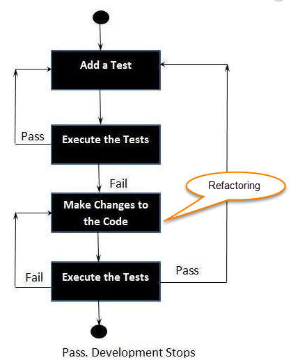
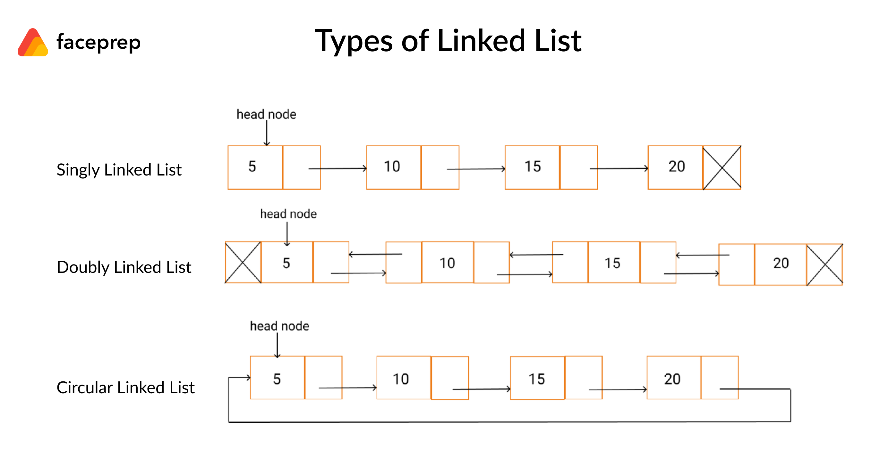

# How to Implement Linked Lists with Test Driven Development

References

- [Web Dev Simplified](https://www.youtube.com/watch?v=gJjPWA8wpQg&list=PLZlA0Gpn_vH_7qOMYNO7fdvIN9_kYEo2I)
- [Jest Docs](https://jestjs.io/docs/getting-started)
- [What is Test Driven Development](https://www.browserstack.com/guide/what-is-test-driven-development)

## Table of Contents

- [Introduction](#introduction)
- [How to do test driven development](#how-to-do-test-drive-development)
- [What a linked list is](#what-a-linked-list-is)
- [How to create a linked list](#how-to-create-a-linked-list)
- [How to write proper tests](#how-to-write-proper-tests)

### Introduction

Linked lists are one of the most popular data structures interviewers ask about in technical interviews. You will probably never have to implement one in a real day to day job, but knowing how to write a linked list and understanding how they work is crucial to passing a technical interview.

On top of covering linked lists in this tutorial, I will also be covering how you can use test driven development to make writing code easier. We will be designing the entirety of the linked list with test driven development to show you how to write better tests.

### How to do test driven development

1. **Create precise tests:** Developers need to create precise unit tests to verify the functionality of specific features. They must ensure that the test compiles so that it can execute. In most cases, the test is bound to fail. This is a meaningful failure as developers are creating compact tests based on their assumptions of how the feature will behave.
1. **Correcting the Code:** Once a test fails, developers need to make the minimal changes required to correct the code so that it can run successfully when re-executed.
1. **Refactor the Code:** Once the test runs successfully, check for redundancy or any possible code optimizations to enhance overall performance. Ensure that refactoring does not affect the external behavior of the program.

The image below represents a high-level TDD approach towards development:



Image taken from [Browserstack.com](https://www.browserstack.com/guide/what-is-test-driven-development)

### What a linked list is

- alternative to an array data structure
- both are linear data structure
- an array is list of objects with each object accessed by an index starting at 0 and going to n-elements and contains a finite number of elements that is defined at creation
- a linked list on the other hand do not have indexes for its stored elements, it stores an object similar to an array however, instead of an consecutive index numbers, the node (element) has a reference to the next node in the list
- linked list is basically a group of nodes where each node points to the next node by means of a pointer
  - node is composed of data and a reference to the next node
- start off with a head node (first or 0 element), it has its value and the reference to next element only
- tail node is the very last node, it stores data and reference points to null
- each node after the head node will also have its value and a reference to next node and so on
- eventually ends with the tail node where it also has its value but does not have any reference to a next node
- three type of linked lists
  - singly linked list - each node references the next node except for the tail node which ends the list
  - doubly linked list - each node references the next node and its previous node except for the head node which starts the list
  - circular linked list - this is similar to a singly linked list except the tail node references back to the head node


image from [faceprep.in](https://www.faceprep.in/data-structures/linked-list-introduction/)

#### Why use a linked list instead of an array?

- one advantage of linked lists is that elements can be added to it indefinitely without reallocation or reorganization of the entire structure because that data items need not be stored contiguously in memory. An array on the other hand will eventually get filled or have to be resized for making an insertion whenever needed (a costly operation that isn't always possible)
- elements are also be easily removed from linked lists whereas removing elements from an array leaves empty spaces that are a waste of computer memory or performing a shift operation in arrays increases the cost thus makes it expensive
- linked lists are more efficient with adding and removing elements than arrays
  - add an element at the beginning: array you can do this but you have to move existing first element down a position which in turn every other element also must move down (O(n) time because who have to loop through all existing elements) whereas in a linked list you can simply create the node, give it a reference to the existing head node and now the new node becomes the head node (O(1) time)
  - now if you are not operating on the first element of a linked list then it becomes O(n) time because you have to start with the first node and traverse through the list to the node you want conversely much quicker to get random elements in an array because you pass in the index of the element you want

#### Operations of Linked Lists

- **Insertion** - inserts an element at specified positions in the list
- **Deletion** - deletes an element at specified positions in the list
- **Search** - searches an element using the given value
- **Update** - update an element at specified position with the given value

### How to create a linked list

1. make project folder and cd into it

```bash
mkdir example
cd example
```

1. initialize npm

   1. this will setup the initial project structure and create package.json

```bash
npm init -y
```

1. install [jest](https://jestjs.io/) as a development package

```bash
npm i jest --save-dev
```

1. create [linkedList.js](./notes/linkedListjs.md)
1. create [linkedList.test.js](./notes/linkedList.testjs.md) for automated testing and to drive writing the file
1. create [app.js](./notes/appjs.md) see we can run code to manually test the `linkedList` file

1. go to [linkedList.js](./notes/linkedListjs.md) for remaining instructions

### How to write proper tests

1. go to [linkedList.test.js](./notes/linkedList.testjs.md) on writing tests
