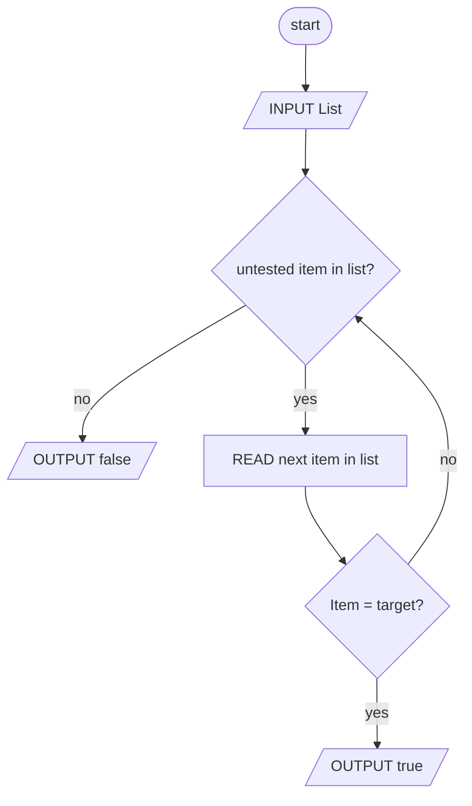

# Expressing and Analyzing Algorithms

### Module 2

## Table of Contents

1. [Learning Outcomes](#learning-outcomes)
1. [Common algorithms: find-max, linear search, binary search](#common-algorithms-find-max-linear-search-binary-search)
1. [Algorithmic complexity: linear, logarithmic, quadratic, exponential, factorial](#algorithmic-complexity-linear-logarithmic-quadratic-exponential-factorial)
1. [Approaches to solving optimization problems: brute force, greedy](#approaches-to-solving-optimization-problems-brute-force-greedy)

## Learning Outcomes

- Describe common algorithms that are used in computational thinking
- Determine the complexity of an algorithm in terms of the number of operations as a function of the input size
- Calculate the number of possible solutions to an optimization problem
- Compare the relative benefits and limitations of common algorithmic approaches to problem solving

## Common algorithms: find-max, linear search, binary search

### Finding the Maximum Value

#### What Can A Computer Do?

- computers can only perform binary operations that take two operands
    - adding two numbers or
    - multiplying two numbers or
    - comparing two numbers

#### Finding the Maximum Value

1. remember the largest value you have seen so far starting at the beginning of the list and store it in a variable named **max**
1. compare it to the next value in the list
1. update the largest value (**max**) so far

#### Algorithm: Find-Max

**Problem:** Find the maximum value in a list of values

- at first, the max is the first one in the list
- look at each value in the list. if it is greater than the current max, then that value becomes the max
- after going through the entire list, the current max is the maximum value in the list

#### Flowchart: Find-Max

#### Flowchart: Find-Min

### Linear Search

Look at each value in a list one time

#### Telling the Computer How to Search

- a computer can't process the list all at once
- it can only compare two things at a time
- the algorithm must be expressed in terms of binary comparisons

#### Algorithm: Searching for a Value

**Problem:** Determine whether a list of values contains a target value

- Look at each value in the list. If it is equal to the target, then we have found the value and we can stop looking
- If we go through the entire list and have not found the target, then it is not in the list

#### Flowchart: Searching for a Value

### Binary Search

This is for lists that are sorted/ordered.

The worst case scenario for this is still the same for linear search and that is the item you are looking for is not in the list at all.

#### Improving Search for Ordered Lists

- Any search algorithm must determine where to look first, and then where to look next
- In **linear** search, we start with the **first** item and then look at the **next** item
- What if we were to start with the **middle** item?

> **Remember** you can only tell the computer to search one item at a time.

So, just simply ordering the list can cut down on the search time because if you were to search for an item and the current you were on is greater than the target, then you can simply stop your search and know that your target is not in the list. However, is an unordered list and using linear search, then you would need to search through all items to make sure your target was not in the list. So simply ordering the list can cut down on the search time.

in a binary search though, not only is the list ordered, but you move where you begin your search as well. You start with the middle item and determine is this your target, if not, then is it greater than or less than your target. By this determination, you can cut down on the number items left to search in half. You keep doing this until either you found what you are looking for or you don't.

#### Searching for a Value: Sorted List

`[4, 7, 8, 12, 22, 25, 31, 34, 38, 42, 49, 51, 58, 60]`

Target: 42
Found: No

`[4, 7, 8, 12, 22, 25, *31*, 34, 38, 42, 49, 51, 58, 60]`

Target: 42
Found: No

Start with the middle item (31), not found, so is the target greater than or less than?

In this case it is greater than so we can eliminate the first half already, no need to search through them.

`[4, 7, 8, 12, 22, 25, 31, 34, 38, 42, *49*, 51, 58, 60]`

Target: 42
Found: No

Once again, start with the middle term (49), not found, so is the target greater than or less than the current item?

Now it is less than so we can now eliminate everything beyond the current item. This leaves us just `[34, 38, 42]` left.

`[4, 7, 8, 12, 22, 25, 31, 34, *38*, 42, 49, 51, 58, 60]`

Target: 42
Found: No

Once again start with the middle term (38), not found, is the target greater than or less than the current item. It is greater so we just eliminated `[34, 38]`.

`[4, 7, 8, 12, 22, 25, 31, 34, 38, *42*, 49, 51, 58, 60]`

Target: 42
Found: Yes

So we found our target on the fourth iteration vs. a linear search we would not have found the target until the 11th iteration.

#### Algorithm: Binary Search

**Problem:** Determine whether a sorted list of values contains a target value

- Repeat these steps whether a sorted list of values contains a target value
    - Compare the value in the middle fo the list to the target
    - If they are equal, then we have found the target and can stop looking
    - If the value in the middle of the list is greater than the target, remove the middle element and elements that are larger than it and repeat
    - If the value in the middle of the list is less than the target, remove the middle element and elements that are smaller than it and repeat
- If we remove all elements in the list, then it does not contain the target

#### Flowchart: Binary Search

#### Binary Search: Complexity

Using the above list again and now a target value is not in the list (worst case scenario), it would still only take 4 comparisons before we eliminated all elements and determined the value is not in the list using the Binary Search Algorithm.

The worst case scenario using linear search would take 15 comparisons before reaching the same conclusion.

To describe the complexity, lets double the list size and evaluate the number of comparisons. This would only increase the number of comparisons by one from the original list.

Here the linear search complexity is shown in red and the binary search is shown in orange. So, as the number of inputs increases, the linear search number of comparisons also increases at the same rate. But, notice the binary search does not, it eventually gets to a point where you increase the number of inputs and no appreciable increase in the number of comparisons. This is known as **logarithmic complexity**. The number of comparisons grow at the rate of the logarithm of the number of inputs increases.

## Algorithmic complexity: linear, logarithmic, quadratic, exponential, factorial

Complexity: expressing the number of steps or operations in an algorithm

- gives us an idea of how long it will take the algorithm to execute
- typically expressed as a function of number of elements in the input data

### Algorithm: Find-Max

**Problem:** Find the maximum value in a list of values

- at first, the max is the first one in the list
- look at each value in the list. if it is greater than the current max, then that value becomes the max
- after going through the entire list, the current max is the maximum value in the list

#### Finding the Maximum Value

How many comparisons were needed to find the max value?

`[*52.3*, 81.2, 33.6, 17.3, 25.1, 90.4, 28.2, 43.1]`

- first value = max and
- no. of comparisons 0

`[-52.3-, *81.2*, 33.6, 17.3, 25.1, 90.4, 28.2, 43.1]`

- second value compared to max - largest so far is 81.2 and
- no. of comparisons 1

`[52.3, -81.2-, *33.6*, 17.3, 25.1, 90.4, 28.2, 43.1]`

- third value compared to max - largest so far 81.2 and
- no. of comparisons 2

`[52.3, -81.2-, 33.6, *17.3*, 25.1, 90.4, 28.2, 43.1]`

- fourth value compared to max - largest so far 81.2 and
- no. of comparisons 3

`[52.3, -81.2-, 33.6, 17.3, *25.1*, 90.4, 28.2, 43.1]`

- fifth value compared to max - largest so far 81.2 and
- no. of comparisons 4

`[52.3, -81.2-, 33.6, 17.3, 25.1, *90.4*, 28.2, 43.1]`

- sixth value compared to max - largest so far 90.4 and
- no. of comparisons 5

`[52.3, 81.2, 33.6, 17.3, 25.1, -90.4-, *28.2*, 43.1]`

- seventh value compared to max - largest so far 90.4 and
- no. of comparisons 6

`[52.3, 81.2, 33.6, 17.3, 25.1, -90.4-, 28.2, *43.1*]`

- seventh value compared to max - largest so far 90.4 and
- no. of comparisons: 7

`[52.3, 81.2, 33.6, 17.3, 25.1, -90.4-, 28.2, 43.1]`

- largest so far 90.4 and
- no. of comparisons = no. of elements - 1

If we double the number of elements, we still must compare against all them. This would result in a total of 15 comparisons which is again no. of elements - 1. What this boils down to is if we double the number of elements then we also double the number of comparisons and so on. This is called linear growth. The number of comparisons roughly equals the number of elements. This algorithm has linear complexity.

### Algorithm: Searching for a Value

**Problem:** Determine whether a list of values contains a target value

- Look at each value in the list. If it is equal to the target, then we have found the value and we can stop looking
- If we go through the entire list and have not found the target, then it is not in the list

#### Searching for a Value

`[52.3, 81.2, 33.6, 17.3, 25.1, 90.4, 28.2, 43.1]`

- Target: 90.4
- Found: No
- No. of Comparisons: 0

`[*52.3*, 81.2, 33.6, 17.3, 25.1, 90.4, 28.2, 43.1]`

- Target: 90.4
- Found: No
- No. of Comparisons: 1

`[52.3, *81.2*, 33.6, 17.3, 25.1, 90.4, 28.2, 43.1]`

- Target: 90.4
- Found: No
- No. of Comparisons: 2

`[52.3, 81.2, *33.6*, 17.3, 25.1, 90.4, 28.2, 43.1]`

- Target: 90.4
- Found: No
- No. of Comparisons: 3

`[52.3, 81.2, 33.6, *17.3*, 25.1, 90.4, 28.2, 43.1]`

- Target: 90.4
- Found: No
- No. of Comparisons: 4

`[52.3, 81.2, 33.6, 17.3,* 25.1*, 90.4, 28.2, 43.1]`

- Target: 90.4
- Found: No
- No. of Comparisons: 5

`[52.3,*81.2, 33.6, 17.3, 25.1,* 90.4*, 28.2, 43.1]`

- Target: 90.4
- Found: Yes
- No. of Comparisons: 6

Assuming 90.4 stays in the same place and we double the number of inputs, it would still only take 6 comparisons. The number of elements that come after is really does not matter, therefore doubling the number of elements really does not take any more time than before.

But, when we analyze the complexity of an algorithm, we use the worse case to give up a better idea of what might happen when the number of elements grow.

Now, lets try a search where the target is not within the list. We have to look at every element in the list.

`[52.3, 81.2, 33.6, 17.3, 25.1, 90.4, 28.2, 43.1]`

- Target: 50.5
- Found: No
- No. of Comparisons: 0

`[*52.3*, 81.2, 33.6, 17.3, 25.1, 90.4, 28.2, 43.1]`

- Target: 50.5
- Found: No
- No. of Comparisons: 1

`[52.3, *81.2*, 33.6, 17.3, 25.1, 90.4, 28.2, 43.1]`

- Target: 50.5
- Found: No
- No. of Comparisons: 2

`[52.3, 81.2, *33.6*, 17.3, 25.1, 90.4, 28.2, 43.1]`

- Target: 50.5
- Found: No
- No. of Comparisons: 3

`[52.3, 81.2, 33.6, *17.3*, 25.1, 90.4, 28.2, 43.1]`

- Target: 50.5
- Found: No
- No. of Comparisons: 4

`[52.3, 81.2, 33.6, 17.3, *25.1*, 90.4, 28.2, 43.1]`

- Target: 50.5
- Found: No
- No. of Comparisons: 5

`[52.3, 81.2, 33.6, 17.3, 25.1, *90.4*, 28.2, 43.1]`

- Target: 50.5
- Found: No
- No. of Comparisons: 6

`[52.3, 81.2, 33.6, 17.3, 25.1, 90.4, *28.2*, 43.1]`

- Target: 50.5
- Found: No
- No. of Comparisons: 7

`[52.3, 81.2, 33.6, 17.3, 25.1, 90.4, 28.2, *43.1*]`

- Target: 50.5
- Found: No
- No. of Comparisons: 8

Now, if we double the number of elements, then we also roughly double the number of comparisons we have to do. This is still linear and therefore linear complexity.

## Approaches to solving optimization problems: brute force, greedy

