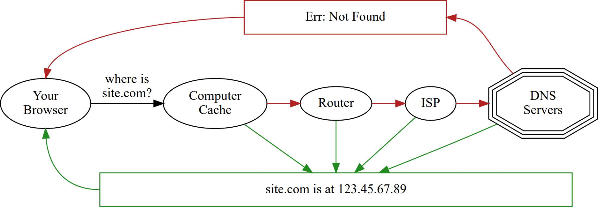
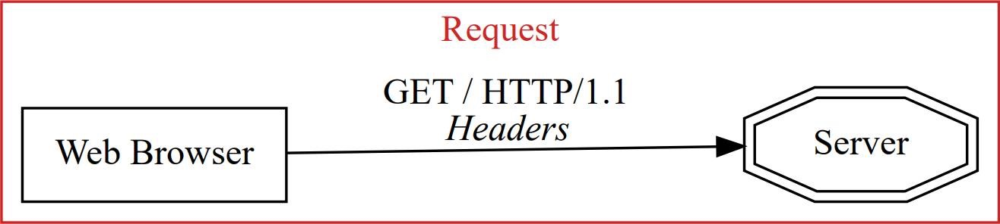
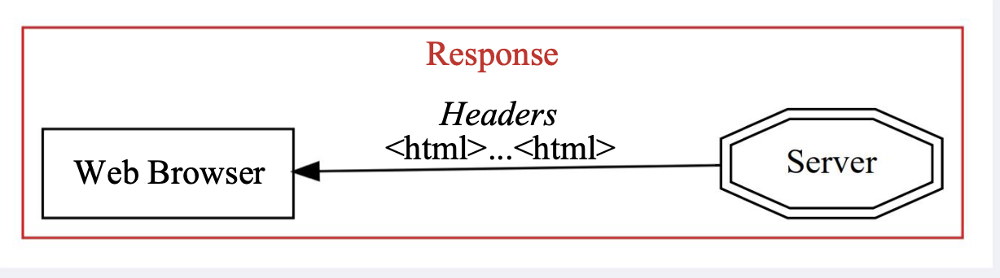
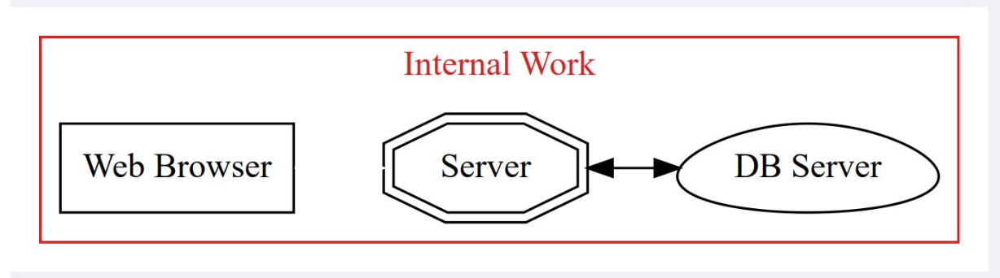

# How the Web Works

## Table of Contents

1. [Abbreviations](#abbreviations)
1. [Introduction](#introduction)
1. [Networks](#networks)
1. [URLs](#urls)
1. [DNS](#dns)
1. [Browsers and Servers](#browsers-and-servers)
1. [Serving Over HTTP](#serving-over-http)
1. [Multiple Requests](#multiple-requests)
1. [Trying on Command Line](#trying-on-command-line)
1. [Methods: GET and POST](#methods-get-and-post)

## Abbreviations

- \*[API]: Application Programming Interface
- \*[DNS]: Domain Name Service
- \*[ftp]: File Transfer Protocol
- \*[html]: Hypertext Markup Language
- \*[http]: Hypertext Transfer Protocol
- \*[https]: Hypertext Transfer Protocol Secure
- \*[IP]: Internet Protocol
- \*[URL]: Universal Resource Locator

## Introduction

If you want to be a web developer, you've got to know how the web works. Luckily, the internet was designed by incredibly smart people with accessibility in mind.

In this subunit, we'll teach you all the fundamentals of how the internet works: what happens behind the scenes when you type in a URL, how data passes between computers, what IP addresses are and how they work, the Domain Name Server, and much, much more. You've been using all of these services for years!

### Goals

- High level: what happens when you visit a URL in browser
- Explain what IP and DNS are
- Describe the different parts of a URL
- Describe the request / response cycle
- Compare **GET** vs **POST** requests

### What happens when...

When I type [http://site.com/some/page.html]() into a browser, what really happens?

This is a common interview question for software engineers.

### How the Web Works

The internet is complicated.
Really, really complicated.
Fortunately, to be a software developer, you only need to know a bit.
For people who want to work in "development operations," or as a system administrator, it's typical to have to learn more about the details here.

[](#table-of-contents)

## Networks

A _network_ is a set of computers that can intercommunicate.
The internet is just a really, huge network.
The internet is made up of smaller, "local" networks.

### Hostnames

We often talk to servers by "hostname" — [site.com]() or [computer-a.site.com]().
That's just a nickname for the server, though — and the same server can have many hostnames.

[](#table-of-contents)

### IP Addresses

On networks, computers have an "IP Address" — a unique address to find that computer on the network. IP addresses look like `123.77.32.121` , four numbers (0-255) connected by dots.
There are a lot of advanced edges here that make this more complicated, but most of these details aren't important for software engineers:

- there another whole way to specify networks, "IPv6", that use a different numbering scheme.
- some computers can have multiple IP addresses they can be reached by
- under some circumstances, multiple computers can share an IP address and have this be handled by a special kind of router. If you're interested in system administration details, you can learn about this by reading about "Network Address Translation".

[](#table-of-contents)

### 127.0.0.1

`127.0.0.1` is special - it's "this computer that you're on".
In addition to their IP address on the network, all computers can reach themselves at this address. The name **localhost** always maps to `127.0.0.1`.

[](#table-of-contents)

## URLs

**http://site.com/some/page.html?x=7**

turn into:

| Protocol | Hostname | Port | Resource        | Query |
|----------|----------|------|-----------------|-------|
| http     | site.com | 80   | /some/page.html | ?x=1  |

### Protocols

| <span style="color:red">**Protocol**</span> | Hostname | Port | Resource        | Query |
|---------------------------------------------|----------|------|-----------------|-------|
| <span style="color:red">**http** </span>    | site.com | 80   | /some/page.html | ?x=1  |

"Protocols" are the conventions and ways of one thing talking to another.

**http** - Hypertext Transfer Protocol (standard web) (How browsers and servers communicate)

**https** - HTTP Secure (How browsers and servers communicate with encryption)

**ftp** - File transfer protocol (An older protocol for sending files over internet)

There are many others, but these are the common ones.
In this lecture, we'll focus only on HTTP

[](#table-of-contents)

### Hostname

| Protocol | <span style="color:red">**Hostname**</span> | Port | Resource        | Query |
|----------|---------------------------------------------|------|-----------------|-------|
| http     | <span style="color:red">**site.com**</span> | 80   | /some/page.html | ?x=1  |

DNS (domain name service) turns this into an IP address

So [site.com]() might resolve to `123.45.67.89`

[](#table-of-contents)

### Port

| Protocol | Hostname | <span style="color:red">**Port**</span> | Resource        | Query |
|----------|----------|-----------------------------------------|-----------------|-------|
| http     | site.com | <span style="color:red">**80**</span>   | /some/page.html | ?x=1  |

- Every server has 65,535 unique "ports" you can talk to
- Services tend to have a [default port](https://en.wikipedia.org/wiki/List_of_TCP_and_UDP_port_numbers)
- For HTTP, is port 80
- For HTTPS, is port 443
- You don't have to specify in URL unless you want a different port
  - To do: http://site.com:12345/some/page.html

[](#table-of-contents)

### Resource

| Protocol | Hostname | Port | <span style="color:red">**Resource**</span>        | Query |
|----------|----------|------|----------------------------------------------------|-------|
| http     | site.com | 80   | <span style="color:red">**/some/page.html**</span> | ?x=1  |

- This always talks to some "web server" program on the server
  - For some servers, may just have them read an actual file on disk: **/some/page.html**
  - For many servers, "dynamically generates" a page

[](#table-of-contents)

### Query String

| Protocol | Hostname | Port | Resource        | <span style="color:red">**Query**</span> |
|----------|----------|------|-----------------|------------------------------------------|
| http     | site.com | 80   | /some/page.html | <span style="color:red">**?x=1**</span>  |

- This provides "extra information" — search terms, info from forms, etc
  - The server is provided this info; might use to change page
  - Sometimes, JavaScript will use this information in addition/instead
- Multiple arguments are separated by &: `?x=i&y=2`
  - Argument can be given several times: `?x=i&x=2`

[](#table-of-contents)

### So

**http://site.com/some/page.html?x=7**

means

- Turn "site.com" into `123.45.67.89`
- Connect to `123.45.67.89`
- On port 80 (default)
- Using HTTP protocol
- Ask for **/some/page.html**
- Pass along query string: x=1

[](#table-of-contents)

## DNS

I want to talk to [site.com]()



[](#table-of-contents)

Unix (and OSX and Linux) systems ship with a utility, **dig**, which will translate a hostname into an IP address for you, and provide debugging information about the process by which it answered this.

```bash
$ dig site.com
; <<>> DiG 9.8.3-P1 <<>> site.com
;; global options: +cmd
;; Got answer:
;; ->>HEADER<<- opcode: QUERY, status: NOERROR, id: 959
;; flags: qr rd ra; QUERY: 1, ANSWER: 1, AUTHORITY: 0, ADDTL: 0
;; QUESTION SECTION: ;site.com. IN A
;; ANSWER SECTION:
site.com. 631 IN A 123.45.67.89 # Answer
;; Query time: 28 msec
;; SERVER: 10.0.1.1#53(10.0.1.1)
;; WHEN: Mon Apr 20 00:48:16 2018 ;; MSG SIZE rcvd: 46
```

[](#table-of-contents)

## Browsers and Servers

### Request and Response

When you point your browser to a webpage on a server, your browser makes a **request** to that server.
This is almost always a **GET** request, and it contains the exact URL you want.



The server then responds with the exact HTML for that page:



It's often the case, though, that the web server itself will have to do some work to get the page you want, often interacting with other things, such as database servers.




And then it can give back the response you want:


[](#table-of-contents)

### What's in a Request

- Method (ex: **GET**)
- HTTP protocol version (almost always 1.1)
- Resource URL you want
- Headers
  - Hostname you're asking about
  - Date your browser thinks it is
  - Language your browser wants information in
  - Any cookies that server has sent
  - And more!

[](#table-of-contents)

### What's in a Response

- HTTP protocol version (almost always 1.1)
- Response Status Code (200,404, etc)
- Headers
  - Content Type (typically text/html for web pages)
  - Date/time the server thinks it is
  - Any cookies server wants to set
  - Any caching information
  - And more!

[](#table-of-contents)

### Watch a Request/Response

```bash
$ telnet 123.45.67.89 80
Trying 123.45.67.89...
Connected to site.com.
Escape character is ,A]'.
GET / HTTP/1.1                    # GET request for /
Host: site.com                    # Header in request

HTTP/1.1 200 OK                        # HTTP Ver & Response Code
Date: Mon, 20 Apr 2018 07:09:16 GMT    # Date Header
Server:Apache                          # Server version
Content-Type: text/html                # This is HTML content

<!doctype html>                        # Body of response
  <html>
    <head>
      <title>The Site</title>
    </head>
    <body>
    </body>
  </html>
```

[](#table-of-contents)

### Response Codes

**200** - OK

**301** - What you requested is elsewhere

**404** - Not Found

**500** - Server has an internal problem

[](#table-of-contents)

## Serving Over HTTP

Just opening an HTML file in browser uses **file** protocol, not **http**
Some things don’t work same (esp security-related stuff)
It’s often useful to start a simple HTTP server for testing

You can start a simple, local HTTP server with Python:

```bash
python3 -m http.server
```

Server files in current directory (& below):

```bash
python3 -m http.server
Serving HTTP on 0.0.0.0 port 8000 (http://0.0.0.0:8000/)...
```

[](#table-of-contents)

## Multiple Requests

### Sample HTML

_demo/demo.html_

```html
<!DOCTYPE html>
<html>
  <head>
    <link rel="stylesheet" href="demo.css" />
  </head>
  <body>
    <h1>Hi There!</h1>
    
    <script src="demo.js"></script>
  </body>
</html>
```

[](#table-of-contents)

### CSS

_demo/demo.html_

```html
<!DOCTYPE html>
<html>
  <head>
    <link rel="stylesheet" href="demo.css" />
  </head>
  <body>
    <h1>Hi There!</h1>
    
    <script src="demo.js"></script>
  </body>
</html>
```

Connects to [site.com]() on port 80 and requests:

```bash
GET /demo.css HTTP/1.1
Host: site.com
Date: [date browser thinks it is]
Cookie: [any cookie browser is storing for the host]
```

Response:

```bash
HTTP/1.1 200 OK
Date: [date server thinks it is]
Content-Type: text/css
Cookie: [any cookies server wants you to set]
...

body {
  background-color: lightblue;
}
...
```

[](#table-of-contents)

### Image

_demo/demo.html_

```html
<!DOCTYPE html>
<html>
  <head>
    <link rel="stylesheet" href="demo.css" />
  </head>
  <body>
    <h1>Hi There!</h1>
    
    <script src="demo.js"></script>
  </body>
</html>
```

Connects to **[tinyurl.com()]()** on port 80 and requests:

```bash
GET /rithm-logo HTTP/1.1
Host: tinyurl.com
Date: [date browser thinks it is]
Cookie: [any cookies browser is storing for tinyurl.com]
```

[](#table-of-contents)

### JavaScript

```html
<!DOCTYPE html>
<html>
  <head>
    <link rel="stylesheet" href="demo.css" />
  </head>
  <body>
    <h1>Hi There!</h1>
    
    <script src="demo.js"></script>
  </body>
</html>
```

Connects to **[site.com]()** on port 80 and requests:

```bash
GET /demo.js HTTP/1.1
Host: site.com
Date: [date browser thinks it is]
Cookie: [any cookies browser is storing for that host]
```

**Hey, That's a Lot of Work!**

- Yes, it is
- Requesting 1 webpage often involves many requests!
- Browsers issue these requests asynchronously
  - They'll assemble the final result as requests come back
- You can view this in browser console --> Network

[](#table-of-contents)

## Trying on Command Line

### Curl (OSX)

OSX systems come with a utility, **curl**, which will make an HTTP request on the command line.

```bash
$ curl -v site.com
Rebuilt URL to: http://site.com/ <http://site.com/>
  Trying 123.45.67.89...
Connected to site.com (123.45.67.89) port 80 (#0) GET / HTTP/1.1
User-Agent: curl/7.41.0
Host: site.com

HTTP/1.1 200 OK
Date: Mon, 20 Apr 2018 08:28:50 GMT
Server: Apache/2.4.7 (Ubuntu)
Vary: Accept-Encoding
Transfer-Encoding: chunked
Content-Type: text/html; charset=UTF-8

<!doctype html>
<html>
  <head>
    <link rel="stylesheet" href="demo.css">
  </head>
...
```

**Hey...**

**Everything is a string!**

[](#table-of-contents)

## Methods GET and POST

### GET vs POST

- **GET**: requests without side effects (i.e. don't change server data)

  - Typically, arguments are passed along in query string
    - if you know that arguments, you can change the URL
  - Entering-URL-in-browser, clicking links, and some form submissions

- **POST**: requests with side effects (i.e. change data on server)
  - Typically, arguments sent as body of the request (not in query string)
  - Some form submissions (but never entering-URL-in-browser of links)
  - Always do this if there's a side effect: sending mail, charge credit card, etc
  - "Are you sure want to resubmit?"

[](#table-of-contents)

### Sample GET Requests

```html
<a href="/about-us">About Us</a>

<a href="/search?q=lemurs">Search For Lemurs!</a>

<!-- will submit to URL like search?q=value-in-input -->
<form action="/search" method="GET">
  <input type="text" name="q" />
  <button type="submit">Search!</button>
</form>
```

### Sample POST Request

POST requests are always form submissions:

```html
<!-- will submit to URL add-comment, with value in body -->
<form action="add-comment" method="POST">
  <input type="text" name="comment" />
  <button type="submit">Add</button>
</form>
```

### HTTP Methods

**GET** and **POST** are "HTTP methods" (also called "HTTP verbs")

They're the most common, by far, but there are others

[](#table-of-contents)

## Further Study

- [](https://www.youtube.com/watch?v=Dxcc6ycZ73M&list=PLzdnOPI1iJNfMRZm5DDxco3UdsFegvuB7) How the Internet Works: A Code.org Video Series
- [How Does the Internet Work?](https://web.stanford.edu/class/msande91si/www-spr04/readings/week1/InternetWhitepaper.htm)
- [How DNS Works](https://howdns.works/)
