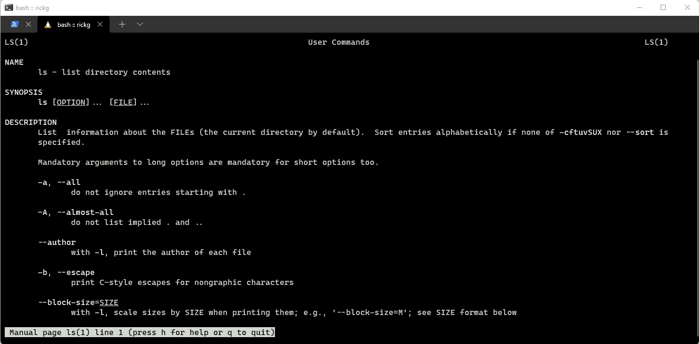

# Command Line

References

- [git](https://git-scm.com/)

## Table of Contents

- [Abbreviations](#abbreviations)
- [Introduction](#introduction)
- [Terminal Introduction](#terminal-introduction)
- [Installing Terminal](#installing-terminal)
- [Path and Folders](#path-and-folders)
- [Moving Around](#moving-around)
- [Listing Files](#listing-files)
- [Files and Folders](#files-and-folders)
- [Command Line Cheat Sheet](developer-fundamentals.command-line.cheatsheet.md)

## Abbreviations

- \*[CLI]: Command Line Interface
- \*[WSL]: Windows Subsystem for Linux

## Introduction

In this subunit, we'll introduce you to the Command Line, how to navigate with it, and create folders in it. The most essential part of working with the Terminal is knowing how to navigate around within it. We'll start by teaching you some essential commands like `ls`, `mkdir`, `pwd`, and `cd` so you can always know where you are and move to where you want to go.

When you're starting to visualize how the Terminal and command line work, think about finder or Windows explorer. You use these tools to navigate through the files, folders, and directories in your computer - and to open things like applications. The Terminal and command line offer you another way to explore these files and directories, through commands you type. Only the functionality you get from Terminal is far more powerful and robust - for instance, you can push your entire codebase to GitHub with one line... or pull down any updates that have been made. We'll explore how to do this in the next unit.

## Terminal Introduction

### Goals

- Define what Terminal is and how it is structured
- Navigate through and list files on your machine
- Define the following terms: shell, terminal, directory, absolute path, relative path
- List files using flags
- Create, move, copy and remove files
- Explain what the following commands do: `cat`, `echo`, `less`, `open`

### What is Terminal

Terminal is an application that gives us a command line interface (CLI) to interact with the computer.

Everything you can do in Finder or Windows Explorer, you can do in Terminal, but it's faster!

### What is a shell Bash/ZSH

You will also hear the term "shell" when learning about Terminal, so it is important to distinguish between these terms.

**shell**
: the program which actually processes commands adn returns output

Most shells also manage foreground and background processes, command history and command line editing.

These features (and many more) are standard in bash, the most common shell in modern linux systems

**terminal**
: a wrapper program which runs a shell

Decades ago, this was a physical device consisting of little more than a monitor and keyboard.

As unix/linux systems added better multiprocessing and windowing systems, this terminal concept was abstracted into software.

## Installing Terminal

If you're on a Mac or Linux, you're good to go! Simply launch the Terminal application

- If you're using a Windows machine we recommend using [Git Bash](https://gitforwindows.org/)

There are other options for installing a Terminal on Windows, however the most user-friendly option for this course is Git Bash. If you choose to use another option like WSL, that is totally

## Path and Folders

In Terminal, all files and folders begin at the root directory

The root directory is noted by a `/`.

Inside the root directory are essential files/folders that your machine needs, but we do not modify the files and folders in the root directory often.

### The users folder

Inside the root directory, we have a folder called **Users** which contains all the user accounts on your computer.

If you move into the directory for your user account, you will be in the **home** directory, which is denoted by `~`.

For example, if your username on the computer is **colt**, then your home directory would be `/Users/colt`.

A synonym for the `/Users/colt` path is `~` when you are logged in as **colt**.

## Moving Around

The firs thing you want to start to understand when using Terminal is how to navigate from folder to folder.

### Where am I

Before you start moving around, it’s helpful to know where you are.

Thankfully, there is a handy command called `pwd` which will display the absolute path and let you know what current directory you are working in.

So if you are ever unsure, just type in `pwd` (which is short for print working directory).

### Moving around

One of the most common commands you will be using in Terminal is `cd` which is short for “change directory.”

In order to change a directory, type `cd` followed by the directory or a path to the directory.

If we want to move up a directory we use `cd ..` and if we want to move into a directory we specify the name of the directory we are moving into.

For example, if you are in your home directory and type `cd Desktop`, you should move into your Desktop directory.

We just mentioned that you can type `cd` followed by a directory or path. But what is a path?

### Absolute Paths vs Relative Paths

A path is simply the way to reach a file or folder; it's like an address for the file or folder you're trying to reach.

When we specify a path starting from the root directory `/`, we call that an absolute path.

If you’re currently in the `~` home directory, and you want to change directories into the Desktop folder, here are two following ways:

1. `cd Desktop` - relative to where I am currently
2. `cd /Users/colt/Desktop` - absolute, starting from the root (first `/`, then **Users**, then **colt**, then **Desktop**)

### Moving around the terminal efficiently

One of the hardest parts about getting used to the Terminal is the handling an interface where you can not easily use a mouse!

This means we will have lots of typing to do and quite a few shortcuts to learn!

If you hold down the alt/option key you can click on a line in the terminal to move your cursor there, but it is still much easier to get comfortable with keyboard shortcuts

### Useful keyboard shortcuts

- `Command/Control + a` (move to beginning of line)
- `Command/Control + e` (move to end of line)
- `Command/Control + w` (delete the word where your cursor is)
- `Command/Control + u` (delete an entire line)
- `Option/Alt + left/right` (jump between words)

## Listing Files

One of the most important commands you are going to be using is `ls`, which lists the contents of a directory.

Typing `ls` in your home directory will show you all the files and folders inside that directory.

Sometimes the default `ls` command does not give us all the information we want. In such cases, we'll need to add some flags to get more details.

### Flags

- Flags can change and even enhance commands and are added using a `-` after the command.
- Flags are usually represented by single uppercase and lowercase letters.
- With the `ls` command, we can pass in the -`a` flag to list "all" files (including hidden files and folders).
- If we want the `ls` command to give us more information about each file, we can pass in the `-l` flag.
- To combine flags we can just use one `-` adn pass in each flag. So the command to use `ls` and show all files and more detailed information about each one would be `ls -la`.

Using flags for `ls` will be essential when working with permissions as well as when you start working with **[git](https://git-scm.com/)**.

### Using the manual to learn more

If you ever want to learn more about a terminal command you can use the `man` command followed by the terminal command to see a manual on the command!

Let’s try it with `ls`

```bash
man ls
```



## Files and Folders

### Creating Files And Folders

To create a folder we use the `mkdir` command (short for “make directory”), followed by the name (or space-separated names) of the folder(s) that we would like to create.

```bash
mkdir first_folder
```

Now that we made the **first_folder**, how do we change directories into it?

We use the `cd` command!

Now that we are inside our new folder, **first_folder**, let's create a new file. A simple way to create a file is with the `touch` command.

```bash
touch first_file
```

### Displaying Contents Of A File

You can display the contents of a file using the `cat` command.

If you type `cat NAME_OF_FILE` you can see the contents of the file easily, right there in Terminal.

Let’s add some text to a file so that we can use `cat`.

```bash
echo "Hello World" > first_file
```

The `echo` command simply writes text to the terminal.

The `>` is called a redirect. The `>` redirects the output from the command on the left side into the file on the right hand side.

We will see more on redirection later on!

### Opening up a file

If you would like to open up a file, you can use the `open` command.

So if we want to see the contents of **first_file** we can do `open first_file`.

The `open` command is also very useful if you want to open all the files and folders in a directory.

### Moving Files And Folders

To move files and folders we use `mv` command. Let's try this out!

```bash
mv test.txt ../
```

### Renaming files and folders

```bash
mv test.txt newfile.txt
```

### Copying Files and Folders

Sometimes you may want to make a copy of a file or a folder. To copy a file, we use the `cp` command (short for copy).

```bash
cp PATH_TO_ORIGINAL_FILE PATH_TO_COPIED_FILE
```

For example, if we wanted to create a copy of **test.txt** and call it **test_copy.txt**, we could enter the following command (assuming we’re inside of **first_folder**):

```bash
cp test.txt test_copy.txt
```

In order to copy a directory, you need to modify the `cp` command as follows:

```bash
cp -r first_folder first_folder_copy
```

The `-r` is called a _flag_; you can think of a flag for a command as an option that can be passed to that command.

To learn more about the flags that you can pass to `cp`, you can type `man cp`.

### Deleting Files And Folders

To remove a file or a folder we use `rm` command.

```bash
rm newfile.txt
```

If this works, you should not see any output from the Terminal. You can always run `ls` make sure the file is not there

### Where did it go

Now that it is gone… where did it go? The Trash? The answer is it is completely removed from your computer.

There is no undo so be **VERY** careful when using the `rm` command.

### Removing a folder

It turns out that `rm` is for a file, while the command `rmdir` is used to remove (empty) directories.

If there is anything inside the folder, you will have to use `rm -rf`.

Like we saw with `cp`, the `r` and `f` in `-rf` are examples of flags