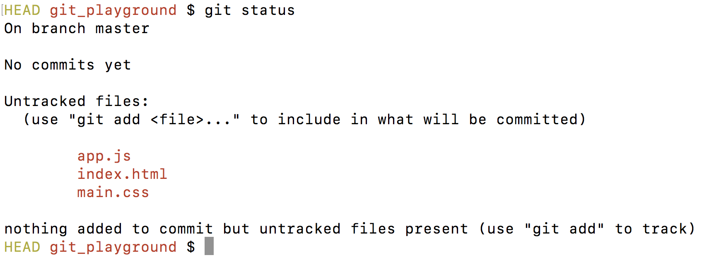
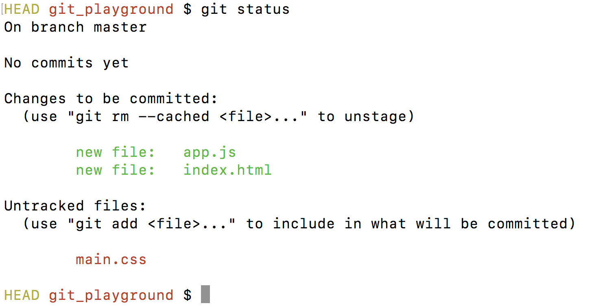
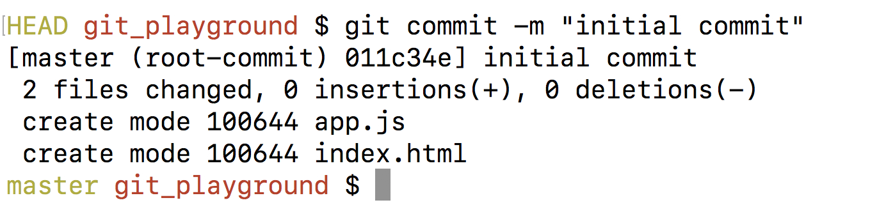

# Git Fundamentals


[](https://git-scm.com/docs)

## Table of Contents

1. [Abbreviations](#abbreviations)
2. [Introduction](#introduction)
3. [Local Workflow](#local-workflow)
4. [Committing Workflow](#committing-workflow)
5. [git config Settings](#git-config-settings)
6. [Best Practices](#best-practices)
7. [Git Fundamentals Cheat Sheet](../../../cheatsheets/developer-fundamentals.git-fundamentals.cheat-sheet.md)

## Abbreviations

- \*[VCS]: Version Control System

## Introduction

In this subunit, we'll introduce you to **git**. Git is a **command line argument**, and **the most popular form of version control in the world**. It is the first of two tools you'll need to master work effectively with a team. At the end of the subunit, you'll have a short exercise, so you can practice git to your heart's content.

When you're working in a professional setting, you won't be the only developer on your team (unless you're the first hire at a startup). One of the most important professional skills you can have as a software engineer is effectively collaborating with your teammates. This doesn't just mean knowing how to communicate, there are tools you'll need to master to manage a large codebase and work on it simultaneously with other developers. If you don't regularly put the code you're working on in a place where others can access it, then people won't be able to build on your improvements. If you don't regularly pull the code other people are working on, you won't be able to take advantage of the new features they're implementing or bugs they've fixed. But how will you be able to keep track of changes made across thousands of lines of code and hundreds of files?

### Goals

- Describe why Git is useful
- Describe the workflow for using Git locally
- Define what a VCS is
- Initialize an empty git repository, and explain what the command `git init` does
- Remove a git repository

[](#table-of-contents)

### What is Git

If you google "what is git” you will probably see the definition for "an unpleasant or contemptible person." Thankfully, Git is much better than that. According to [the Git documentation](https://git-scm.com/doc):

"Git is a free and open source distributed version control system designed to handle everything from small to very large projects with speed and efficiency."

In plain English, Git is a tool that allows developers to track versions of their code over time.

It does this by creating "snapshots" of the current state of the code base whenever you tell it to.

Put simply, Git is essential when collaborating with other developers to ensure that previous "snapshots" of the code can be revisited if necessary.

This is helpful when revisiting breaking changes or undoing changes.

When you're learning about tools like Git, you’ll often see the acronym VCS. This stands for **Version Control System**

Git is a VCS because it lets you create different versions of your code and easily swap back and forth between different versions.

While Git is a hugely popular VCS, it’s not the only one. Subversion is another example.

[](#table-of-contents)

### Installing Git

Before we can get started with anything Git related, we need to make sure you have Git installed.

In your terminal, type in `git —version`; if you do not see an error, you are good to go.

If you are seeing any errors, you may need to install Git on your computer.

If you’re on Linux, try running `sudo apt-get install git` or

If you’re on Windows - [download](https://git-scm.com/downloads)

[](#table-of-contents)

### Getting started with Git

Once you have Git installed, you need to “initialize” a repository with Git before you can start using it

run the command `git init` inside of a folder to do this!

This creates a **.git** folder which is what allows you to start using git in that folder

### Initializing a repository in the wrong place

If you accidentally initialize a repository in the wrong directory, you can just remove the **.git** folder using `rm -rf .git`.

You **don’t** want to make your Desktop or Home folder a git repository!

[](#table-of-contents)

## Local Workflow

- Three areas
  - Working Directory
  - Staging Area (added, but not committed)
  - Repository (added and committed)

### Git status

- In order to see where our files are in the local workflow we run the command `git status`
- Untracked files will be in red text
- Tracked but uncommitted files will be in green text
- After committing our working directory will be clean and no longer show the committed files

### Working Directory

- The working directory holds files that we are working on but have not yet saved to git
- As files are edited, git sees that they have been modified but their changes are not recorded
- Let's imagine we just created a new repository
- If we run the command `git status`, it would look something like this



- All files have been modified are shown in red text
- These files are untracked until we move them to the staging area with the command `git add`

### Git add

- Git add is used to save our modified files so that they will be included in the next commit
- This allows us to choose what modified changes we want to save and which changes we want to ignore
- The command `git add` followed by the name of the file moves that file to the staging area
- To move all modified files to the staging area at once we use `git add .`

This is what git status would look like after adding ‘app.js’ and ‘index.html’



‘main.css’ will not be included in the next commit unless it is moved to staging

### Staging Area

- If we move a modified file to the staging area, we are preparing to commit teh state of the file at that point
- If we continue working on that file we have to add again or the new changes won't be tracked
- The staging area is where we save teh state of the work we are preparing to include with the next commit
- Files that are staged are shown in green text

### Git commit

- Once we are satisfied with the work of a file in our staging area we commit it to the local repository
- We need include a commit message that summarizes the changes that were made in that commit
- The message is connected to the commit with the `-m` flag
  - `git commit -m "summary of this commit"`
- A commit is still local until we push it to a remote repository (more on this later)

After making the commit will see a message similar to this



[](#table-of-contents)

## Committing Workflow

- `git status` - What files have been added/modified?
- `git diff` - Among those files, what has been changed?
- `git add NAME_OF_FILE` - Add NAME_OF_FILE to staging area
- `git commit -m` - Commit the file with a message!
- Optional: `git log` - See a log of all your commits

[](#table-of-contents)

## git config Settings

If you take a look at `git log` you may not see any information for the author and email.

Here’s how you change it:

```bash
git config --global user.name "YOUR NAME"
git config --global user.email "YOUR EMAIL"
```

If you also find it annoying to press `q` every time in `git log`, you can change this as well

```bash
git config --global --replace-all core.pager cat
```

Another config setting is showing color in the shell for git

```bash
got config --global color.ui auto
```

These global configuration settings live in a file call **.gitconfig** which typically lives in your home directory. Try running `cat ~/.gitconfig` to see all your settings!

[](#table-of-contents)

## Best Practices

1. **Atomic Commits** - includes changes related to only one feature or task of your program
   - if something you change turns out ro cause some problems, it is easy to revert the specific change without losing other changes
   - enables you to write better commit messages
2. leveraging those atomic commits to make your commit messages more useful

[How to write a Git Commit Message](https://cbea.ms/git-commit/)

[](#table-of-contents)
