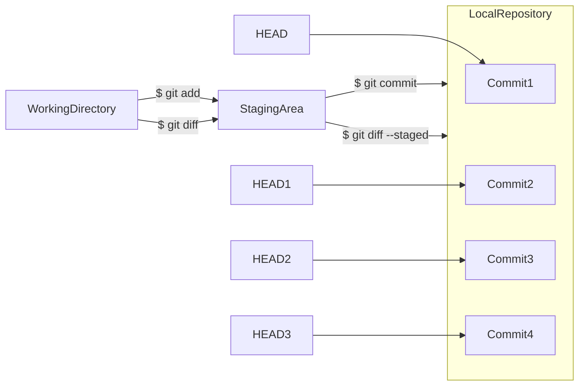
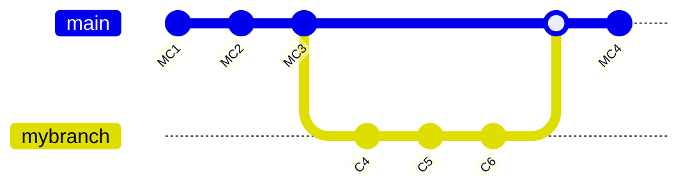
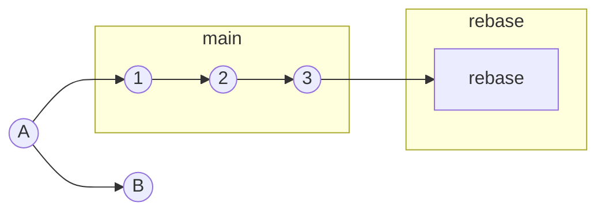
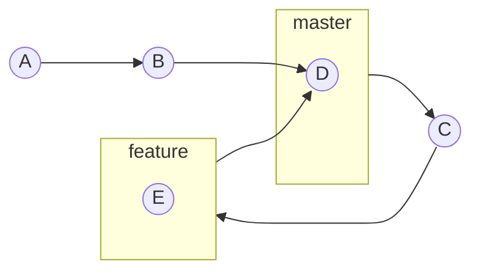
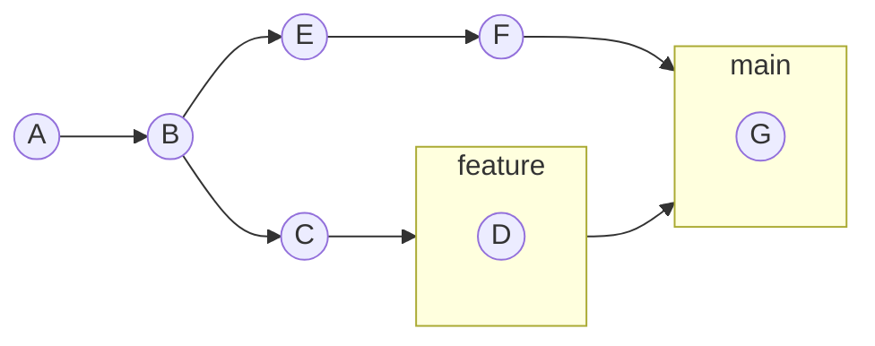
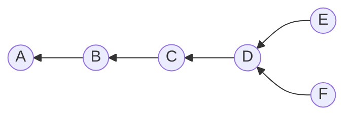
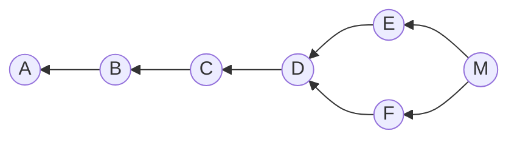
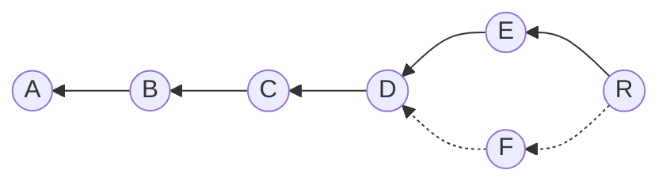

# Git

A simplylearn course

## TOC

1. [Git Basics](#git-basics)
2. [Getting Started With Git](#getting-started-with-git)
3. [Github and Remotes](#github-and-remotes)
4. [Branching Merging and Rebasing in Git](#branching-merging-and-rebasing-in-git)

## Abbreviations

\*[VCS]: Version Control System

## Git Basics

### Introduction to Git

- Git provides a flexible environment to work collaboratively and securely
- Has a Version Control System (VCS) to allow multiple users:
  - to modify the same file,
  - to record and track changes,
  - to revert to earlier versions
  - to compare multiple versions of a file
  - to manage conflicts and merge files
- Allows users to create and manage remote repositories (repos)
- Facilitates branching and merging of files with the main repo
- Allows each user to have a copy of the file locally thus keeping the file in the server secure

[back](#toc)

### Limitations fo Existing VCS and What is Git

- Limitations of Existing VCS
  - Existing VCS have a centralized architecture
  - Changes cannot be done offline
    - User retrieves the file, makes changes, and commits
    - Next user can only pull the data when online
  - All changes are made in the central server
    - Connecting to the central server is necessary to make edits
    - Leaves no room for error
- What is Git?
  - A VCS - distributed revision control system aimed at:
    - speed
    - data integrity
    - security

[back](#toc)

### Git Configuration Levels

- Three levels of configuration
  - System level: `--system`
    - applicable to all users who use the system where git is installed
    - **command:** `git config --system`
    - saves to: `/etc/gitconfig`
  - Global level: `--global`
    - applicable to user settings for all repos
    - **command:** `git config --global`
    - saves to: `~/.gitconfig`
  - Local level: `--local`
    - applicable to the current repo only
    - **command:** `git config --local` or `git config`
    - saves to: `.git/config`

> 📎 NOTE 📎
>
> Local overrides Global and Global overrides System Level.

The following settings needs to be configured for all commits:

- user.name
- user.email

[back](#toc)

## Getting Started with Git

### Creating a Git Repository

Steps to Create a Git Repository

1. Create an empty directory and change directory into created directory `mkdir <directory-name> && cd <directory-name>`
1. Convert the directory into repository `git init`
1. **ALT:** `git init <directory-name>` combines steps 1 & 2
1. Run git status `git status`

> 📎 NOTE 📎
>
> **`git init`** command creates a hidden directory that stores all the metadata required for it to function.

### Git Workflow

Git maintains three snapshots of a file maintained in separate directories:

1. Working Directory
   - refers to the directory where git was initialized by `git init` command
   - when a file is entered/created in this directory, it is **untracked**
   - Staging Area
     - area where files are moved to when **tracked**
     - **command:** `git add`
1. **.git/index file**
   - storage of staged files
1. Local Repository
   - file moved to this area when it is committed
   - **command:** `git commit`

#### Working Directory to Staging Area

- Working Directory
  1. drop a file into the directory
  2. add the file using `git add` command
- Staging Area

  - tracked
  - ready to commit

  1. commit the file to the local repo by using the `git commit` commands

- Local Repository
  - once the file is committed to the local repo, the working directory is cleaned
  - the local repo is in sync with the latest changes in the working repo

> 📎 NOTE 📎
>
> While committing, it is important to add a message using the **-m flag**.
> If missing, a default editor opens asking for comments.

### Managing and Viewing Changes

To modify a file in git --> Update --> Add --> Commit

To view the changes in a file:

- **command:** `git log`
  - lists all the commands enacted on the file in reverse chronological order by:
    - Commit ID
    - Author
    - Date
    - Commit Message

> 📎 NOTE 📎
>
> To restrict the output to one line, execute: **`git log --oneline`**,
> this will display the information is a single line.
>
> > Another useful command to display more readable information on oneline with multiple branches execute: **`git log --oneline --decorate --graph`**

### Tracking File Changes

Ability to identify changes between the different versions of the same file, spread across various repos

> 📎 NOTE 📎
>
> Command `git diff --staged` is similar to `git diff HEAD`

> :bulb: If the number of commits increase beyond a certain count, use the
> **hashcode** command.
>
> `git diff <commit hashcode>`

**command:** `git diff`

- view the changes of a modified file in it's working directory and it's staged state

**command:** `git diff --staged`

- view the changes of the staged file and it's last commit of the same file

Once in the local repo, the latest commit of a file is pointed to by a pointer called **HEAD**

- each of the previous commits are also pointed to by a pointer called **HEADX** where X is an incremented number beginning with 1

### Reverting to Earlier Commits

Steps to Revert to Earlier Commits in Git

1. List details of the commit associated with a file **command:** `git log`
2. Stage the file **command:** `git checkout <version-code>` or `git checkout HEAD~1 <filename>`
3. Share the command to unstage the file **command:** `git status`
4. Remove the file from the staging area and bring it back to the working directory **command:** `git reset`

### Deleting Files in Git

Deleting Files from Staging Area and Working Directory

- Delete the file from staging area and working directory **command:** `git rm <filename>`
  - To verify file has been removed from the staging area **command:** `git ls-files --stage`
- Delete a file only from the staging area **command:** `git rm --cached <filename>`

> 📎 NOTE 📎
>
> This file will be untracked as it is removed from the staging area.

#### Restoring Deleted Files

The deleted file history is still in the repo

- **command:** `git checkout <version> <filename>`

### Ignoring File in Git

How to ignore Files in Git

- Add the file to a **.gitignore** file
  - stores file name
  - stores file pattern
- The file name and file pattern can be overridden using the **-f flag**

### Renaming Files in Git

Steps to Rename Files in Git

1. **command:** `git mv <filename> <new-filename>`
2. **command:** `git add .`
3. **command:** `git commit -m "renamed <filename> => <new-filename>"`
4. **command:** `git status`

[back](#toc)

## Github and Remotes

### Introduction to Github

#### Github Basics

- Web-based Git repository hosting service
- Web interface to upload files
- Copies files from the local repository to the remote repository
- Local repository aka **main**
- Remote repository aka **origin**

### Creating a Repository in Github

There are two protocols you can use to create a repo

1. HTTPS
1. SSH

#### Steps to Create a Repository in Github using HTTPS

1. Go to Github and login
1. Create a new repository
1. Follow Github instructions
   1. Create a symbolic link to Github
   1. Push from local repository to Github

#### Creating a Repository in Github using SSH

1. Ensure the local repository is ready
1. Create an SSH key (ssh-keygen)
1. Configure Github with SSH Public Key
1. Create a Github repository
1. Push from local repository to Github

> NOTE:
>
> The SSH key helps you create a repository without a username and password.

### Pulling Commits from Github

- to push changes from local (main) to remote (origin) **command:** `git push origin main`

Sometimes, files on origin (remote) may change without having come from main (local) so, you will need to pull from origin to main.

- **command:** `git pull origin main`

### Managing Multiple Commits in Git

Scenario: same file has been changed in the local and remote repos

How does Git manage these changes?

- when you attempt to push your change from the local, Git identifies the file on the remote has changed as well
- Git will reject the push action and suggest you do a pull changes from remote
- once the changes are pulled, the remote commit comes to the local and git will merge those changes in with the local changes
- this forces an additional commit at the local which then can be pushed to the remote later

### Merging File Changes in Git

What are these file changes?

Scenario: User A want to modify a particular line of a file in the local repo, User B want to modify the same line of the same file in the remote repo

- User A attempts to pull the change, git shows a conflict and suggest to resolve the conflict manually
- To resolve conflicts manually **command:** `git merge`

[back](#toc)

## Branching Merging and Rebasing in Git

### Branching in Git

Branching is very important in Git. It helps:

1. reducing errors
1. protecting the content in the main repo

Branches are separate workspaces created when you need to:

- experiment or test something without impacting the main code base
- manage releases
- create hotfixes to the production branches

#### Branches Example

Main Branch is automatically created when you initialize a git repo

A branch is a method of requesting a new working directory and staging area.

> NOTE:
>
> A Git branch is just a pointer to the commits; it does not change the contents of the repository.

#### Branch Commands

- create a new branch **command:** `git branch <branch name>`
- list all branches in current repo **command:** `git branch`
- switch to a branch **command:** `git checkout <branch name>`
- merge branches **command:** `git merge <branch name>`

> NOTE:
>
> To create a new branch and switch to it, execute: **`git checkout -b <branch name>`**

### Merging Branches in Git

#### Merging Branches - Prerequisites

- analyze the difference between them
  - prevent conflicts
  - **command:** `git diff` or `git diff <branch name>..<diff branch name>`

#### Steps to Merge Branches

1. switch to the branch you want to merge to
1. execute: **`git merge <branch name>`**
   1. `<branch name>` is the branch you want to merge from

### Fast Forward and Recursive Merge

Git employs a merge algorithm based on the context it has to merge to

**Fast Forward Merge** - Employed when you merge into a branch, the latest commit of which is your parent

- When one branch has been created from a parent branch (in this case the main) and no more commits have been done to the parent branch
- Git moves the main label to the latest commit brought from the branch
- Used when a Hotfix is needed over the production code base to fix bugs

**Recursive Merge** - Employed when dealing with multiple merge bases

- When one branch has been created from a parent branch (in this case the main) and there have been more commits done to the parent branch since the creation of child branch
- Git creates another commit on the parent branch and brings all the changes into this additional commit

### Resolving Merge Conflicts in Git

_Scenario:_

**What causes conflicts?**

Two users change the same line in a file. One user wants to delete the line while the other just wants to modify the line. Git does not have any idea how to merge these changes together, so it shows the conflict in the file.

**How does Git resolve these conflicts?**

Normally, if Git can resolve them it will do so automatically. However, in this scenario, it has no clue so it flags the file and requests a manual resolve.

### Stashing in Git

#### Stashing Across Branches

- revert to the last commit, without interrupting the current work **command:** `git stash`
- records the current state of the working directory and the staging area and revert to a clean working directory
- To query what is stashed **command:** `git stash list`
- any user can revert to your saved snapshot (stash) and pick up where you left off
  - **command:** `git stash apply` (snapshot stays on the stash list)or
  - **command:** `git stash pop command` (snapshot is removed from the stash list once reverted to it)

### Rebasing in Git

#### Why Rebase?

Collaboration is essential in a development environment

When you want to branch off from another commit (A) and start developing your own feature (B), it is likely your feature is dependant on a subsequent commit done on another branch (main). What you do is get the last commit from that branch (3). Git rebase will get used in this case.

**Rebasing** if the process of moving a branch to a different commit.

#### Rebase Example

- rebase the current branch to the latest commit in main **command:** `git rebase master`

#### Rebase vs Merge

**Rebase** and **Merge** are designed to integrate changes across branches

Commits E & F will result in a conflict that can be resolved with either `git merge` or `git rebase`. Lets try `git merge` first.

**Git Merge**

**Merge** will result in a new commit M which will inherit the changes from both commits. However, this will pollute the history and make it confusing for other developers later on.

**Git Rebase**

In **Rebase**, commit F will completely vanishes and its contents are available in commit R. This creates a clean, straight history easily understood by future developers.

> NOTE:
>
> Never use a **"git rebase"** on public branches.

### Cloning in Git

#### What is cloning?

**Cloning** help in creating a copy of the repository and link it to the original repository.

Accomplished in two ways

1. copy the entire working directory of the original repo
1. clone the original repo

Clone takes two arguments **`<URL of the original repo>`** and **`<destination directory>`**. The duplicate repo is in sync with the original repo.

[back](#toc)
