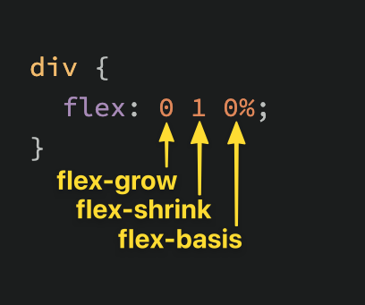

# Flexbox

[](https://developer.mozilla.org/en-US/docs/Learn/CSS/CSS_layout/Flexbox) |
[](https://www.w3schools.com/cssref/default.asp) |
[DevDocs](https://devdocs.io/) |
[The Odin Project](https://www.theodinproject.com/)

# Table of Contents

1. [Abbreviations](#abbreviations)
1.  [Introduction](#introduction)
1.  [Growing and Shrinking](#growing-and-shrinking)
1.  [Axes](#axes)
1.  [Alignment](#alignment)

## Abbreviations

- \*[CSS]: Cascading Style Sheets
- \*[HTML]: Hypertext Markup Language

## Introduction

As you’ll learn, there are _many_ ways to move elements around on a web page. Over the years, new methods have been developed, and older things have fallen out of style. Flexbox is a [relatively new](https://medium.com/@BennyOgidan/history-of-css-grid-and-css-flexbox-658ae6cfe6d2) way of manipulating elements in CSS, and when it was introduced it was _revolutionary_.

Because it is somewhat new as a technology, many resources put it near the end of their curriculum, but at this point, it has become the default way of positioning elements for many developers. Flexbox will be one of the most used tools in your toolbox, so why not learn it first?

### Goals

- You will learn how to position elements using flexbox.
- You will learn about flex containers and flex items.
- You will learn how to create useful components and layouts that go beyond just stacking and centering items.
- You’ll learn the 3 properties that are defined by the **flex** shorthand, and how to use them individually.
- You’ll learn about the 2 “axes” of a flex container.
- You’ll learn how to change those axes to arrange your content in columns instead of rows.
- You'll learn how to align items inside a flex container both vertically and horizontally

### Before we get started

Flexbox layouts can get a little complicated. In a previous lesson you learned how to inspect and debug things using your browser’s developer tools. Those tools will be _crucial_ for you in the following lessons. If something isn’t behaving the way you expect, inspecting it in the developer tools should be your first step _every time_.

### Let's Flex

Flexbox is a way to arrange items into rows or columns, where those items will flex (i.e. grow or shrink) based on some simple rules that you can define. To get started, let’s look at a simple demonstration. For all of the exercises here, take your time to inspect the code and really understand what’s going on. Actually playing with the code yourself will make it much easier to retain this information.

[](https://codepen.io/TheOdinProjectExamples/pen/QWgNxrp)

We’ll get into exactly what’s going on here soon enough, but for now, uncomment the two flex related lines in the above CSS and check out the result. All 3 divs should now be arranged horizontally. If you resize your browser you’ll also see that the divs will ‘flex’. They will fill the available area, and will each have equal width.

If you add another div to the HTML, inside of `.flex-container`, it will show up alongside the others, and everything will flex to make it fit.

> **Note**
>
> If it’s hard to see what’s going on in the small embedded CodePen, feel free to click the “Edit on CodePen” or “Fork on Codepen” button.
> This will bring the example into a full-sized environment.
> Some of the later examples might especially benefit from doing this.

#### Flex Containers and Flex Items

As you’ve seen, flexbox isn’t just a single CSS property, but a whole toolbox of properties that you can use to put things where you need them. Some of these properties belong on the flex container and some go on the flex items. This is a simple but important concept.

A flex container is any element that has `display: flex` on it. A flex item is any element that lives directly inside of a flex container.


Somewhat confusingly, any element can be both a flex container and a flex item. Said another way, you can also put `display: flex` on a flex item, and then use flexbox to arrange its children.

This method of creating and nesting multiple flex containers and items is the primary way we will be building up complex layouts. The next image was achieved using _only_ flexbox to arrange, size, and place the various elements. Flexbox is a _very_ powerful tool.


[](#table-of-contents)

## Growing and Shrinking

### The flex shorthand

The **flex** declaration is actually a shorthand for 3 properties that you can set on a flex item. These properties affect how flex items size themselves within their container. You’ve seen some shorthand properties before, but we haven’t officially defined them yet.

> Shorthand properties are CSS properties that let you set the values of multiple other CSS properties simultaneously.
> Using a shorthand property, you can write more concise (and often more readable) stylesheets, saving time and energy.
>
> Source: [Shorthand properties on MDN](https://developer.mozilla.org/en-US/docs/Web/CSS/Shorthand_properties)

In this case, **flex** is actually a shorthand for **flex-grow**, **flex-shrink** and **flex-basis**.



The default value of the **flex** property is shown in the above screenshot: `flex-grow: 0`, `flex-shrink: 1`, `flex-basis: 0%`. Very often you see the flex shorthand defined with only one value. In that case, that value is applied to **flex-grow**, so when we put **flex: 1** on our divs, we were actually specifying `flex: 1 1 0%`.

[](#table-of-contents)

### flex-grow

**flex-grow** expects a single number as its value, and that number is used as the flex-item’s “growth factor”. When we applied `flex: 1` to every div inside our container, we were telling every div to grow the same amount. The result of this is that every div ends up the exact same size. If we instead add `flex: 2` to just one of the divs, then that div would grow to 2x the size of the others.

In the following example the **flex** shorthand has values for **flex-shrink** and **flex-basis** specified with their default values.

[](https://codepen.io/TheOdinProjectExamples/pen/YzQqvgK)

[](#table-of-contents)

### flex-shrink

**flex-shrink** is similar to **flex-grow**, but sets the “shrink factor” of a flex item. **flex-shrink** only ends up being applied if the size of all flex items is larger than their parent container. For example, if our 3 divs from above had a width declaration like: `width: 100px`, and **.flex-container** was smaller than **300px**, our divs would have to shrink to fit.

The default shrink factor is `flex-shrink: 1`, which means all items will shrink evenly. If you do not want an item to shrink then you can specify `flex-shrink: 0`;. You can also specify higher numbers to make certain items shrink at a higher rate than normal.

Here’s an example. Note that we’ve also changed the **flex-basis** for reasons that will be explained shortly. If you shrink your browser window you’ll notice that **.two** never gets smaller than the given width of 250px, even though the **flex-grow** rule would otherwise specify that each element should be equally sized.

[](https://codepen.io/TheOdinProjectExamples/pen/JjJXZVz)

An important implication to notice here is that when you specify **flex-grow** or **flex-shrink**, flex items do not necessarily respect your given values for **width**. In the above example, all 3 divs are given a width of 250px, but when their parent is big enough, they grow to fill it. Likewise, when the parent is too small, the default behavior is for them to shrink to fit. This is not a bug, but it could be confusing behavior if you aren’t expecting it.

[](#table-of-contents)

### flex-basis

**flex-basis** simply sets the initial size of a flex item, so any sort of **flex-growing** or **flex-shrinking** starts from that baseline size. The shorthand value defaults to `flex-basis: 0%`. The reason we had to change it to **auto** in the **flex-shrink** example is that with the basis set to **0**, those items would ignore the item’s width, and everything would shrink evenly. Using **auto** as a flex-basis tells the item to check for a width declaration (`width: 250px`).

> **Important note about flex-basis:**
>
> There is a difference between the default value of **flex-basis** and the way the **flex** shorthand defines it if no **flex-basis** is given.
> The actual default value for **flex-basis** is **auto**, but when you specify `flex: 1` on an element, it interprets that as `flex: 1 1 0`.
> If you want to _only_ adjust an item’s **flex-grow** you can simply do so directly, without the shorthand, or you can be more verbose and use the full 3 value shorthand `flex: 1 1 auto`.

[](#table-of-contents)

### In practice...

In practice you will likely not be using complex values for **flex-grow**, **flex-shrink** or **flex-basis**. Generally, you’re most likely to use declarations like `flex: 1;` to make divs grow evenly and `flex-shrink: 0` to keep certain divs from shrinking.

It _is_ possible to get fancy, and set up layouts where some columns relate to each other in a specific ratio, so it’s useful to know that you can use other values, but those are relatively rare.

[](#table-of-contents)

## Axes

The most confusing thing about flexbox is that it can work either horizontally or vertically, and the way some rules work changes a bit depending on which direction you are working with.

The default direction for a flex container is horizontal, or row, but you can change the direction to vertical, or column. The direction can be specified in CSS like so:

```css
.flex-container {
  flex-direction: column;
}
```

### Axes

No matter which direction you’re using, you need to think of your flex-containers as having 2 axes: the main axis and the cross axis. It is the direction of these axes that changes when the **flex-direction** is changed. In most circumstances, `flex-direction: row` puts the main axis horizontal (left-to-right), and **column** puts the main axis vertical (top-to-bottom).

In other words, in our very first example, we put `display: flex` on a div and it arranged its children horizontally. This is a demonstration of `flex-direction: row`, the default setting. The following example is very similar. If you uncomment the line that says `flex-direction: column`, those divs will stack vertically.

[](https://codepen.io/TheOdinProjectExamples/pen/BaZKPdw)

One thing to note is that in this example, `flex-direction: column` would not work as expected if we used the shorthand `flex: 1`. Try it out now (i.e. go change the flex value on the `flex: 1 1 auto`; line). Can you figure out why it does not work if `flex: 1` is used? The divs collapse, even though they clearly have a **height** defined there.

The reason for this is that the flex shorthand expands flex-basis to 0, which means that all **flex-grow**ing and **flex-shrink**ing would begin their calculations from **0**. Empty divs by default have 0 height, so for our flex items to fill up the height of their container, they don’t actually need to have any height at all.

The example above fixed this by specifying `flex: 1 1 auto`, telling the flex items to default to their given **height**. We could also have fixed it by putting a height on the parent `.flex-container`, or by using `flex-grow: 1` instead of the shorthand.

Another detail to notice: when we changed the flex-direction to **column**, **flex-basis** refers to **height** instead of **width**. Given the context this may be obvious, but it’s something to be aware of.

We’ve strayed from the point slightly… We were talking about flex-direction and axes. To bring it back home, the default behavior is `flex-direction: row` which arranges things horizontally. The reason this often works well without changing other details in the CSS is because block-level elements default to the full width of their parent. Changing things to vertical using `flex-direction: column` adds complexity because block-level elements default to the height of their content, and in this case there _is_ no content.

> There are situations where the behavior of flex-direction could change if you are using a language that is written top-to-bottom or right-to-left, but you should save worrying about that until you are ready to start making a website in Arabic or Hebrew.

[](#table-of-contents)

## Alignment

So far everything we’ve touched with flexbox has used the rule `flex: 1` on all flex items, which makes the items grow or shrink equally to fill all of the available space. Very often, however, this is not the desired effect. Flex is also very useful for arranging items that have a specific size.

Let's look at another example.

[](https://codepen.io/TheOdinProjectExamples/pen/MWoyBzR)

You should be able to predict what happens if you put `flex: 1` on the `.item` by now. Give it a shot before we move on!

Adding `flex: 1` to **.item** makes each of the items grow to fill the available space, but what if we wanted them to stay the same width, but distribute themselves differently inside the container? we can to this!

Remove `flex: 1` from **.item** and add `justify-content: space-between` to **.container**. Doing so should give you something like this:


**justify-content** aligns items across the **main axis**. There are a few values that you can use here. You'll learnt the rest of them in the reading assignments, but for now try changing it to **center**, which should center the boxes along the main axis.

To change the placement of items along the **cross axis** use **align-items**. Try getting the boxes to the center of the container by adding `align-items: center` to **.container**. The desired result looks like this:


Because **justify-content** and **align-items** are based on the main and cross axis of your container, their behavior changes when you change the flex-direction of a flex-container. For example, when you change **flex-direction** to **column**, **justify-content** aligns vertically and **align-items** aligns horizontally. The most common behavior, however, is the default, i.e. **justify-content** aligns items horizontally (because the main axis defaults to horizontal), and **align-items** aligns them vertically. One of the biggest sticking points that beginners have with flexbox is confusion when this behavior changes.

[](#table-of-contents)

### GAP

One more very useful feature of flex is the **gap** property. Setting **gap** on a flex container simply adds a specified space between flex items, very similar to adding a margin to the items themselves. **gap** is a _very_ new property so it doesn't show up in very many resources yet, but it works reliably in all modern browsers, so it is safe to use and is very handy! Adding `gap: 8px;` to the centered example above produces the result below.

[](https://codepen.io/rgoshen/pen/rNYJdrq)

There's more for you to learn in the reading below, but at this point surely you can see how immensely useful flexbox is. Using just the properties we've already covered you could already put together some impressive layouts!

Take your time going through the reading. There will be some review of the items we've already covered here, but it goes into more depth and touches on a few things that haven't been mentioned yet. Don't stress too much about trying to memorize every little detail yet; just code along with the examples and do your best to internalize everything that is _possible_ with flexbox. You'll have to reach for these resources again once you get to the practice exercises, but that's perfectly acceptable. The more you use this stuff the better it will stick in your mind...anf you will be using it _constantly_. Have fun!

[](#table-of-contents)

## Further Reading

- [Basic Concepts fo flexbox](https://developer.mozilla.org/en-US/docs/Web/CSS/CSS_Flexible_Box_Layout/Basic_Concepts_of_Flexbox)
- [Aligning Items in a Flex Container](https://developer.mozilla.org/en-US/docs/Web/CSS/CSS_Flexible_Box_Layout/Aligning_Items_in_a_Flex_Container)
- [Typical use case of Flexbox](https://developer.mozilla.org/en-US/docs/Web/CSS/CSS_Flexible_Box_Layout/Typical_Use_Cases_of_Flexbox)
- [CSS Tricks "Guide to Flexbox"](https://css-tricks.com/snippets/css/a-guide-to-flexbox/)
