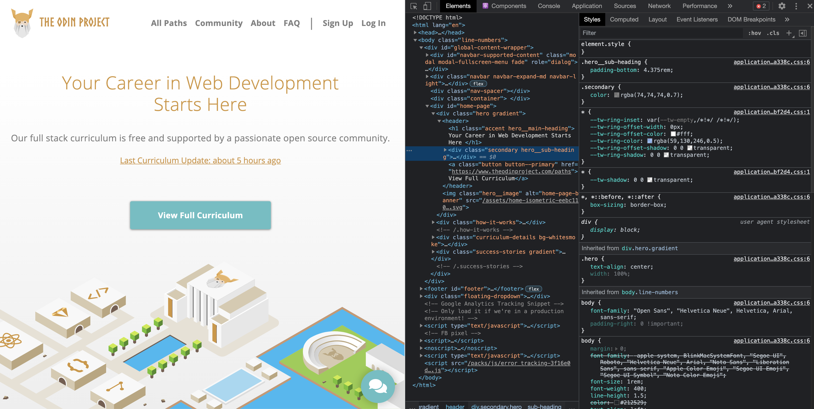
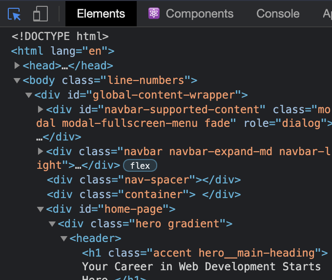
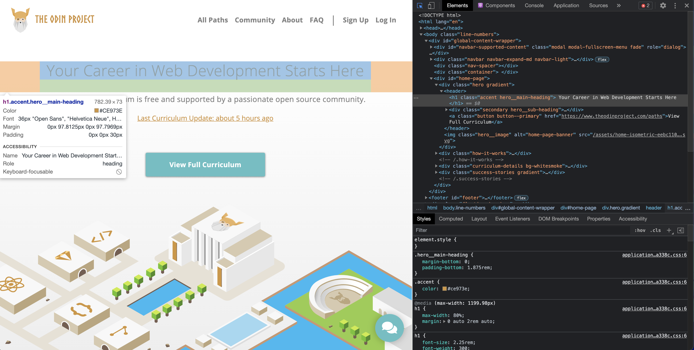
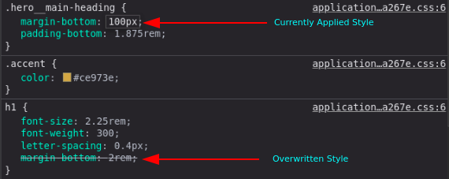
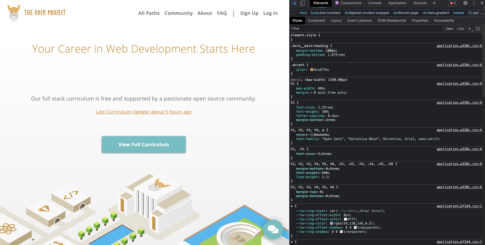
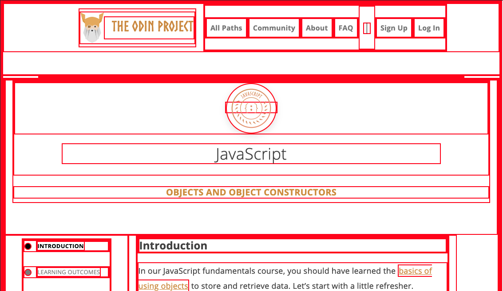
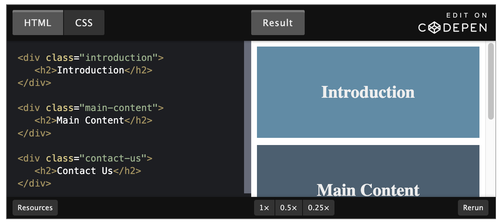
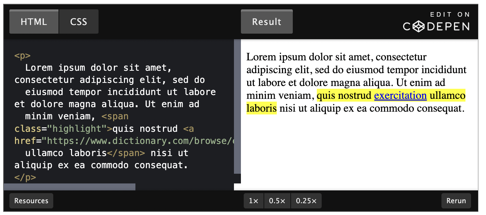

# Foundations

[](https://developer.mozilla.org/en-US/docs/Web/css) |
[](https://www.w3schools.com/cssref/default.asp) |
[DevDocs](https://devdocs.io/) |
[The Odin Project](https://www.theodinproject.com/) |
[](https://developer.chrome.com/docs/devtools/)

## Table of Contents

1. [Abbreviations](#abbreviations)
1.  [Introduction](#introduction)
1.  [CSS Foundations](#css-foundations)
1.  [Inspecting HTML and CSS](#inspecting-html-and-css)
1.  [The Box Model](#the-box-model)
1.  [Block and Inline](#block-and-inline)

## Abbreviations

- \*[CSS]: Cascading Style Sheets
- \*[HTML]: Hypertext Markup Language

## Introduction

In the previous lesson you learned how to write the HTML that determines how a web page is structured. The next step is to make that structure look good with some style, which is exactly what CSS is for. In this lesson we’re going to focus on what we believe are some foundational CSS concepts, things that everyone should know from the beginning - whether they are just starting out or simply need a refresher.

### Goals

- Add styles to HTML and CSS
- Understand how to use the class and ID attributes
- Add styles to specific elements using the correct selectors
- Understand what cascade does
- You will know how to access the element inspector
- You will know how to select and inspect specific elements
- You will know how to test out HTML and CSS in the inspector
- You’ll learn all about the box model
- You’ll learn how to make sure elements are just the right size with **margin**, **padding**, and **borders**
- You’ll learn about “Normal flow”
- You’ll learn the difference between **block** and **inline** elements
- You’ll learn which elements default to **block** and which elements default to **inline**
- You’ll learn what divs and spans are

[](#table-of-contents)

## CSS Foundations

### Basic Syntax

At the most basic level, CSS is made up of various rules. These rules are made up of a selector (more on these in a bit) and a semi-colon separated list of declarations, with each of those declarations being made up of a property:value pair.


> **NOTE:** A `<div>` is one of the basic HTML elements. It is simply an empty container.
> In general it is best to use other tags such as `<h1>` or `<p>` for content in your projects, but as we learn more about CSS you’ll find that there are many cases where the thing you need is just a container for other elements.
> Many of our exercises use plain `<div>`s for simplicity.
> Later lessons will go into much more depth about when it is appropriate to use the various HTML elements.

[](#table-of-contents)

### Selectors

Selectors simply refer to the HTML elements to which CSS rules apply; they’re what is actually being “selected” for each rule. The following subsections don’t cover every selector available, but they’re by far the most common and the ones you should get comfortable using first.

[](#table-of-contents)

#### Universal Selector

The universal selector will select elements of any type, hence the name “universal”, and the syntax for it is a simple asterisk. In the example below, every element would have the `color: purple;` style applied to it.

```css
* {
  color: purple;
}
```

[](#table-of-contents)

#### Type Selectors

A type selector (or element selector) will select all elements of the given element type, and the syntax is just the name of the element:

```html
<!-- index.html -->

<div>Hello, World!</div>
<div>Hello again!</div>
<p>Hi...</p>
<div>Okay, bye.</div>
```

```css
/* styles.css */

div {
  color: white;
}
```

Here, all three `<div>` elements would be selected, while the `<p>` element wouldn’t be.

[](#table-of-contents)

#### Class Selectors

Class selectors will select all elements with the given class, which is just an attribute you place on an HTML element. Here’s how you add a class to an HTML tag and select it in CSS:

```html
<!-- index.html -->

<div class="alert-text">Please agree to our terms of service.</div>
```

```css
/* styles.css */

.alert-text {
  color: red;
}
```

Note the syntax for class selectors: a period immediately followed by the case-sensitive value of the class attribute. Classes aren’t required to be unique, so you can use the same class on as many elements as you want.

Another thing you can do with the class attribute is add multiple classes to a single element as a space-separated list, such as `class="alert-text severe-alert"`. Since whitespace is used to separate class names like this, you should never use spaces for multi-worded names and should use a hyphen instead.

[](#table-of-contents)

#### ID Selectors

ID selectors are similar to class selectors. They select an element with the given ID, which is another attribute you place on an HTML element:

```html
<!-- index.html -->

<div id="title">My Awesome 90's Page</div>
```

```css
/* styles.css */

#title {
  background-color: red;
}
```

Instead of a period, we use a hashtag immediately followed by the case-sensitive value of the ID attribute. A common pitfall is people overusing the ID attribute when they don’t necessarily need to, and when classes will suffice. While there are cases where using an ID makes sense or is needed, such as taking advantage of specificity or to have links redirect to a section on the current page, you should use IDs **sparingly** (if at all).

The major difference between classes and IDs is that an element can only have **one** ID. An ID cannot be repeated on a single page, and the ID attribute should not contain any whitespace at all.

[](#table-of-contents)

#### Grouping Selector

What if we have two groups of elements that share some of their style declarations?

```css
.read {
  color: white;
  background-color: black;
  /* several unique declarations */
}

.unread {
  color: white;
  background-color: black;
  /* several unique declarations */
}
```

Both our `.read` and `.unread` selectors share the `color: white;` and `background-color: black;` declarations, but otherwise have several of their own unique declarations. To cut down on the repetition, we can group these two selectors together as a comma-separated list:

```css
.read,
.unread {
  color: white;
  background-color: black;
}

.read {
  /* several unique declarations */
}

.unread {
  /* several unique declarations */
}
```

Both of the examples above (with and without grouping) will have the same result, but the second example reduces repetition of declarations and makes it easier to edit either the **color** or **background-color** for both classes at once.

[](#table-of-contents)

#### Chaining Selectors

Another way to use selectors is to chain them as a list without any separation. Let’s say we had the following HTML:

```html
<div>
  <div class="subsection header">Latest Posts</div>
  <p class="subsection preview">This is where a preview for a post might go.</p>
</div>
```

We have two elements with the **subsection** class that have some sort of unique styles, but what if we only want to apply a separate rule to the element that also has **header** as a second class? Well, we could chain the two class selectors together in our CSS like so:

```css
.subsection.header {
  color: red;
}
```

What `.subsection.header` does is it selects any element that has both the **subsection** and **header** classes. Notice how there isn’t any space between the `.subsection` and `.header` class selectors. This syntax basically works for chaining any combination of selectors, with the exception of chaining more than one [type selector](#type-selectors).

In general, you can’t chain more than one type selector since an element can’t be two different types at once. For example, chaining two type selectors like `div` and `p`, would give us the selector **divp**, which wouldn’t work since the selector would try to find a literal `<divp>` element, which doesn’t exist.

[](#table-of-contents)

#### Descendant Combinator

Combinators allow us to combine multiple selectors differently than grouping or chaining them, as they show a relationship between the selectors. There are four types of combinators in total, but for right now we’re going to only show you the descendant combinator, which is represented in CSS by a single space between selectors. A **descendant combinator** will only cause elements that match the last selector to be selected if they also have an ancestor (parent, grandparent, etc) that matches the previous selector.

So something like `.ancestor` `.child` would select an element with the class **child** if it has an ancestor with the class **ancestor**. Another way to think of it is **child** will only be selected if it is nested inside of **ancestor**, no matter how deeply. Take a quick look at the example below and see if you can tell which elements would be selected based on the CSS rule provided:

```html
<!-- index.html -->

<div class="ancestor">
  <!-- A -->
  <div class="contents">
    <!-- B -->
    <div class="contents"><!-- C --></div>
  </div>
</div>

<div class="contents"></div>
<!-- D -->
```

```css
/* styles.css */

.ancestor .contents {
  /* some declarations */
}
```

In the above example, the first two elements with the **contents** class (B and C) would be selected, but that last element (D) won’t be. Was your guess correct?

There’s really no limit to how many combinators you can add to a rule, so `.one` `.two` `.three` `.four` would be totally valid. This would just select an element that has a class of **four** if it has an ancestor with a class of **three**, and if that ancestor has its own ancestor with a class of **two**, and so on. You generally want to avoid trying to select elements that require this level of nesting, though, as it can get pretty confusing and long, and it can cause issues when it comes to specificity.

[](#table-of-contents)

### Properties to Get Started With

There are some CSS properties that you’re going to be using all the time, or at the very least more often than not. We’re going to introduce you to several of these properties, though this is by no means a complete list. Learning the following properties will simply be enough to help get you started.

#### `color` and `background-color`

The `color` property sets an element’s text color, while `background-color` sets, well, the background color of an element. I guess we’re done here?

Almost. Both of these properties can accept one of several kinds of values. A common one is a keyword, such as an actual color name like **red** or the **transparent** keyword. They also accept HEX, RGB, and HSL values, which you may be familiar with if you’ve ever used a photoshop program or a site where you could customize your profile colors.

```css
p {
  /* hex example: */
  color: #1100ff;
  /* rgb example: */
  color: rgb(100, 0, 127);
  /* hsl example: */
  color: hsl(15, 82%, 56%);
}
```

Take a quick look at [CSS Legal Color Values](https://www.w3schools.com/cssref/css_colors_legal.asp) to see how you can adjust the opacity of these colors by adding an alpha value.

[](#table-of-contents)

#### Typography Basics and `text-align`

**font-family** can be a single value or a comma-separated list of values that determine what font an element uses. Each font will fall into one of two categories, either a “font family name” like **"Times New Roman"** (we use quotes due to the whitespace between words) or “generic family name” like **sans-serif** (generic family names never use quotes).

If a browser cannot find or does not support the first font in a list, it will use the next one, then the next one and so on until it finds a supported and valid font. This is why it’s best practice to include a list of values for this property, starting with the font you want to be used most and ending with a generic font family as a fallback, e.g. `font-family: "Times New Roman", sans-serif;`

**font-size** will, as the property name suggests, set the size of the font. When giving a value to this property, the value should not contain any whitespace, e.g. `font-size: 22px` has no space between “22” and “px”.

**font-weight** affects the boldness of text, assuming the font supports the specified weight. This value can be a keyword, e.g. `font-weight: bold`, or a number between 1 and 1000, e.g. `font-weight: 700` (the equivalent of bold). Usually the numeric values will be in increments of 100 up to 900, though this will depend on the font.

**text-align** will align text horizontally within an element, and you can use the common keywords you may have come across in word processors as the value for this property, e.g. `text-align: center`.

[](#table-of-contents)

#### Image Height and Width

Images aren’t the only elements that we can adjust the height and width on, but we want to focus on them specifically in this case.

By default, an `` element’s **height** and **width** values will be the same as the actual image file’s height and width. If you wanted to adjust the size of the image without causing it to lose its proportions, _you would use a value of “auto” for the height property and adjust the width value_:

```css
img {
  height: auto;
  width: 500px;
}
```

It’s best to include both of these properties for `` elements, even if you don’t plan on adjusting the values from the image file’s original ones. When these values aren’t included, if an image takes longer to load than the rest of the page contents, the image won’t take up any space on the page at first, but will suddenly cause a drastic shift of the other page contents once it does load in. Explicitly stating a **height** and **width** prevents this from happening, as space will be “reserved” on the page and will just appear as a blank space until the image loads.

[](#table-of-contents)

### The Cascade of CSS

Sometimes we may have rules that conflict with one another, and we end up with some unexpected results. “But I wanted these paragraphs to be blue, why are they red like these other paragraphs?!” As frustrating as this can be, it’s important to understand that CSS doesn’t just do things against our wishes. CSS only does what we tell it to do. One exception to this is the default styles that are provided by a browser. These default styles vary from browser to browser, and they are why some elements create a large “gap” between itself and other elements, or why buttons look the way they do, despite us not writing any CSS rules to style them that way.

So if you end up with some unexpected behavior like this it’s either because of these default styles, or due to not understanding how a property works or not understanding this little thing called the cascade.

The cascade is what determines which rules actually get applied to our HTML. There are different factors that the cascade uses to determine this, three of which we’ll go over to hopefully help you avoid (as many of) those frustrating “I hate CSS” moments.

#### Specificity

A CSS declaration that is more specific will take precedence over ones that are less specific. Inline styles, which we will go over more in the Adding CSS to HTML section towards the end of the lesson, have the highest specificity compared to selectors, while each type of selector has its own specificity level that contributes to how specific a declaration is. There are other selectors that contribute to specificity, but we’re focusing only on the ones mentioned in this lesson:

1. ID selectors (most specific selector)
1. Class selectors
1. Type selectors

Specificity will only be taken into account when an element has multiple, conflicting declarations targeting it, sort of like a tie-breaker. An ID selector will always beat any number of class selectors, a class selector will always beat any number of type selectors, and a type selector will always beat any number of anything less specific than it. When no declaration has a selector with a higher specificity, a larger amount of a single selector will beat a smaller amount of that same selector.

Let’s take a look at a few quick examples to visualize how specificity works.

```css
/* rule 1 */
.subsection {
  color: blue;
}

/* rule 2 */
.main .list {
  color: red;
}
```

In the example above, both rules are using only class selectors, but rule 2 is more specific because it is using more class selectors, so the `color: red;` declaration would take precedence.

```css
/* rule 1 */
.subsection {
  color: blue;
}

/* rule 2 */
.main .list {
  color: red;
}
```

In the example above, despite rule 2 having more class selectors than ID selectors, rule 1 is more specific because ID beats class. In this case, the `color: blue;` declaration would take precedence.

```css
/* rule 1 */
#subsection .list {
  background-color: yellow;
  color: blue;
}

/* rule 2 */
#subsection .main .list {
  color: red;
}
```

In this final example, both rules are using ID and class selectors, so neither rule is using a more specific selector than the other. The cascade then checks the amounts of each selector type. Both rules only have one ID selector, but rule 2 has more class selectors, so rule 2 has a higher specificity!

While the `color: red` declaration would take precedence, the `background-color: yellow` declaration would still be applied since there’s no conflicting declaration for it.

> Note: when comparing selectors you may come across special symbols for the universal selector (\*) as well as combinators (+, ~, >, and an empty space). These symbols do not add any specificity in and of themselves.

```css
/* rule 1 */
.class.second-class {
  font-size: 12px;
}

/* rule 2 */
.class .second-class {
  font-size: 24px;
}
```

Here both rule 1 and rule 2 have the same specificity. Rule 1 uses a chaining selector (no space) and rule 2 uses a descendant combinator (the empty space). But both rules have two classes and the combinator symbol itself does not add to the specificity.

```css
/* rule 1 */
.class.second-class {
  font-size: 12px;
}

/* rule 2 */
.class .second-class {
  font-size: 24px;
}
```

This example shows the same thing. Even though rule 2 is using a child combinator (>), this does not change the specificity value. Both rules still have two classes so they have the same specificity values.

```css
/* rule 1 */
* {
  color: black;
}

/* rule 2 */
h1 {
  color: orange;
}
```

In this example, rule 2 would have higher specificity and the orange value would take precedence for this element. Rule 2 uses a type selector, which has the lowest specificity value. But rule 1 uses the universal selector (\*) which has no specificity value.

[](#table-of-contents)

#### Inheritance

Inheritance refers to certain CSS properties that, when applied to an element, are inherited by that element’s descendants, even if we don’t explicitly write a rule for those descendants. Typography based properties (**color**, **font-size**, **font-family**, etc.) are usually inherited, while most other properties aren’t.

The exception to this is when directly targeting an element, as this always beats inheritance:

```html
<!-- index.html -->

<div id="parent">
  <div class="child"></div>
</div>
```

```css
/* styles.css */

#parent {
  color: red;
}

.child {
  color: blue;
}
```

Despite the **parent** element having a higher specificity with an ID, the **child** element would have the `color: blue` style applied since that declaration directly targets it, while `color: red` from the parent is only inherited.

[](#table-of-contents)

#### Rule Order

The final factor, the end of the line, the tie-breaker of the tie-breaker. Let’s say that after every other factor has been taken into account, there are still multiple conflicting rules targeting an element. How does the cascade determine which rule to apply?

Really simply, actually. Whichever rule was last defined is the winner.

```css
/* styles.css */

.alert {
  color: red;
}

.warning {
  color: yellow;
}
```

For an element that has both the **alert** and **warning** classes, the cascade would run through every other factor, including inheritance (none here) and specificity (neither rule is more specific than the other). Since the `.warning` rule was the last one defined, and no other factor was able to determine which rule to apply, it’s the one that gets applied to the element.

[](#table-of-contents)

### Adding CSS to HTML

Okay, we went over quite a bit so far. The only thing left for now is to go over how to add all of this CSS to our HTML. There are three methods to do so.

#### External CSS

External CSS is the most common method you will come across, and it involves creating a separate file for the CSS and linking it inside of an HTML’s opening and closing `<head>` tags with a self-closing `<link>` element:

```html
<!-- index.html -->

<head>
  <link rel="stylesheet" href="styles.css" />
</head>
```

```css
/* styles.css */

div {
  color: white;
  background-color: black;
}

p {
  color: red;
}
```

First, we add a self-closing `<link>` element inside of the opening and closing `<head>` tags of the HTML file. The **href** attribute is the location of the CSS file, either an absolute URL or, what you’ll be utilizing, a URL relative to the location of the HTML file. In our example above, we are assuming both files are located in the same directory. The **rel** attribute is required, and it specifies the relationship between the HTML file and the linked file.

Then inside of the newly created **styles.css** file, we have the selector (the **div** and **p**), followed by a pair of opening and closing curly braces, which create a “declaration block”. Finally, we place any declarations inside of the declaration block. `color: white;` is one declaration, with **color** being the property and **white** being the value, and `background-color: black;` is another declaration.

A note on file names: **styles.css** is just what we went with as the file name here. You can name the file whatever you want as long as the file type is .css, though “style” or “styles” is most commonly used.

A couple of the pros to this method are:

1. It keeps our HTML and CSS separated, which results in the HTML file being smaller and makes things look cleaner.
1. We only need to edit the CSS in one place, which is especially handy for websites with multiple pages that all share similar styles.

[](#table-of-contents)

#### Internal CSS

Internal CSS (or embedded CSS) involves adding the CSS within the HTML file itself instead of creating a completely separate file. With the internal method, you place all of the rules inside of a pair of opening and closing `<style>` tags, which are then placed inside of the opening and closing `<head>` tags of your HTML file. Since the styles are being placed directly inside of the `<head>` tags, we no longer need a `<link>` element that the external method requires.

Besides these differences, the syntax is exactly the same as the external method (selector, curly braces, declarations):

```html
<head>
  <style>
    div {
      color: white;
      background-color: black;
    }

    p {
      color: red;
    }
  </style>
</head>
<body>
  ...
</body>
```

This method can be useful for adding unique styles to a single page of a website, but it doesn’t keep things separated like the external method, and depending how many rules and declarations there are it can cause the HTML file to get pretty big.

[](#table-of-contents)

#### Inline CSS

Inline CSS makes it possible to add styles directly to HTML elements, though this method isn’t as recommended:

```html
<body>
  <div style="color: white; background-color: black;">...</div>
</body>
```

The first thing to note is that we don’t actually use any selectors here, since the styles are being added directly to the opening `<div>` tag itself. Next we have the `style=` attribute, with its value within the pair of quotation marks being the declarations.

If you need to add a _unique_ style for a _single_ element, this method can work just fine. Generally, though, this isn’t exactly a recommended way for adding CSS to HTML for a few reasons:

- It can get pretty messy pretty quickly once you start adding a lot of declarations to a single element, causing your HTML file to become unnecessarily bloated.
- If you want multiple elements to have the same style, you would have to copy + paste the same style to each individual element, causing lots of unnecessary repetition and more bloat.
- Any inline CSS will override the other two methods, which can cause unexpected results. (While we won’t dive into it here, this can actually be taken advantage of).

[](#table-of-contents)

## Inspecting HTML and CSS

Being able to inspect and debug your HTML and CSS is critical to frontend development. This lesson will take us through the Chrome Dev Tools, which allow you to see detailed information about your elements and CSS rules, as well as assist you in finding and fixing problems in your code.

### The Inspector

To open up the inspector, you can right click on any element of a webpage and click “Inspect Element” or press F12. For example, if you navigate to our [homepage](https://www.theodinproject.com/) and open the inspector, you might see something that looks a little bit like the image below. (Note that if you are already logged in to TOP you will not see the page shown below. If you want to stay logged in, use Incognito mode or your browser’s equivalent to separately view the page.)



Don’t get overwhelmed with all of the tools you’re now seeing! For this lesson, we want to focus on the Elements and Styles panes.

[](#table-of-contents)

### Inspecting Elements

In the Elements pane, you can see the entire HTML structure of your page. You can click on any of the elements in this pane to select that specific element. Alternatively, you can click the blue-highlighted icon shown below on the left, and hover over any element on the page.



When an element is selected, the Styles tab will show all of the currently applied styles, as well as any styles that are being overwritten (indicated by a strikethrough of the text). For example, if you use the inspector to click on the “Your Career in Web Development Starts Here” header on the TOP homepage, on the right hand side you’ll see all of the styles that are currently affecting the element, as seen below:





[](#table-of-contents)

### Testing Styles in The Inspector

The Styles pane also allows you to edit styles directly in the browser. You can click inside of any individual selector to add a new rule, or click on an existing attribute or value to alter it.

In the below image, we have altered the value of **margin-bottom** in the `.hero__main-heading` class, and the webpage responds with the changes in real time. This won’t affect the source code in your text editor, but it is extremely useful for quickly testing out various attributes and values without needing to reload the page over and over again.



[](#table-of-contents)

## The Box Model

Now that you understand the basic syntax of HTML and CSS, we’re going to get serious. The most important skills you need to master with CSS are positioning and layout. Changing fonts and colors is a crucial skill, but being able to put things exactly where you want them on a webpage is even more crucial. After all, how many webpages can you find where absolutely every element is just stacked one on top of another?

Learning to position elements on a webpage is not that difficult once you understand just a few key concepts. Unfortunately many learners race through learning HTML and CSS to get to JavaScript, and end up missing these fundamental concepts. This leads to frustration, pain (and [funny gifs](https://giphy.com/gifs/css-13FrpeVH09Zrb2)), because all of the JavaScript skills in the world are meaningless if you can’t stick your elements on the page where you need them to be. So with that in mind, let’s get started.

### The Box Model

The first important concept that you need to understand to be successful in CSS is the box model. It isn’t complicated, but skipping over it now will cause you much frustration down the line.

Basically, every single thing on a webpage is a rectangular box. These boxes can have other boxes in them and can sit alongside one another. You can get a rough idea of how this works by sticking a border on every item on the page like this:

```css
* {
  border: 2px solid red;
}
```


You can use the browser’s inspector to add the CSS above to this web page if you want. Boxes in boxes!



OK, so there might be some circles in the above image… but when it comes to layout, they fit together like rectangular boxes and not circles. In the end, laying out a webpage and positioning all of its elements is basically just deciding how you are going to nest and stack these boxes.

The only real complication here is that there are multiple ways to manipulate the size of these boxes, and the space between them, using **margin**, **padding**, and **border**. The assigned articles go into more depth on this concept, but to sum it up briefly: padding increases the space between the edge of a box and the content inside of it; margin increases the space between a box and any others that sit next to it; and border adds space (even if it’s only a pixel or two) between the margin and the padding. Be sure to study the diagrams carefully.


[](#table-of-contents)

## Block and Inline

The MDN box model article linked in the previous lesson mentions that different display types have subtly different box models, and that you can change how a box is calculated by changing the display property. We will explore the different **display** values you can use further in this lesson.

### Block vs Inline

Most of the elements that you have learned about so far are block elements. In other words, their default style is `display: block`. By default, block elements will appear on the page stacked atop each other, each new element starting on a new line.

Inline elements, however, do not start on a new line. They appear in line with whatever elements they are placed beside. A clear example of an inline element is a link, or `<a>` tag. If you stick one of these in the middle of a paragraph of text, it will behave like a part of the paragraph. The link’s text will sit alongside other words in that paragraph. Additionally, padding and margin behave differently on inline elements. In general, you do not want to try to put extra padding or margin on inline elements.

Inline-block elements behave like inline elements, but with block-style padding and margin. Inline-block is a useful tool to know about, but in practice you’ll probably end up reaching for flexbox more often if you’re trying to line up a bunch of boxes. Flexbox will be covered in depth in the next lesson.

[](#table-of-contents)

### Divs and Spans

We can’t talk about block and inline elements without discussing divs and spans. All the other HTML elements we have encountered so far give meaning to their content. For example, paragraph elements tell the browser the text it contains is to be displayed as a paragraph, and strong elements tell the browser the text within is important etc. Divs and spans, on the other hand, give no particular meaning to their content. They are just generic boxes that can contain anything.

Having elements like this available to us is a lot more useful than it may first appear. We will often need elements that serve no other purpose than to be “hook” elements we can give an id or class so we can target them for styling with CSS. Another use case we will face regularly is grouping related elements under one parent element to position them on the page correctly. Divs and spans provide us with the ability to do this.

Div is a block-level element by default. It is commonly used as a container element to group other elements. Divs allows us to _divide_ the page into different blocks and apply styling to those blocks.

[](https://codepen.io/TheOdinProjectExamples/pen/KKXXbwR)

Span is an inline-level element by default. It is commonly used to group text content and inline HTML elements so we can apply styling to them.

[](https://codepen.io/TheOdinProjectExamples/pen/abLLPor)

[](#table-of-contents)
