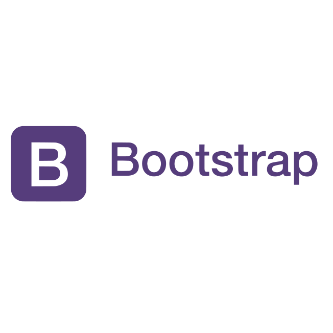

[](https://getbootstrap.com/)

# Bootstrap

### Bootstrap Lesson

[](https://getbootstrap.com/docs/5.1/getting-started/introduction/) |
[](https://fontawesome.com/docs)

# Table of Contents

1.  [Abbreviations](#abbreviations)
1.  [Introduction](#introduction)
1.  [Using Bootstrap](#using-bootstrap)
1.  [Layout](#layout)
1.  [Images](#images)
1.  [Tables](#tables)
1.  [Alerts](#alerts)
1.  [Buttons](#buttons)
1.  [UI Components](#ui-components)
1.  [JavaScript Components](#javascript-components)
1.  [Font Awesome](#font-awesome)
1. [Wrap-up](#wrap-up)
1. [Tutorials](#tutorials)

## Abbreviations

- \*[CSS]: Cascading Style Sheets
- \*[JS]: JavaScript

## Introduction

This unit will cover how to use one of the most popular libraries in web development: [Bootstrap](https://getbootstrap.com/). Libraries provide additional functionality outside of what is built-in the language. They provide new functionality for you to use without having to implement the functions and methods yourself. **Twitter Bootstrap** is a CSS library that will give you a tremendous amount of power for styling pages as you see fit. This library is extremely pervasive and relatively easy to use.

Bootstrap is the most widely used CSS framework. You'll be able to use its features to create more beautiful looking, neatly ordered web pages.

This is an optional subunit on Twitter Bootstrap. This material is very good to know, but not mandatory for course completion. You will find Bootstrap in some of the starter code throughout the course, but you will not need to know how to write any Bootstrap code in order to complete any projects. When reading through this code, you might be confused about what the Bootstrap does - in that case either Google the classes or refer to this subunit.

In this subunit, we'll cover Twitter Bootstrap. Bootstrap is one of the most popular CSS frameworks and is essential for modern front-end web development. We'll go over what Bootstrap is, why you would use it, and some of the most useful features it offers.

### Goals

- Learn benefits of Bootstrap & how to include it
- Learn Bootstrap layout/grid system
- Meet some of the more important components
- Learn to integrate Font Awesome into

### Benefits

- Make tricky column layouts easy
- Provides consistent results across browsers
- Make responsive design much easier
- Includes useful interactive components
  - Modals, dropdowns, popovers, etc.
- "Declarative" look and feel
  - Easier to theme
  - Familiar for writing custom CSS

### Responsive Groups

**xs** - cell phones in portrait mode
**sm** - cell phones in landscape / small tablets
**md** - tablets
**lg** - most desktop users
**xl** - very-wide desktop windows

### Semantic Colors

| Name      | Purpose                         | Default    |
| --------- | ------------------------------- | ---------- |
| primary   | Brand color                     | blue       |
| secondary | Neutral brand-appropriate color | grey       |
| success   | Operation successful            | green      |
| danger    | Dangerous operation / error     | red        |
| warning   | Risky operation                 | orange     |
| info      | FYI message                     | light blue |

Used for table cells, text, buttons, & more

[](#table-of-contents)

## Using Bootstrap

Include their CSS:

```html
<link
  href="https://cdn.jsdelivr.net/npm/bootstrap@5.1.3/dist/css/bootstrap.min.css"
  rel="stylesheet"
  integrity="sha384-1BmE4kWBq78iYhFldvKuhfTAU6auU8tT94WrHftjDbrCEXSU1oBoqyl2QvZ6jIW3"
  crossorigin="anonymous"
/>
```

To use interactive components, include JS:

```html
<script
  src="https://cdn.jsdelivr.net/npm/bootstrap@5.1.3/dist/js/bootstrap.bundle.min.js"
  integrity="sha384-ka7Sk0Gln4gmtz2MlQnikT1wXgYsOg+OMhuP+IlRH9sENBO0LRn5q+8nbTov4+1p"
  crossorigin="anonymous"
></script>
```

[](#table-of-contents)

## Layout

All content should descend from a container element:

**.container-fluid** - Full-browser-width container (with small amount of breathing room).

**.container** - Full-browser-width but at specific breakpoints. Makes Ul testing easier: far fewer possible layouts to test.

Content that doesn't need to be in columns can go directly in this.

### Grids

- 12 Column Layout
- Cells can span any number of columns
- After all columns are used, will become new row
- To use: all columns must be in a **.row**

```html
<div class="container">
  <div class="row">
    <div class="col-4">A</div>
    <div class="col-4">B</div>
    <div class="col-4">C</div>
    <div class="col-4">D</div>
    <div class="col-4">E</div>
    <div class="col-4">F</div>
  </div>
</div>
```

two rows of 3 columns

### Responsive Grid

- Can specify a breakpoint: that size and above use this
- Specification without breakpoint is for **xs**

_different # columns_

```html
<div class="container">
  <div class="row">
    <div class="col-6 col-md-4">A</div>
    <div class="col-6 col-md-4">B</div>
    <div class="col-6 col-md-4">C</div>
    <div class="col-6 col-md-4">D</div>
    <div class="col-6 col-md-4">E</div>
    <div class="col-6 col-md-4">F</div>
  </div>
</div>
```

(2 columns on cell phones; 3 columns for larger devices)

### Auto-Columns

- Can leave off numbers & divide by available size
- Useful when you don't know how many items there will be

_auto-columns_

```html
<div class="container">
  <div class="row">
    <div class="col">A</div>
    <div class="col">B</div>
  </div>

  <div class="row">
    <div class="col">C</div>
    <div class="col">D</div>
    <div class="col">E</div>
    <div class="col">F</div>
  </div>
</div>
```

**Learn more**: [](https://getbootstrap.com/docs/5.1/layout/grid/)

[](#table-of-contents)

## Images

**.img-fluid** - Make images responsive; won't be wider than parent

**Learn more**: [](https://getbootstrap.com/docs/5.1/content/images/)

[](#table-of-contents)

## Tables

**.table** - Get nice standard table look (use this plus other classes)

**.table-hover** - Hover-effect over a row

**.table-sm** - Tighten up margin around cells

**.table-striped** - Stripe alternative rows

**Learn more**: [](https://getbootstrap.com/docs/5.1/content/tables/)

[](#table-of-contents)

## Alerts

Useful for providing feedback/warnings:

**.alert** - (use this plus other classes)

**.alert-[semantic-color]** - Use color scheme for this level of message.

**Learn more**: [](https://getbootstrap.com/docs/5.1/components/alerts/)

[](#table-of-contents)

## Buttons

**.btn** - (Use this plus other classes)

**.btn-[semantic-color]** - Use color scheme for this level of message

**.btn-link** - Make button look like a `<a>` link

**.btn-lg** / **.btn-sm** - Make larger or smaller button

Can use on `<a>` links to look like buttons—very useful!

**Learn more**: [](https://getbootstrap.com/docs/5.1/components/buttons/)

[](#table-of-contents)

## UI Components

- Breadcrumbs
- Forms
- Lists
- Media cards
- Pagination sets
- and more!

**Learn more**: [](https://getbootstrap.com/docs/5.1/getting-started/introduction/)

[](#table-of-contents)

## JavaScript Components

- Carousels
- Collapse
- Dropdown
- Modals
- Popovers
- Tooltips
- and more!

**Learn more**: [](https://getbootstrap.com/docs/5.1/getting-started/introduction/)

[](#table-of-contents)

## Font Awesome

- [Awesome set](https://fontawesome.com/v5/cheatsheet) of icons for common symbols & brands
- Comes as a font, so it scales & can be in any color
- Convenient classes for resizing, animating, stacking, and more!

Include this:

```html
<link
  rel="stylesheet"
  href="https://cdnjs.cloudflare.com/ajax/libs/font-awesome/6.0.0/css/all.min.css"
  integrity="sha512-9usAa10IRO0HhonpyAIVpjrylPvoDwiPUiKdWk5t3PyolY1cOd4DSE0Ga+ri4AuTroPR5aQvXU9xC6qOPnzFeg=="
  crossorigin="anonymous"
  referrerpolicy="no-referrer"
/>
```

Use icons by name on a / or **span** tag

```html
<!DOCTYPE html>
<html>
  <head>
    <link
      rel="stylesheet"
      href="https://cdnjs.cloudflare.com/ajax/libs/font-awesome/4.7.0/css/font-awesome.min.css"
    />
  </head>
  <body>
    <i class="fa fa-car"></i>
    <i class="fa fa-car" style="font-size:48px;"></i>
    <i class="fa fa-car" style="font-size:60px;color:red;"></i>
  </body>
</html>
```

[](https://fontawesome.com/start)

[](#table-of-contents)

## Wrap-up

### Does everyone use Bootstrap

No

But almost everyone uses some CSS framework

Other popular frameworks:

- [Foundation](https://get.foundation/index.html)
- [Materialize](https://materializecss.com/)

### Theming Bootstrap

- Can write your own CSS to change things
- Can make your own Bootstrap with SASS (advanced)
- Can find thousands of Bootstrap themes
- Can easily use [Bootswatch](https://bootswatch.com/)

[](#table-of-contents)

