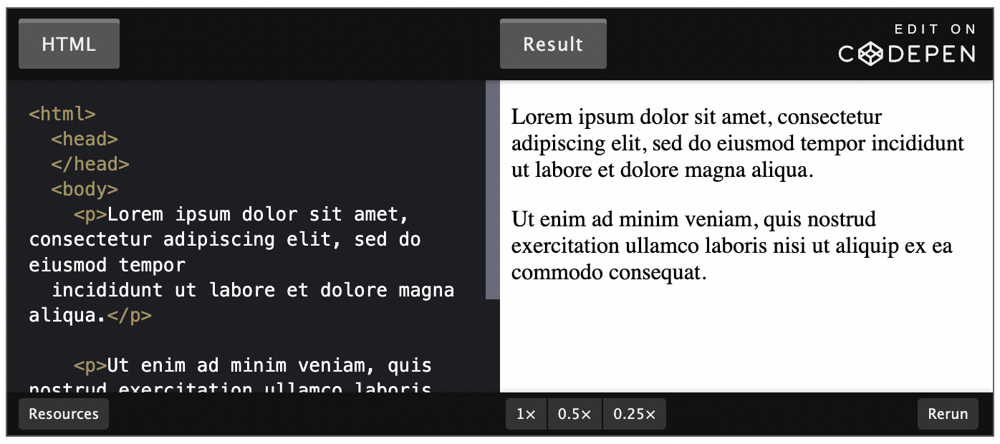
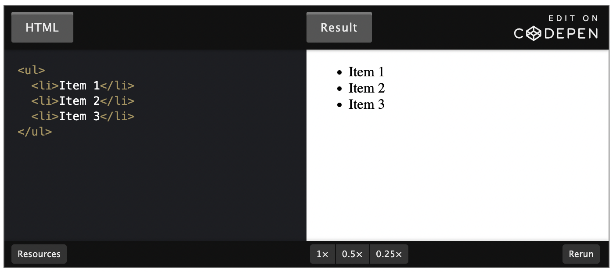

# HTML Foundations


[](https://developer.mozilla.org/en-US/docs/Web/HTML) |
[](https://www.w3schools.com/html/default.asp) |
[DevDocs](https://devdocs.io/) |
[The Odin Project](https://www.theodinproject.com/)

# Table of Contents

1. [Abbreviations](#abbreviations)
1. [Introduction](#introduction)
1. [Elements & Tags](#elements-and-tags)
1. [HTML Boilerplate](#html-boilerplate)
1. [Working with Text](#working-with-text)
1. [Lists](#lists)
1. [Links & Images](#links-and-images)

## Abbreviations

- \*[CSS]: Cascading Style Sheets
- \*[HTML]: Hypertext Markup Language

## Introduction

So here it is: it’s time to actually start making things. This section will teach you the basics of HTML and CSS, the two foundational building blocks of pretty much everything on the web.

### Goals

- Get a basic overview of HTML, CSS and how they work together
- Explain what HTML tags are
- Explain what HTML elements are
- How to write the basic boilerplate for an HTML document
- How to open HTML documents in your browser
- How to create paragraphs
- How to create bold text
- How to crete italicized text
- The relationships between nested elements
- How to create HTML comments
- How to create an unordered list
- How to create an ordered list
- How to create links to pages on other websites on the internet
- How to create links to other pages on you own website
- The difference between absolute and relative links
- How to display an image on webpage using HTML

### HTML and CSS

- HTML is the structure and raw data of the webpage
  - text, links, cards, lists, buttons and etc.
  - used to put information on the webpage
- CSS adds the style to all those HTML data
  - used to position that information, give it color, change font, etc.

[](#table-of-contents)

## Elements and Tags

Almost all elements on an HTML page are just pieces of content wrapped in opening and closing HTML tags.

Opening tags tell the browser this is the start of an HTML element. They are comprised of a keyword enclosed in angle brackets <>. For example, an opening paragraph tag looks like this: `<p>`.

Closing tags tell the browser where an element ends. They are almost the same as opening tags; the only difference is that they have a forward slash before the keyword. For example, a closing paragraph tag looks like this: `</p>`.

There are some HTML elements that do not have a closing tag. These are known as empty elements because they don’t wrap any content.

HTML has a [vast list of predefined tags](https://developer.mozilla.org/en-US/docs/Web/HTML/Element) that you can use to create all kinds of different elements. It is important to use the correct tags for content. Using the correct tags can have a big impact on two aspects of your sites: how they are ranked in search engines; and how accessible they are to users who rely on assistive technologies, like screen readers, to use the internet.

Using the correct elements for content is called semantic HTML. We will explore this in much more depth later on in the curriculum.

[](#table-of-contents)

## HTML Boilerplate

### Creating a HTML File

To demonstrate HTML boilerplate, we first need an HTML file to work with.

To let the computer know we want to create an HTML file, we need to append the filename with the **.html** extension as we have done when creating the **index.html** file.

It is worth noting that we named our HTML file index. We should always name the HTML file that will contain the homepage of our websites' **index.html**. This is because web servers will by default look for an **index.htm**l page when users land on our websites - and not having one will cause big problems.

_example/index.html_

```html
<!DOCTYPE html>
```

[](#table-of-contents)

### The DOCTYPE

Every HTML page starts with a doctype declaration. The doctype’s purpose is to tell the browser what version of HTML it should use to render the document. The latest version of HTML is HTML5, and the doctype for that version is simply `<!DOCTYPE html>`.

The `doctypes` for older versions of HTML were a bit more complicated. For example, this is the doctype declaration for HTML4:

```html
<!DOCTYPE html PUBLIC "-//W3C//DTD HTML 4.01 Transitional//EN" "http://www.w3.org/TR/html4/loose.dtd">
```

However, we probably won’t ever want to be using an older version of HTML, and so we’ll always use `<!DOCTYPE html>`.

Open the index.html file created earlier in your text editor and add `<!DOCTYPE html>` to the very first line.

_example/index.html_

```html
<!DOCTYPE html>
```

[](#table-of-contents)

### HTML Element

After we declare the doctype, we need to provide an `<html>` element. This is what’s known as the root element of the document, meaning that every other element in the document will be a descendant of it.

This becomes more important later on when we learn about manipulating HTML with JavaScript. For now, just know that the HTML element should be included on every HTML document.

Back in the index.html lets add the <html> element by typing out its opening and closing tags, like so:

```html
<!DOCTYPE html>
<html lang="en"></html>
```

**What is the <span style="color:red">lang</span> attribute?**

<span style="color:red">lang</span> specifies the language of the text content in that element. This attribute is primarily used for improving accessibility of the webpage. It allows assistive technologies, for example screen readers, to adapt according to the language and invoke correct pronunciation.

[](#table-of-contents)

### Head Element

The `<head>` element is where we put important meta-information **about** our webpages, and stuff required for our webpages to render correctly in the browser. Inside the `<head>`, we **should not** use any element that displays content on the webpage.

#### Title Element

One element we should always include in the head of an HTML document is the title element:

```html
<title>My First Webpage</title>
```

The title element is used to give webpages a human-readable title which is displayed in our webpage’s browser tab.

If we didn’t include a title element, the webpage’s title would default to its file name. In our case that would be **index.html**, which isn’t very meaningful for users; this would make it very difficult to find our webpage if the user has many browser tabs open.

#### The Charset Meta Element

Another important element we should always have in the head element is the meta tag for the charset encoding of the webpage: `<meta charset="utf-8">`.

Setting the encoding is very important because it ensures that the webpage will display special symbols and characters from different languages correctly in the browser.

There are many more elements that can go within the head of an HTML document. However, for now it’s only crucial to know about the two elements we have covered here.

Back in our **index.html**, let’s add a head element with a title and a charset meta element within it. The head element goes within the HTML element and should always be the first element under the opening `<html>` tag:

```html
<!DOCTYPE html>
<html lang="en">
  <head>
    <title>My First Webpage</title>
    <meta charset="UTF-8" />
  </head>
</html>
```

[](#table-of-contents)

### Body Element

The final element needed to complete the HTML boilerplate is the `<body>` element. This is where all the content that will be displayed to users will go - the text, images, lists, links, and so on.

To complete the boilerplate, add a body element to the **index.html** file. The body element also goes within the HTML element and is always below the head element, like so:

```html
<!DOCTYPE html>
<html lang="en">
  <head>
    <title>My First Webpage</title>
    <meta charset="UTF-8" />
  </head>
  <body></body>
</html>
```

[](#table-of-contents)

### Viewing HTML Files in the Browser

The HTML boilerplate in the **index.html** file is complete at this point, but how do you view it in the browser? There are a couple of different options:

> A note: In order to avoid branching our lesson’s instructions to accommodate for all the differences between browsers, we are going to be using Google Chrome as our primary browser for the remainder of this course.
> All references to the browser will pertain specifically to Google Chrome.
> We **strongly** suggest that you use Google Chrome for all of your testing going forward.

1. You can drag and drop an HTML file from your text editor into the address bar of your browser.
1. You can find the HTML file in your file system and then double click it. This will open up the file in the default browser your system uses.
1. You can use the terminal to open the file in your browser.
   1. **Ubuntu** - Navigate to the directory containing the file and use `google-chrome index.html`
   1. **macOS** - Navigate to the directory containing the file and use `open ./index.html`

Using one of the methods above, open up the **index.html** file we have been working on. You’ll notice the screen is blank. This is because we don’t have anything in our body to display.

Back in the index.html file, lets add a heading (more on these later) to the body, and save the file:

```html
<!DOCTYPE html>
<html lang="en">
  <head>
    <title>My First Webpage</title>
    <meta charset="UTF-8" />
  </head>
  <body>
    <h1>Hello World!</h1>
  </body>
</html>
```

Now, if you refresh the page in the browser, you should see the changes take effect, and the heading “Hello World!” will be displayed.

[](#table-of-contents)

### VSCode Shortcut

VSCode has a built-in shortcut you can use for generating all the boilerplate in one go. Please note that this shortcut only works while editing a file with the’.html’ extension or a text file with the HTML language already selected. To trigger the shortcut, delete everything in the **index.html** file and just enter `!` on the first line. This will bring up a couple of options. Press the enter key to choose the first one, and voilà, you should have all the boilerplate populated for you.

But it’s still good to know how to write the boilerplate yourself in case you find yourself using a text editor like notepad (heaven forbid) which doesn’t have this shortcut. Try not to use the shortcut in your first few HTML projects, so you can build some muscle memory of how to write the boilerplate code.

Resource: [HTML Validator](https://validator.w3.org/)

[](#table-of-contents)

## Working with Text

### Introduction

Most content on the web is text-based, so you will find yourself needing to work with HTML text elements quite a bit.

In this lesson, we will learn about the text-based elements you are likely to use the most.

### Paragraphs

What would you expect the following text to output on an HTML page?

```html
<body>
  Lorem ipsum dolor sit amet, consectetur adipiscing elit, sed do eiusmod tempor
  incididunt ut labore et dolore magna aliqua. Ut enim ad minim veniam, quis
  nostrud exercitation ullamco laboris nisi ut aliquip ex ea commodo consequat.
</body>
```

It looks like two paragraphs of text, and so you might expect it to display in that way. However, that is not the case, as you can see in the output below:

[](https://codepen.io/TheOdinProjectExamples/pen/xxrKqeV)

When the browser encounters new lines like this in your HTML, it will compress them down into one single space. The result of this compression is that all the text is clumped together into one long line.

If we want to create paragraphs in HTML, we need to use the paragraph element, which will add a newline after each of our paragraphs. A paragraph element is defined by wrapping text content with a `<p>` tag.

Changing our example from before to use paragraph elements fixes the issue:

[](https://codepen.io/TheOdinProjectExamples/pen/xxrKqeV)

[](#table-of-contents)

### Headings

Headings are different from other HTML text elements: they are displayed larger and bolder than other text to signify that they are headings.

There are 6 different levels of headings starting from `<h1>` to `<h6>`. The number within a heading tag represents that heading’s level. h1 is the most important and is larger than the other headings, and h6 is the lowest level and therefore the smallest of the headings.

Headings are defined much like paragraphs. For example, to create a h1 heading, we wrap our heading text in a `<h1>` tag.

[](https://codepen.io/TheOdinProjectExamples/pen/LYLPLbg)

Using the correct level of heading is important as levels provide a hierarchy to the content. A h1 heading should always be used for the heading of the overall page, and the lower level headings should be used as the headings for content in smaller sections of the page.

[](#table-of-contents)

### Strong Element

The `<strong>` element makes text bold. It also semantically marks text as important; this affects tools, like screen readers, that users with visual impairments will rely on to use your website. The tone of voice on a screen reader will change to communicate the importance of the text within a strong element. To define a strong element we wrap text content in a `<strong>` tag.

You can use strong on its own:

[](https://codepen.io/TheOdinProjectExamples/pen/qBjWXrB)

But you will probably find yourself using the strong element much more in combination with other text elements, like this:

[](https://codepen.io/TheOdinProjectExamples/pen/wvewqJr)

Sometimes you will want to make text bold without giving it an important meaning. You’ll learn how to do that in the CSS lessons later in the curriculum.

[](#table-of-contents)

### Em Element

The em element makes text italic. It also semantically places emphasis on the text, which again affects things like screen readers. To define an emphasized element we wrap text content in a `<em>` tag.

To use em on its own:

[](https://codepen.io/TheOdinProjectExamples/pen/wvewqpp)

Again, like the strong element, you will find yourself mostly using the em element with other text elements:

[](https://codepen.io/TheOdinProjectExamples/pen/VwWZzyj)

[](#table-of-contents)

### Nesting and Indentation

You may have noticed that in all the examples in this lesson we indent any elements that are within other elements. This is known as nesting elements.

When we nest elements within other elements, we create a parent and child relationship between them. The nested elements are the children and the element they are nested within is the parent.

In the following example, the body element is the parent and the paragraph is the child:

[](https://codepen.io/TheOdinProjectExamples/pen/oNwjEvO)

Just as in human relationships, HTML parent elements can have many children. Elements at the same level of nesting are considered to be siblings.

For example, the two paragraphs in the following code are siblings, since they are both children of the body tag and are at the same level of nesting as each other:

[](https://codepen.io/TheOdinProjectExamples/pen/ZEybrYx)

We use indentation to make the level of nesting clear and readable for ourselves and other developers who will work with our HTML in the future. It is recommended to indent any child elements by two spaces.

The parent, child, and sibling relationships between elements will become much more important later when we start styling our HTML with CSS and adding behavior with JavaScript. For now, however, it is just important to know the distinction between how elements are related and the terminology used to describe their relationships.

[](#table-of-contents)

### HTML Comments

HTML comments are not visible to the browser; they allow us to _comment_ on our code so that other developers or our future selves can read them and get some context about something that might not be clear in the code.

Writing an HTML comment is simple: we just put `<!-- and -->` at either end of the comment. For example:

[](https://codepen.io/TheOdinProjectExamples/pen/abwoyBg)

[](#table-of-contents)

## Lists

Whether it be IMDB’s top 250 movies or the FBI’s most wanted, lists are everywhere on the web, and you are going to need one eventually in your webpages.

Luckily, with HTML there are a couple of different types of lists at your disposal.

### Unordered Lists

If you want to have a list of items where the order doesn’t matter, like a shopping list of items that can be bought in any order, then you can use an unordered list.

Unordered lists are created using the `<ul>` element, and each item within the list is created using the list item element `<li>`.

Each list item in an unordered list begins with a bullet point:

[](https://codepen.io/TheOdinProjectExamples/pen/powjajd)

[](#table-of-contents)

### Ordered Lists

If you instead want to create a list of items where the order does matter, like step-by-step instructions for a recipe, or your top 10 favorite TV shows, then you can use an ordered list.

Ordered lists are created using the `<ol>` element. Each individual item in them is again created using the list item element `<li>`. However, each list item in an ordered list begins with a number instead:

[](https://codepen.io/TheOdinProjectExamples/pen/yLXYvYp)

[](#table-of-contents)

## Links and Images

Links are one of the key features of HTML. They allow us to link to other HTML pages on the web. In fact, this is why it’s called the web. The internet is essentially a web of HTML pages connected to one another with links.

In this lesson, we will learn how to create links and add some visual flair to our websites by embedding images.

### Preparation

To get some practice using links and images throughout this lesson we need an HTML project to work with.

1. Create a new directory named <span style="color:blue">odin-links-and-images</span>.
1. Within that directory, create a new file names <span style="color:blue">index.html</span>
1. Fill in the usual HTML boilerplate
1. Finally, add the following h1 to the body

```html
<h1>Homepage</h1>
```

[](#table-of-contents)

### Anchor Elements

To create a link in HTML, we use the anchor element. An anchor element is defined by wrapping the text or another HTML element we want to be a link with a `<a>` tag.

Add the following to the body of the index.html page we created and open it in the browser:

```html
<a>click me</a>
```

You may have noticed that clicking this link doesn’t do anything. This is because an anchor tag on its own won’t know where we want to link to. We have to tell it a destination to go to. We do this by using an HTML attribute.

An HTML attribute gives additional information to an HTML element and always goes in the element’s opening tag. An attribute is made up of two parts, a name, and a value. In our case, we need to add a href (hyperlink reference) attribute to the opening anchor tag. The value of the href attribute is the destination we want our link to go to.

Add the following href attribute to the anchor element we created previously and try clicking it again, don’t forget to refresh the browser so the new changes can be applied.

```html
<a href="https://www.theodinproject.com/about">click me</a>
```

By default, any text wrapped with an anchor tag without a **href** attribute will look like plain text. If the **href** attribute is present, the browser will give the text a blue color and underline it to signify it is a link.

It’s worth noting you can use anchor tags to link to any kind of resource on the internet, not just other HTML documents. You can link to videos, pdf files, images, and so on, but for the most part, you will be linking to other HTML documents.

[](#table-of-contents)

### Absolute and Relative Links

Generally, there are two kinds of links we will create:

1. Links to pages on other websites on the internet
1. Links to pages located on out own website

#### Absolute Links

Links to pages on other websites on the internet are called absolute links. A typical absolute link will be made up of the following parts: **protocol://domain/path**. An absolute link will always contain the protocol and domain of the destination.

We’ve already seen an absolute link in action. The link we created to The Odin Project’s About page earlier was an absolute link as it contains the protocol and domain.

https://www.theodinproject.com/about

#### Relative Links

Links to other pages within our own website are called relative links. Relative links do not include the domain name, since it is another page on the same site, it assumes the domain name will be the same as the page we created the link on.

Relative links only include the file path to the other page, relative to the page you are creating the link on. This is quite abstract, let’s see this in action using an example.

Within the <span style="color:blue">odin-links-and-images</span> directory, create another HTML file named <span style="color:blue">about.html</span> and paste the following code into it:

```html
<!DOCTYPE html>
<html>
  <head>
    <title>Odin Links and Images</title>
    <meta charset="UTF-8" />
  </head>

  <body>
    <h1>About Page</h1>
  </body>
</html>
```

Back in the index page, add the following anchor element to create a link to the about page:

```html
<body>
  <h1>Homepage</h1>
  <a href="https://www.theodinproject.com/about">click me</a>

  <a href="about.html">About</a>
</body>
```

Open the index file in a browser and click on the about link to make sure it is all wired together correctly. Clicking the link should go to the about page we just created.

This works because the index and about page are in the same directory. That means we can simply use the name of the `about.html` file <span style="color:blue">about.html</span> as the value of the href in the link.

But we will usually want to organize our website directories a little better. Normally we would only have the index.html at the root directory and all other HTML files in their own directory.

Create a directory named pages within the <span style="color:blue">odin-links-and-images</span> directory and move the <span style="color:blue">about.html</span> file into this new directory.

Refresh the index page in the browser and then click on the about link. It will now be broken. This is because the location of the about page file has changed.

To fix this, we just need to update the about link href value to include the **pages/** directory since that is the new location of the `about.html` file relative to the index file.

Refresh the index page in the browser and try clicking the about link again, it should now be back in working order.

In many cases, this will work just fine; however, you can still run into unexpected issues with this approach. Prepending `./` before the link will in most cases prevent such issues. By adding `./` you are specifying to your code that it should start looking for the file/directory _relative_ to the **current** directory.

```html
<body>
  <h1>Homepage</h1>
  <a href="./pages/about.html">About</a>
</body>
```

#### A Metaphor

Absolute and relative links are a tricky concept to build a good mental model of, a metaphor may help:

Think of the directory in which a website is located as a house, and each page on the website as a room in that house. Relative links are directions from the room you are currently in (the bedroom) to another room (the kitchen). Absolute links, on the other hand, are directions to an entirely different house.

[](#table-of-contents)

### Images

Websites would be fairly boring if they could only display text. Luckily HTML provides a wide variety of elements for displaying all sorts of different media. The most widely used of these is the image element.

To display an image in HTML we use the `` element. Unlike the other elements we have encountered so far, the `` element is empty. Which means it doesn’t have a closing tag.

Instead of wrapping content with an open and closing tag, it embeds an image into the page using a src attribute which tells the browser where the image file is located. The src attribute works much like the href attribute for anchor tags. It can embed an image using both absolute and relative paths.

For example, using an absolute path we can display an image located on The Odin Project site:

[](https://codepen.io/TheOdinProjectExamples/pen/gORbExZ)

To use images that we have on our own websites, we can use a relative path.

1. Create a new directory named <span style="color:blue">images</span> with in <span style="color:blue">odin-links-and-images</span> project
1. Next, download this [image](https://unsplash.com/photos/Mv9hjnEUHR4/download?force=true&w=640) and move it into the `images` directory we just created
1. Rename the image to dog.jpg

Finally add the image to the <span style="color:blue">index.html</span> file:

```html
<body>
  <h1>Homepage</h1>
  <a href="https://www.theodinproject.com/about">click me</a>

  <a href="pages/about.html">About</a>

  
</body>
```

Save the <span style="color:blue">index.html</span> file and open it in a browser to view Charles in all his glory.

[](#table-of-contents)

### Parent Directories

What if we want to use the dog image in the about page? We would first have to go up one level out of the `pages` directory into its parent directory, so we could then access the `images` directory.

To go to the parent directory we need to use two dots in the relative filepath like this: `../`. Let's see this in action, within the body of the <span style="color:blue">about.html</span> file, add the following image below the heading we added earlier:

```html

```

To break this down:

1. First, we are going to the parent directory of the `pages` directory which is <span style="color:blue">odin-links-and-images</span>
1. Then, from the parent directory, we can go into the <span style="color:blue">images</span> directory
1. Finally, we can access the **dog.jpg** file

Using the metaphor we used earlier, using `../` in a filepath is kind of like stepping out from the room you are currently in to the main hallway, so you can go to another room.

[](#table-of-contents)

### Alt attribute

Besides the src attribute, every image element should also have an alt (alternative text) attribute.

The alt attribute is used to describe an image, it will be used in place of the image if it cannot be loaded. It is also used with screen readers to describe what the image is to visually impaired users.

This is how The Odin Project logo example we used earlier looks with an alt attribute included:

[](https://codepen.io/TheOdinProjectExamples/pen/ExXjoEp)

As a bit of practice, add an alt attribute to the dog image we added to the <span style="color:blue">odin-links-and-images</span> project.

[](#table-of-contents)
