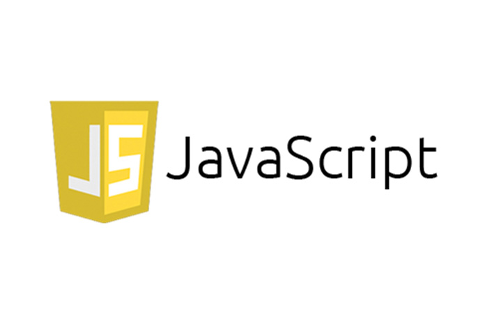

# forEach, map, and filter



[](https://developer.mozilla.org/en-US/docs/Web/JavaScript) |
[](https://www.w3schools.com/js/default.asp)

## Table of Contents

1. [Introduction](#introduction)
1. [forEach](#foreach)
1. [map](#map)
1. [filter](#filter)

## Introduction

In this subunit, we'll take a look at three of the most common array
methods: **forEach**, **map**, and **filter**. We'll explore the functionality of these methods and when to use them. We touched on higher order functions when we taught you about JavaScript functions back in the Web Fundamentals unit, in this subunit we'll dive deeper into what they are and how they can be used to write more elegant code. You'll do some practice with each of these methods as we go along because they are essential for working with modern JavaScript frameworks and codebases.

[](#table-of-contents)

## forEach

### Goals

- Understand what foreach does
- Write our own version of the forEach function

### Why do I need to know this

- Write cleaner and more declarative code
- Use built in higher order functions and callback functions
- Foundation for modern libraries and frameworks

### What does it do

- Loops through an array
- Runs a callback function for each value in the array and then returns **undefined**
- forEach will always return undefined - **no matter what**

### An Example

```javascript
let arr = [1, 2, 3];
arr.forEach(function (value, index, array) {
  console.log(value);
});

// i
// 2
// 3
// undefined
```

### Let's Build Our Own

- Loops through an array
- Runs a callback function on each value in the array
- returns **undefined**

```javascript
function forEach(array, callback) {
  for (let i = 0; i < array.length; i++) {
    callback(array[i], i, array);
  }
}
```

### An Example

```javascript
function countzeroes(arr) {
  let total = 0;
  arr.forEach(function (val) {
    if (val === 0) {
      totat++;
    }
  });
  return total;
}
countZeroes([2, 4, 6]); // 0 countzeroes([0,1,2,0,1]); // 2
```

Remember - forEach always returns undefined!

### When You Would Use forEach

- You want to iterate over an array, but the return value of your callback is not important
- Almost all of the time there are better options...

[](#table-of-contents)

## map

### Goals

- Understand what map does
- Write your own version of map

### What does it do

- Creates a new array
- Iterates through an array
- Runs a callback function for each value in the array
- Adds the result of that callback function to the new array
- Returns the new array
- map always returns a new array of the same length

### An Example

```javascript
let numbers = [1, 2, 3];
numbers.map(function (value, index, array) {
  return value * 10;
});

// [10,20,30]
```

### How Does It Work

```javascript
function map(array, callback) {
  let newArray = [];

  for (let i = 0; i < array.length; i++) {
    newArray.push(callback(array[i], i, array));
  }
  return newArray;
}
```

- Creates a new array
- Loops through an array
- Runs a callback function for each value in the array
- Pushes result of the callback function to the new array
- Returns the new array

### Using map In A Function

```javascript
function squareValues(array) {
  return array.map(function (value) {
    return value ** 2;
  });
}
squareValues([2, 3, 4]); // [4,9,16]

function extractCourse(array) {
  return array.map(function (value) {
    return value.course;
  });
}
extractcourse([
  { author: 'Billy Banks', course: 'Tai Bo' },
  { author: 'Colt Steele', course: 'JavaScript 101' },
  { author: 'Gordon Ramsey', course: 'Cooking and Yelling' },
]);
// ["Tai Bo", "JavaScript 101", "Cooking and Yelling"]
```

### When You Would Use Map

- You want to "transform” an array into another array of the same length
- You do not want to overwrite an existing array and instead return a new copy

[](#table-of-contents)

## filter

### Goals

- Understand what filter does
- Write your own filter function

### What does it do

- Creates a new array
- Loops through an array
- Runs a callback function on each value in the array
- If the callback function returns true, that value is pushed to the new array
- If the callback function returns false, that value will not be included in the new array
- the result of the callback will always be evaluated into a boolean

### An Example

```javascript
let letters = ['a', 'b', 'c', 'b', 'c'];
letters.filter(function (value, index, array) {
  return value === 'b';
});
// "b", "b"]
```

### Another Example

```javascript
let friends = [
  { name: 'Amanda' },
  { name: 'Tommy' },
  { name: 'Nathan' },
  { name: 'Pat' },
];
friends.filter(function (value, index, array) {
  return value.name.includes('n');
});

// [{name: "Amanda"},{name: "Nathan"}];
```

### How Does It Work

```javascript
function filter(array, callback){
  let newArray = [];

  for(let i = 0; i < array.length; i+ + ){
    if(callback(array[i], i, array)){
      newArray.push(array[i]);
    }
  }
  return newArray;
}
```

- Creates a new array
- Iterates through an array
- Runs a callback function on each value in the array
- If the callback function returns true, that value will be added to the new array
- If the callback function returns false, that value will be ignored from the new array

### Using Filter In A Function

```javascript
function fourOrLessNames(names) {
  return names.fiIter(function (value) {
    return value.length <= 4;
  });
}
fourOrLessNames(['Fido', 'Blue', 'Rascal']); // ['Fido', 'Blue']

function onlyInstructors(arr) {
  return arr.filter(function (value) {
    return arr.isInstructor;
  });
}
onlyInstructors([
  { name: 'Colt', isInstructor: true },
  { name: 'Beth', isInstructor: false },
  { name: 'Daniel' },
]); // [{name: "Colt", isInstructor: true}]
```

### When You Would Use Filter

- You want to "transform" an array into another array of the same length or smaller length depending on a condition
- You want to see how many elements in an array satisfy a certain condition
- You do not want to modify the existing array you are filtering

[](#table-of-contents)