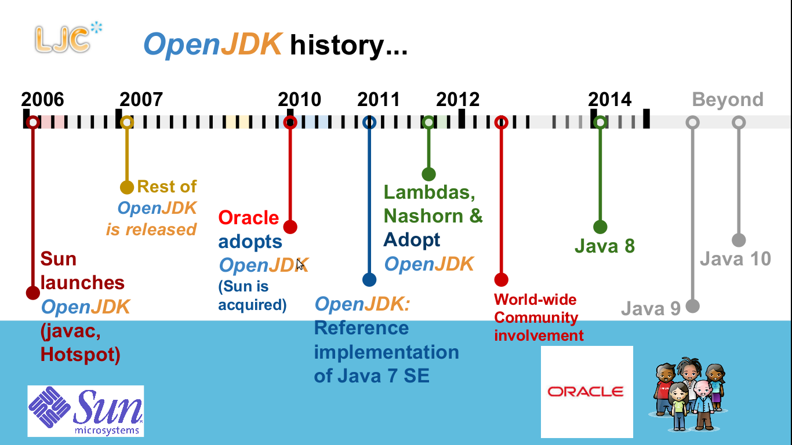
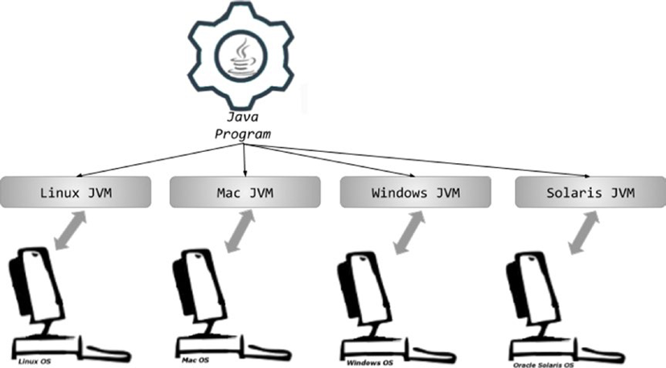

# Java for Absolute Beginners

[Java for Absolute Beginners](https://link.springer.com/book/10.1007/978-1-4842-3778-6)

# Table of Contents

1. [Abbreviations](#abbreviations)
1. [An Introduction to Java and Its History](#an-introduction-to-java-and-its-history)
1. [Preparing Your Development Environment](#preparing-your-development-environment)

## Abbreviations

- \*[OS]: Operating System
- \*[JVM]: Java Virtual Machine

## An Introduction to Java and Its History

### Portability

Other languages compile source code directly into machine code designed to run on a specific microprocessor architecture or OS (i.e. such as windows)

JVM mimics a Java processor that interprets the program into a sequence of actions or OS calls on any processor regardless of OS

Basics Steps in Java:

1. Developer writes program.java (source file)
1. Java compiles source file to program.class (byte code)
1. JVM executes the byte code on OS (interprets)

## Preparing Your Development Environment
