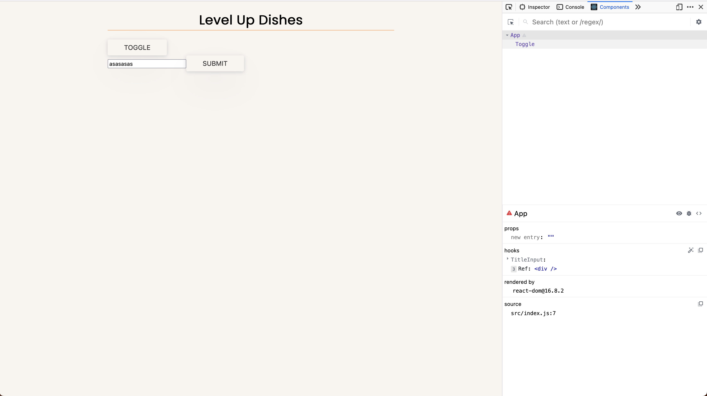

# React Hooks for Everyone

[](https://reactjs.org/)

[](https://reactjs.org/docs/getting-started.html) |
[Level Up Tutorials](https://leveluptutorials.com/) |
[useHooks](https://usehooks.com/)

## Table of Contents

- [React Hooks for Everyone](#react-hooks-for-everyone)
  - [Table of Contents](#table-of-contents)
  - [What are React Hooks](#what-are-react-hooks)
  - [useState](#usestate)
  - [Refactoring a Class Component](#refactoring-a-class-component)
  - [useState Part 2](#usestate-part-2)
  - [useEffect](#useeffect)
  - [Creating Custom Hooks](#creating-custom-hooks)
  - [Use Refs with useRef](#use-refs-with-useref)
  - [Context with Hooks](#context-with-hooks)
  - [Advanced State Management with useReducer](#advanced-state-management-with-usereducer)
  - [useMemo for Expensive Functions](#usememo-for-expensive-functions)
  - [useLayoutEffect To Wait For DOM](#uselayouteffect-to-wait-for-dom)
  - [More Complex Custom Hooks](#more-complex-custom-hooks)

## What are React Hooks

[React Hooks Docs](https://reactjs.org/docs/hooks-intro.html)

- Hooks are a new addition in React 16.8. They let you use state and other React features for function based components without writing a class.
- A Hook is a special function that lets you “hook into” React features.
- When would I use a Hook? If you write a function component and realize you need to add some state to it, previously you had to convert it to a class. Now you can use a Hook inside the existing function component.

[top](#table-of-contents)

## useState

[useState Docs](https://reactjs.org/docs/hooks-state.html)

- can only be used on a function based component, not on a class based component
  - on a class based component, you just use state as normal

`const [value, setValue] = useState(intialState);`

_/src/App.js_

```javascript
import React, { useState } from 'react';

const App = () => {
  const [name, setName] = useState('');
  return (
    <div className='main-wrapper'>
      <h1>Level Up Dishes</h1>
      <h3>{name}</h3>
      <input
        type='text'
        onChange={(e) => setName(e.target.value)}
        value={name}
      />
    </div>
  );
};

export default App;
```

[top](#table-of-contents)

## Refactoring a Class Component

Class-based component

_src/Toggle.js_

```javascript
import React, { Component } from 'react';

export default class Refactor extends Component {
  constructor(props) {
    super(props);
    this.state = { isToggled: false };
  }

  toggle() {
    this.setState((state) => {
      return { isToggled: !state.isToggled };
    });
  }

  render() {
    return (
      <div>
        <button onClick={this.toggle}>Toggle</button>
        {this.state.isToggled && <h2>Hello!</h2>}
      </div>
    );
  }
}
```

Function-based component

_src/Toggle.js_

```javascript
import React, { useState } from 'react';

const Toggle = () => {
  const [isToggled, setIsToggled] = useState(false);
  return (
    <div>
      <button onClick={() => setIsToggled(!isToggled)}>Toggle</button>
      {isToggled && <h2>Hello</h2>}
    </div>
  );
};

export default Toggle;
```

[top](#table-of-contents)

## useState Part 2

[useState Docs](https://reactjs.org/docs/hooks-state.html)

[top](#table-of-contents)

## useEffect

[useEffect Docs](https://reactjs.org/docs/hooks-effect.html)

- The Effect Hook lets you perform side effects in function components
  - Data fetching, setting up a subscription, and manually changing the DOM in React components are all examples of side effects.

> ❗ **Tip**
>
> If you’re familiar with React class lifecycle methods, you can think of `useEffect` Hook as `componentDidMount`, `componentDidUpdate`, and `componentWillUnmount` combined.

- There are two common kinds of side effects in React components: those that don’t require cleanup, and those that do
  - Sometimes, we want to **run some additional code after React has updated the DOM**
  - Network requests, manual DOM mutations, and logging are common examples of effects that don’t require a cleanup
- some effects do require cleanup, **we might want to set up a subscription** to some external data source

  - it is important to clean up so that we don’t introduce a memory leak!

- with `useEffect` will run after React has updated the DOM

[top](#table-of-contents)

## Creating Custom Hooks

[Docs](https://reactjs.org/docs/hooks-custom.html)

- Building your own Hooks lets you extract component logic into reusable functions

_src/App/js_

```javascript
import React, { useState, useEffect } from 'react';
import useTitleInput from './hooks/useTitleInput';

const App = () => {
  const [name, setName] = useTitleInput('');

  return (
    <div className='main-wrapper'>
      <h1>Level Up Dishes</h1>
      <form
        onSubmit={(e) => {
          e.preventDefault();
        }}
      >
        <input
          type='text'
          onChange={(e) => setName(e.target.value)}
          value={name}
        />
        <button>Submit</button>
      </form>
    </div>
  );
};

export default App;
```

_src/hooks/useTitleInput.js_

```javascript
import { useState, useEffect } from 'react';

export default function useTitleInput(initialValue) {
  const [value, setValue] = useState(initialValue);

  useEffect(() => {
    document.title = value;
  });

  return [value, setValue];
}
```

[top](#table-of-contents)

## Use Refs with useRef

[useRef Docs](https://reactjs.org/docs/hooks-reference.html#useref)

- `useRef` returns a mutable ref object whose `.current` property is initialized to the passed argument (`initialValue`)
- The returned object will persist for the full lifetime of the component.
- handy for keeping any mutable value around similar to how you’d use instance fields in classes
- Mutating the `.current` property doesn’t cause a re-render
- hooks way to interact with DOM nodes via refs

_src/App.js_

```javascript
import React, { useState, useEffect, useRef } from 'react';
import Toggle from './Toggle';
import useTitleInput from './hooks/useTitleInput';

const App = () => {
  const [name, setName] = useTitleInput('');
  const ref = useRef();
  // will be undefined on initial DOM load
  // however, after the DOM is loaded and re-rendered, then
  // ref.current will populate with div object
  // console.log('ref', ref.current);

  return (
    <div className='main-wrapper' ref={ref}>
      {/* <h1 onClick={() => console.log(ref.current.className)}> */}
      <h1 onClick={() => ref.current.classList.add('new-class-name')}>
        Level Up Dishes
      </h1>
      <Toggle />
      <form
        onSubmit={(e) => {
          e.preventDefault();
        }}
      >
        <input
          type='text'
          onChange={(e) => setName(e.target.value)}
          value={name}
        />
        <button>Submit</button>
      </form>
    </div>
  );
};

export default App;
```

1. attach a reference to a DOM element
2. create a new reference

[top](#table-of-contents)

## Context with Hooks

[useContext Docs](https://reactjs.org/docs/hooks-reference.html#usecontext)

- Accepts a context object (the value returned from `React.createContext`) and returns the current context value for that context
- The current context value is determined by the `value` prop of the nearest`<MyContext.Provider>` above the calling component in the tree.
- When the nearest`<MyContext.Provider>` above the component updates, this Hook will trigger a rerender with the latest context `value` passed to that `MyContext` provider.
- share state all over you app

1. create a provider (`export const UserContext = createContext()`) and export it
2. use the created provider (`<UserContext.Provider></UserContext.Provider>`)
3. give the provider value (`<UserContext.Provider value={{user:true}}>`)

_src/App.js_

```javascript
import React, { useState, useEffect, useRef, createContext } from 'react';
import Toggle from './Toggle';
import useTitleInput from './hooks/useTitleInput';

export const UserContext = createContext();

const App = () => {
  const [name, setName] = useTitleInput('');
  const ref = useRef();

  return (
    <UserContext.Provider
      value={{
        user: true,
      }}
    >
      <div className='main-wrapper' ref={ref}>
        <h1 onClick={() => ref.current.classList.add('new-class-name')}>
          Level Up Dishes
        </h1>
        <Toggle />
        <form
          onSubmit={(e) => {
            e.preventDefault();
          }}
        >
          <input
            type='text'
            onChange={(e) => setName(e.target.value)}
            value={name}
          />
          <button>Submit</button>
        </form>
      </div>
    </UserContext.Provider>
  );
};

export default App;
```

_src/hooks/Toggle.js_

```javascript
import React, { useState, useContext } from 'react';
import { UserContext } from './App';

const Toggle = () => {
  const [isToggled, setIsToggled] = useState(false);
  const userInfo = useContext(UserContext);
  console.log('userInfo', userInfo);

  if (!userInfo.user) return null;

  return (
    <div>
      <button onClick={() => setIsToggled(!isToggled)}>Toggle</button>
      {isToggled && <h2>Hello</h2>}
    </div>
  );
};

export default Toggle;
```

[top](#table-of-contents)

## Advanced State Management with useReducer

[useeducer Doc](https://reactjs.org/docs/hooks-reference.html#usereducer)

`const [state, dispatch] = useReducer(reducer, initialArg, init);`

- An alternative to `useState`. Accepts a reducer of type `(state, action) => newState`, and returns the current state paired with a dispatch method.
- `useReducer` is usually preferable to `useState` when you have complex state logic that involves multiple sub-values or when the next state depends on the previous one.
- `useReducer` also lets you optimize performance for components that trigger deep updates because **you can pass `dispatch` down instead of callbacks**

_src/App.js_

```javascript
import React, { useState, useEffect, useRef, createContext } from 'react';
import Toggle from './Toggle';
import useTitleInput from './hooks/useTitleInput';
import Counter from './Counter';

export const UserContext = createContext();

const App = () => {
  const [name, setName] = useTitleInput('');
  const ref = useRef();

  return (
    <UserContext.Provider
      value={{
        user: true,
      }}
    >
      <div className='main-wrapper' ref={ref}>
        <h1 onClick={() => ref.current.classList.add('new-class-name')}>
          Level Up Dishes
        </h1>
        <Toggle />
        <Counter />
        <form
          onSubmit={(e) => {
            e.preventDefault();
          }}
        >
          <input
            type='text'
            onChange={(e) => setName(e.target.value)}
            value={name}
          />
          <button>Submit</button>
        </form>
      </div>
    </UserContext.Provider>
  );
};

export default App;
```

_src/Counter.js_

```javascript
import React, { useReducer } from 'react';

const initialState = { count: 0 };

function reducer(state, action) {
  switch (action.type) {
    case 'add':
      return {
        count: state.count + action.value,
      };
    case 'minus':
      return {
        count: state.count - 1,
      };
    case 'reset':
      return {
        count: initialState.count,
      };
    default:
      throw new Error();
  }
}

const Counter = () => {
  const [state, dispatch] = useReducer(reducer, initialState);
  return (
    <div>
      <h3>{state.count}</h3>
      <button onClick={() => dispatch({ type: 'add', value: 10 })}>+</button>
      <button onClick={() => dispatch({ type: 'minus' })}>-</button>
      <button onClick={() => dispatch({ type: 'reset' })}>Reset</button>
    </div>
  );
};

export default Counter;
```

[top](#table-of-contents)

## useMemo for Expensive Functions

[useMemo Doc](https://reactjs.org/docs/hooks-reference.html#usememo)

`const memoizedValue = useMemo(() => computeExpensiveValue(a, b), [a, b]);`

- Returns a [memoized](https://en.wikipedia.org/wiki/Memoization)[^1] value
- Pass a “create” function and an array of dependencies
- `useMemo` will only recompute the memoized value when one of the dependencies has changed
- Helps to avoid expensive calculations on every render
- The function passed to `useMemo` runs during rendering
- Don’t do anything there that you wouldn’t normally do while rendering
  - side effects belong in `useEffect`, not `useMemo`
- If no array is provided, a new value will be computed on every render
- **You may rely on `useMemo` as a performance optimization, not as a semantic guarantee**

_src/App.js_

````javascript
import React, {
  useState,
  useEffect,
  useRef,
  createContext,
  useMemo,
} from 'react';
import useTitleInput from './hooks/useTitleInput';

export const UserContext = createContext();

const App = () => {
  const [name, setName] = useTitleInput('');
  const ref = useRef();
  const reverseWord = (word) => {
    console.log('reverseWord called');
    return word.split('').reverse().join('');
  };

  // const TitleReversed = reverseWord('Level Up Dishes'); // not memoized

  // this still calls reverseWord on every re-render
  // const TitleReversed = useMemo( () => reverseWord( 'Level Up Dishes' ) ); // not memoized

  const title = 'Level Up Dishes';
  const TitleReversed = useMemo(() => reverseWord(title), [title]); // memomized

  return (
    <div className='main-wrapper' ref={ref}>
      <h1 onClick={() => ref.current.classList.add('new-class-name')}>
        {TitleReversed}
      </h1>
      <form
        onSubmit={(e) => {
          e.preventDefault();
        }}
      >
        <input
          type='text'
          onChange={(e) => setName(e.target.value)}
          value={name}
        />
        <button>Submit</button>
      </form>
    </div>
  );
};

export default App;
``

[top](#table-of-contents)

## useDebugValue For Custom Hook Libraries

[useDebugValue Doc](https://reactjs.org/docs/hooks-reference.html#usedebugvalue)

`useDebugValue(value)`

- `useDebugValue` can be used to display a label for custom hooks in React DevTools

> Tip:
>
> We don’t recommend adding debug values to every custom Hook. It’s most valuable for
> custom Hooks that are part of shared libraries.

_src/hooks/useTitleInput.js_

```javascript
import { useState, useEffect, useDebugValue } from 'react';

export default function useTitleInput(initialValue) {
  const [value, setValue] = useState(initialValue);

  useEffect(() => {
    document.title = value;
  });

  useDebugValue(value);
  // useDebugValue(value.length > 0 ? 'Full' : 'Empty');

  return [value, setValue];
}
````

_Before `useDebugValue`_




_After `useDebugValue`_


[top](#table-of-contents)

## useLayoutEffect To Wait For DOM

[useLayoutEffect Doc](https://reactjs.org/docs/hooks-reference.html#uselayouteffect)

[useBodyLockScroll](https://usehooks.com/useLockBodyScroll/)

- The signature is identical to `useEffect`, but it fires synchronously after all DOM mutations
- Use this to read layout from the DOM and synchronously re-render
- Updates scheduled inside `useLayoutEffect` will be flushed synchronously, before the browser has a chance to paint
- Prefer the standard `useEffect` when possible to avoid blocking visual updates

_src/hooks/useBodyLockScroll.js_

```javascript
import { useLayoutEffect } from 'react';

// https://usehooks.com/page/2
export default function useBodyLockScroll() {
  useLayoutEffect(() => {
    // Get original value of body overflow
    const originalStyle = window.getComputedStyle(document.body).overflow;
    // Prevent scrolling on mount
    document.body.style.overflow = 'hidden';
    // Re-enable scrolling when component unmounts
    return () => (document.body.style.overflow = originalStyle);
  }, []);
}
```

_src/DishForm.js_

```javascript
import React from 'react';
import useBodyLockScroll from './hooks/useBodyLockScroll';

const DishForm = () => {
  useBodyLockScroll();
  return (
    <div className='dish-card'>
      <form>
        <div className='form-row'>
          <label htmlFor='name'>Name: </label>
          <input type='text' id='name' />
        </div>
      </form>
    </div>
  );
};

export default DishForm;
```

_src/App.js_

```javascript
import React, { useState, useEffect, useRef } from 'react';
import Toggle from './Toggle';
import useTitleInput from './hooks/useTitleInput';

const App = () => {
  const [name, setName] = useTitleInput('');
  const [dishes, setDishes] = useState([]);
  const ref = useRef();

  const fetchDishes = async () => {
    console.log('fetching dishes...');
    const res = await fetch(
      'https://my-json-server.typicode.com/leveluptuts/fakeapi/dishes'
    );
    const data = await res.json();
    setDishes(data);
  };

  useEffect(() => {
    fetchDishes();
  }, []); // the empty array just makes sure that it will only fire on mount and unmount

  return (
    <div className='main-wrapper' ref={ref}>
      <h1 onClick={() => ref.current.classList.add('new-class-name')}>
        Level Up Dishes
      </h1>
      <Toggle />
      <form
        onSubmit={(e) => {
          e.preventDefault();
        }}
      >
        <input
          type='text'
          onChange={(e) => setName(e.target.value)}
          value={name}
        />
        <button>Submit</button>
      </form>
      {dishes.map((dish) => (
        <article className='dish-card dish-card--withImage' key={dish.name}>
          <h3>{dish.name}</h3>
          <p>{dish.desc}</p>
          <div className='ingredients'>
            {dish.ingredients.map((ingredient) => (
              <span key={ingredient}>{ingredient}</span>
            ))}
          </div>
        </article>
      ))}
    </div>
  );
};

export default App;
```

[top](#table-of-contents)

## More Complex Custom Hooks

[useOnClickOutside](https://usehooks.com/useOnClickOutside/)

_/src/hooks/useOnClickOutside.js_

```javascript
import React, { useEffect } from 'react';

// https://usehooks.com/useOnClickOutside/
export default function useOnClickOutside(ref, handler) {
  useEffect(
    () => {
      const listener = (event) => {
        // Do nothing if clicking ref's element or descendent elements
        if (!ref.current || ref.current.contains(event.target)) {
          return;
        }

        handler(event);
      };

      document.addEventListener('mousedown', listener);
      document.addEventListener('touchstart', listener);

      return () => {
        document.removeEventListener('mousedown', listener);
        document.removeEventListener('touchstart', listener);
      };
    },
    // Add ref and handler to effect dependencies
    // It's worth noting that because passed in handler is a new ...
    // ... function on every render that will cause this effect ...
    // ... callback/cleanup to run every render. It's not a big deal ...
    // ... but to optimize you can wrap handler in useCallback before ...
    // ... passing it into this hook.
    [ref, handler]
  );
}
```

_src/DishForm.js_

```javascript
import React, { useRef } from 'react';
import useBodyLockScroll from './hooks/useBodyLockScroll';
import useOnClickOutside from './hooks/useOnClickOutside';

const DishForm = ({ setIsToggled }) => {
  const ref = useRef();

  useBodyLockScroll();
  useOnClickOutside(ref, () => {
    setIsToggled(false);
  });

  return (
    <div className='dish-card' ref={ref}>
      <form>
        <div className='form-row'>
          <label htmlFor='name'>Name: </label>
          <input type='text' id='name' />
        </div>
      </form>
    </div>
  );
};

export default DishForm;
```

_src/Toggle.js_

```javascript
import React, { useState } from 'react';
import DishForm from './DishForm';

const Toggle = () => {
  const [isToggled, setIsToggled] = useState(false);

  return (
    <div>
      {isToggled ? (
        <DishForm setIsToggled={setIsToggled} />
      ) : (
        <button onClick={() => setIsToggled(!isToggled)}>Add Dish</button>
      )}
    </div>
  );
};

export default Toggle;
```

[top](#table-of-contents)

[^1]: an optimization technique used primarily to speed up computer programs by storing the results of expensive function calls and returning the cached result when the same inputs occur again
