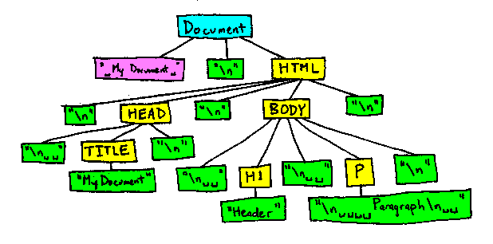

# Document Object Model


[](https://developer.mozilla.org/en-US/docs/Web/JavaScript) |
[](https://www.w3schools.com/js/default.asp) |
[TechTerms](https://techterms.com/)

## Table of Contents

1. [Abbreviations](#abbreviations)
2. [Introduction to the DOM](#introduction-to-the-dom)
3. [Modifying the DOM](#modifying-the-dom)
4. [Working with the DOM](#working-with-the-dom)

## Abbreviations

- \*[CSS]: Cascading Style Sheet
- \*[DOM]: Document Object Model
- \*[HTML]: Hypertext Markup Language
- \*[JS]: JavaScript

## Introduction to the DOM

### Goals

- Understand what the DOM is
- Select HTML elements using document methods
- Compare and contrast elements and nodes

In this subunit, we'll give you an introduction to **what the DOM is and how it's created**! We'll start with a conceptual overview of the Document Object Model and then move to more technical concepts like selecting elements in the DOM by id and class. We'll finish up with some hand-on practice exercises, so you can apply these concepts yourself. **Once you grasp these DOM basics, you can start doing more complex and interesting DOM operations, which you'll start working on in the next subunit**.

### What is the DOM?

- Document Object Model
- It is the programming interface for HTML
- A representation of our HTML that can be accessed using javascript

[further reading](https://developer.mozilla.org/en-US/docs/Web/API/Document_Object_Model/Introduction)

[](#table-of-contents)

### How does it get created?

- When a web page is loaded, the browser creates the DOM for that specific page
- This allows for the creation of dynamic web pages where users can interact with the page

### What does it look like?

#### THe DOM under the hood

The structure of the DOM uses something called a tree, where the topmost mode is the **_document_** object.


Source: [PlainEnglish.io](https://miro.medium.com/max/618/1*0poukmfxSJxjiY3-b6CKIA.png)

#### Using the document object

- the **_document_** object represents teh web page that has been loaded
- it acts as the "starting point" for access to the DOM.

#### The things we can do with the _document_ object

- Finding elements
- Making new elements
- updating elements
- Changing properties on elements
- Listening for events like clicks

[](#table-of-contents)

### Selecting Elements in the DOM

#### How to Select Elements in the DOM

To access the DOM, we make use of the document object.

This object has properties and functions that we use to access our HTML elements which we can manipulate with javascript.

#### Different Methods

javascript has quite a few different methods for selecting elements in the DOM

We're going to be starting with one method call `getElementById`.

**[getElementById](<[getElementById](https://developer.mozilla.org/en-US/docs/Web/API/Document/getElementById)>)**

`getElementById` accepts a string which is the name of an **_id_** in the DOM.

It finds the first matching **_id_**

```javascript
document.getElementById('main');
```

**What do we get back?**

We get back a special object called an HTMLElement.

The exact kind of object we get back depend on what we select (HTMLDivElement vs HTMLParagraphElement)

This special object contains quite a few helpful methods that we will see later!

**[getElementByTagName](https://developer.mozilla.org/en-US/docs/Web/API/Document/getElementsByTagName)**

`getElementByTagName` accepts a string which is the name of an element in the DOM.

It returns a list of all the elements that match the string passed to the function

```javascript
document.getElementByTagName('li');
```

**What do we get back?**

This function returns an HTMLCollection to us!

It looks a lot like an array, and you can access it at a specific index or use a for loop

However, you can not use common methods like **_push, pop, indexOf or includes_**

**[getElementByClassName](https://developer.mozilla.org/en-US/docs/Web/API/Document/getElementsByClassName)**

`getElementByClassName` accepts a string which is the name of an element in the DOM.

It returns a list of all the elements that have a class attribute, which matches the string passed to the function

```javascript
document.getElementByClassName('heading');
```

**What do we get back?**

Just like `getElementByTagName`, we get back a special kind of array called an HTMLCollection.

Don't get too caught up in the difference between an array and an HTMLCollection, just know that you can not use almost all array methods on these special collections.

**[querySelector](https://developer.mozilla.org/en-US/docs/Web/API/Document/querySelector)**

`querySelector` accepts a string which is a valid CSS selector

It returns the first element that matches the CSS selector passed to the function.

```javascript
document.querySelector('#main');
document.querySelector('h2.section-heading');
```

Just like `getElementById`, this function returns a special HTMLElement object to us.

**[querySelectorAll](https://developer.mozilla.org/en-US/docs/Web/API/Document/querySelectorAll)**

`querySelectorAll` accepts a string which is a valid CSS selector.

It returns all the elements that matches the CSS selector passed to the function.

```javascript
document.querySelectorAll('li');
document.querySelectorAll('ul.nav-links');
```

**What do we get back?**

This function returns a NodeList to us!

It looks a lot like an array, and you can access it at a specific index or use a for loop

However, you can not use common methods like **_push, pop, indexOf or includes_**

It's almost identical to a HTMLCollection except it can include special kinds of nodes. You will not need to worry about this for now!

[](#table-of-contents)

### DOM Manipulation

Now that we know how to select elements - let's change them!

Don't worry it's not permanent

**Modifying Properties with [innerText](https://developer.mozilla.org/en-US/docs/Web/API/HTMLElement/innerText)**

```javascript
let hi = document.querySelector('hi');
hi.innerText = 'Something new!';
```

### Recap

- The DOM allows is to use javascript to manipulate HTML
- We can use methods like `querySelector` to access elements on the page
- Using the DOM we can modify elements and attributes

[](#table-of-contents)

## Modifying the DOM

### Goals

- Modify the text adn HTML of elements using `innerText` and `innerHtml`
- Change inline styling of an element using the style object
- Modify attributes using `getAttribute` and `setAttribute`
- Traverse, create, append adn remove elements from the DOM

Selecting elements using JavaScript is just the tip of the iceberg when it comes to the DOM. Now that you can select elements, you'll learn how to manipulate them any way you see fit.

In this subunit, you'll learn **how to change just about everything in the DOM**. You'll add, append, remove, and modify elements and their contents. By the end of the subunit, you'll be able to perform the most common operations in the DOM.

### Modifying Elements in the DOM

#### Accessing text

The easiest way to access the text of an element is to use [innerText](https://developer.mozilla.org/en-US/docs/Web/API/HTMLElement/innerText)

```html
<section id="main-greeting">
  <article>Hello World!</article>
</section>
```

```javascript
const mainGreeting = document.getElementById('main-greeting');
console.log(mainGreeting.innerText);
```

```bash
"Hello World!"
```

#### Modifying text

If you need to change any text, you can assign a new value to the [innerHtml](https://developer.mozilla.org/en-US/docs/Web/API/Element/innerHTML):

```html
<section id="main-greeting">
  <article>Hello World!</article>
</section>
```

```javascript
const mainGreeting = document.getElementById('main-greeting');

mainGreeting.innerHTML = "<article>It's changed!</article>";

console.log(mainGreeting.innerText);
```

```bash
"It's changed!"
```

**Using [textContent](https://developer.mozilla.org/en-US/docs/Web/API/Node/textContent)**

Another common way to access and modify text is to use the `textContent` property

```html
<section id="main-greeting">
  <article>Hello World!</article>
</section>
```

```javascript
const mainGreeting = document.getElementById('main-greeting');
mainGreeting.textContent = "It's changed!";
console.log(mainGreeting.innerText);
```

```bash
"It's changed!"
```

**So what's the difference?**

There are quite a few small differences:

- `innerText` is aware of the rendered appearance of text, while `textContent` is not.
- `textContent` gets the content of all elements, including `<script>` and `<style>` elements. In contrast, `innerText` only shows “human-readable” elements.
- depending on the complexity of the content inside an element, `innerText` can be a bit less performant that `textContent`
- for now, you can use either, but be aware that both exist!

#### Accessing HTML

If you need to access the HTML of an element, you can use `innerHTML`. This will include all the elements inside of the one you select.

```html
<section id="main-greeting">
  <article>Hello World!</article>
</section>
```

You will yourself using `innerText` more commonly, there are some security concerns when using `innerHTML` if you're not careful.

[](#table-of-contents)

### Modifying HTML

If you need to change any HTML, you can assign a new value to the `innerHTML`:

```html
<section id="main-greeting">
  <article>Hello World!</article>
</section>
```

```javascript
const mainGreeting = document.getElementById('main-greeting');
mainGreeting.innerHTML = "<article>It's changed!</article>";
console.log(mainGreeting.innerText);
```

```bash
"It's changed!"
```

Another reason it’s less common to use innerHTML is that you need the string to be valid HTML for everything to work, which can be quite tedious to build

[](#table-of-contents)

### Modifying styling

Aside from the text or HTML of an element, it’s very common that you’ll want to change the inline style for an element.

You can access any inline CSS properties on an element using the style property

```html
<h1 style="color: black; background-color: red;">Hello everyone!</h1>
```

```javascript
const mainHeading = document.querySelector('h1');
console.log(mainHeading.style.color);
```

```bash
"black"
```

To change the style, simply reassign the value of the CSS property

```javascript
const mainHeading = document.querySelector('h1');
mainHeading.style.color = 'red';

console.log(mainHeading.style.color);
```

```bash
"red"
```

**How about background color?**

Let’s go and change the background-color CSS property:

```javascript
const mainHeading = document.querySelector('h1');
console.log(mainHeading.style.background - color); // Error!
```

Make sure to [camelCase](https://techterms.com/definition/camelcase)!

```javascript
mainHeading.style.backgroundColor = 'green';
```

[](#table-of-contents)

### Modifying Attributes

So far you’ve seen how to modify HTML and text.

The third most common thing you’ll be modifying are attributes for an element

To do that, we can get attributes using `getAttribute` and modify attributes using `setAttribute`

#### Attributes

As a quick refresher, attributes are part of every HTML element that modify an HTML element.

An attribute either modifies the default functionality of an element type or provides functionality.

- **src**
- **href**
- **class**
- **id**
- **type**
- **value**

**[getAttribute](https://developer.mozilla.org/en-US/docs/Web/API/Element/getAttribute)**

In order to access an attribute on an element, you can use the `getAttribute` method

```javascript
const firstInput = document.querySelector('input');
console.log(firstInput.getAttribute('type'));
```

```bash
"text"
```

**[setAttribute](https://developer.mozilla.org/en-US/docs/Web/API/Element/setAttribute)**

To set an attribute on an element, you can use the `setAttribute` method

```javascript
const firstInput = document.querySelector('input');
firstInput.setAttribute('type', 'email'); // "text"
```

#### Direct attribute access

There are a few attributes that you can directly access and modify as well instead of having to use `getAttribute` or `setAttribute`.

One of those is **id**

```html
<input type="text" id="first-name" />
```

```javascript
const firstInput = document.querySelector('input');
console.log(firstInput.id);
```

```bash
"first-name"
```

```javascript
firstInput.id = 'full-name'; // changes teh attribute
console.log(firstInput.id);
```

```bash
"full-name"
```

A more common one you will use is the **value** attribute with forms in HTML

```html
<input type="text" />
```

```javascript
const firstInput = document.querySelector('input');
console.log(firstInput.value);
```

```bash
""
```

```javascript
firstInput.value = 'Just added some value!'; // changes the attribute
console.log(firstInput.value);
```

```bash
"Just added some value!"
```

[](#table-of-contents)

### Manipulating classes

We have quite a few ways to manipulate the **class** attribute in JavaScript:

- `setAttribute(“class”)` - this will override the class
- `className` - this will give you a string representation of the class
- `classList` - this will give you an array-like object to add, remove or toggle classes

**`setAttribute(“class”)`**

If you want to access the class attribute you can use `getAttribute(“class”)` or the className property.

```javascript
const mainHeading = document.querySelector('h1');
mainHeading.setAttribute('class', 'section-heading');
```

this works, but will overwrite the previous class

**[className](https://developer.mozilla.org/en-US/docs/Web/API/Element/className)**

You can also add a class by reassigning the className property

```javascript
const mainHeading = document.querySelector('h1');
mainHeading.className += ' top-heading'; // works, but is prone to bugs
```

**[classList](https://developer.mozilla.org/en-US/docs/Web/API/Element/classList)**

An easier way to interact with classes on an element is to use the `.classList` method

```javascript
const mainHeading = document.querySelector('h1');
mainHeading.classList; // []
mainHeading.classList.add('top-heading'); // ["top-heading"]
mainHeading.classList.remove('top-heading'); // []
mainHeading.classList.toggle('top-heading'); // true
mainHeading.classList.contains('top-heading'); // true
```

[](#table-of-contents)

### Changing Multiple Elements

Now that you’ve seen how to modify styles, attributes, and text. How can we modify multiple elements at once?

```javascript
const listItems = document.querySelectorAll('li');

// let's change them all to green!

listItems.style.color = 'green';
// TypeError: Cannot set property 'color' of undefined
```

#### How it's done

To do this we need to loop over multiple elements!

```javascript
const listItems = document.querySelectorAll('li');

for (let listItem of listItems) {
  listItem.style.color = 'red';
}
```

[](#table-of-contents)

## Working with the DOM

### Creating Elements

To create an HTML element, we can use the [createElement](https://developer.mozilla.org/en-US/docs/Web/API/Document/createElement) function and pass in the name of the element

This just makes an empty element, so if we want to add any text, attributes or styling we will have to do that on another line

```javascript
const newButton = document.createElement("button");
const newUnorderedList = document.createElement("ul");
const newDiv = document.createElement("div");

newDiv.innerText = "a brand new div!";
newDiv.style.color = "tomato";
```

[](#table-of-contents)

### Appending Elements

After you create an element, you need to place it in the DOM to see it. You can do this using the [append](https://developer.mozilla.org/en-US/docs/Web/API/Element/append) method.

`append` is a method that a parent element calls, and you pass in the child element that you would like to place inside of the parent element

```javascript
const ul = document.querySelector('ul');
const newLi = document.createElement('li');

newLi.innerText = 'Hello!';

ul.append(newLi);
```

`append` will place the element as the last child in the parent. If you would like the element to be the first child, you can use the `prepend` method.

[](#table-of-contents)

### Removing Elements

If we want to remove elements in the DOM, we can use the handy [remove](https://developer.mozilla.org/en-US/docs/Web/API/Element/remove) method.

In order to remove an element, we first need to find it.

```javascript
const ul = document.querySelector('ul');

ul.remove();
```

This function can only be called on a single element, so if you need to remove multiple elements you’ll need to call `remove` multiple times.

[](#table-of-contents)

### Finding elements near another element

As you start adding and removing elements in the DOM, there are times when you might want to know not only information about an element, but it’s parents or children.

You might want to:

- find an element and remove some or all of its children
- find an element and add an element to one of its children

Thankfully there are some very helpful methods for doing just that!

#### Setting the stage with some HTML

_demo/traversal-methods/index.html_

```html
<!DOCTYPE html>
<html>
  <body>
    <section>
      <h1>Here is a main heading!</h1>
      <div>
        <p>Here is a paragraph inside a div!</p>
        <ul>
          <li>First list item in a div</li>
          <li>Second list item in a div</li>
        </ul>
      </div>
      <div>Here is the second div!</div>
    </section>
    <script src="script.js"></script>
  </body>
</html>
```

Take a look at some parent, child, and sibling element relationships.

We will be focusing specifically on the `<div>` element.

#### Accessing a parent element

If you want to access the parent element of another element, you can use the [parentElement](https://developer.mozilla.org/en-US/docs/Web/API/Node/parentElement) method.

```javascript
const foundDiv = document.querySelector('div');
console.log(foundDiv.parentElement);
```

```bash
<section></section>
```

#### Accessing the children of an element

If you want to access the child elements of another element, you can use the [children](https://developer.mozilla.org/en-US/docs/Web/API/Element/children), [firstElementChild](https://developer.mozilla.org/en-US/docs/Web/API/Element/firstElementChild) or [lastElementChild](https://developer.mozilla.org/en-US/docs/Web/API/Element/lastElementChild) methods.

```javascript
console.log(foundDiv.children);
console.log(foundDiv.firstElementChild);
console.log(foundDiv.lastElementChild);
```

```bash
HTMLCollection(2) [p, ul]
<p>Here is a paragraph inside a div!</p>
<ul></ul>
```

#### Accessing the siblings of an element

If you want to access the previous sibling or next sibling element of another element, you can use the [previousElementSibling](https://developer.mozilla.org/en-US/docs/Web/API/Element/previousElementSibling) or [nextElementSibling](https://developer.mozilla.org/en-US/docs/Web/API/Element/nextElementSibling) method.

```javascript
console.log(foundDiv.previousElementSibling);
console.log(foundDiv.nextElementSibling);
```

```bash
<h1>Here is a main heading!</h1>
<div>Here is the second div!</div>
```

[](#table-of-contents)

### Text Nodes

You may come across other methods for finding things in the DOM, we have shown you the most common ones, but as you learn more you may come across something called a text node

### Nodes Vs. Elements

With some of these finder methods, you will see that you don't always get back an HTML element, you sometimes get back what is called a text node

Everything in the DOM is a node, some nodes are not actually HTML elements, but text or even comments!

With most of the common traversal methods, you will not need to worry about text nodes

You will be using other methods less frequently, but know that they exist if you need to see elements near/above/below the element you find.

[](#table-of-contents)
