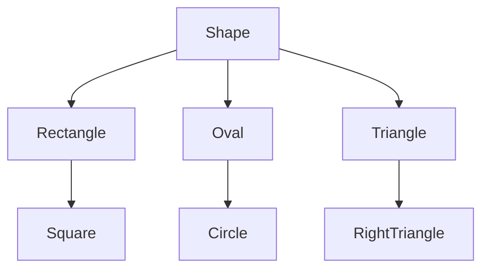

# ES2015 Classes

{display: block, margin: 0 auto, max-height: 400px}

[](https://developer.mozilla.org/en-US/docs/Web/JavaScript) |
[](https://www.w3schools.com/js/default.asp)

## Table of Contents

1. [Abbreviations](#abbreviations)
1. [Introduction](#introduction)
1. [JS Objects Review](#js-objects-review)
1. [Mixing Data and Functionality](#mixing-data-and-functionality)
1. [Classes](#classes)
1. [Constructors](#constructors)
1. [Methods](#methods)
1. [Inheritance and Super](#inheritance-and-super)
1. [Terminology](#terminology)

## Abbreviations

- \*[JS]: JavaScript
- \*[OOP]: Object-Oriented Programming
- \*[POJO]: Plain Old JavaScript Object

## Introduction

Object-Oriented Programming structures data into **classes**. Understanding what classes are and how to use them is foundational to working in Object-Oriented Programming.

In this subunit, **we'll explore how ES2015 implements classes**. First, we'll cover concepts you're already familiar with, like objects, which are instances of classes - then we'll teach you everything else you need to know to get up to speed using classes. After that, **we'll show you how you can create your own custom classes**. The end of the subunit will be a project where you implement a class to model a vehicle - don't worry, this subunit might stretch the conceptual muscles of your brain, but modeling a vehicle class is less intense than it sounds. No one will have to drive it, and it doesn't have to be street legal.

### Goals

- Review how objects work in JavaScript
- Define classes in JavaScript
- Use classes to create instances that share functionality
- Describe constructor functions and use them to create instances
- Describe inheritance
- Define commonly used OOP (object-orientated programming) terms

[](#table-of-contents)

## JS Objects Review

"Plain Old JavaScript Object" (POJO):

```javascript
let o1 = {};

let o2 = new Object(); // same thing

o1.name = 'Whiskey';

o1['name'] = 'Whiskey'; // same thing
```

Can add functions as keys:

```javascript
o1.sayHi = function () {
  return 'Hi!';
};

o1.sayHi(); //Hi!
```

Can get arrays of keys, values, or [key, val] arrays.

```javascript
Object.keys(o1); //["name", "sayHi"]

Object.values(o1); //["Whiskey", function(){...}]

Object.entries(o1); //[["name", "Whiskey"], ["sayHi", function(){...}]]
```

### Details You Should Know

- Properties that do not exist in the object register as **_undefined_**.

```javascript
o1.elie; // undefined
```

(This causes issues when you attempt to invoke `()` or `.access` them)

- All keys get "stringified":

```javascript
o1[1] = 'hello';
o1['l'] = 'goodbye';
```

- What is `o1[i]`?

```javascript
o1[l]; // "goodbye"
```

(This gets even more confusing when using things like nested arrays as keys)

[](#table-of-contents)

## Mixing Data and Functionality

### Functions and Data

Imagine some useful functions:

_demo/triangles.js_

```javascript
/* area of right triangle */

function getTriangleArea(a, b) {
  return (a * b) / 2;
}

/* hypotenuse of right triangle */

function getTriangleHypotenuse(a, b) {
  return Math.sqrt(a * a + b * b);
}

getTriangleArea(3, 4); // 6
getTriangleHypotenuse(3, 4); // 5
```

This gets a bit messy, though - all those functions to keep track of!

### Using a POJO

_demo/triangle-pojo.js_

```javascript
let triangle = {
  a: 3,
  b: 4,
  getArea: function () {
    return (this.a * this.b) / 2;
  },
  getHypotenuse: function () {
    return Math.sqrt(this.a ** 2 + this.b ** 2);
  },
};

triangle.getArea(); // 6
triangle.getHypotenuse(); // 5
```

For now:

```javascript
let triangle = {
  a: 3,
  b: 4,
  getArea: function () {
    return (this.a * this.b) / 2;
  },
};
```

**this** references to "this object"

So, we can helpfully mix data & functionality!

- This is tidy: related functionality lives together
- Annoying when we want more than one triangle

[](#table-of-contents)

## Classes

Classes are a "blueprint" of functionality:

_demo/triangle-oo.js_

```javascript
class Triangle {
  getArea() {
    return (this.a * this.b) / 2;
  }

  getHypotenuse() {
    return Math.sqrt(this.a ** 2 + this.b ** 2);
  }
}

let myTri = new Triangle(); // "instantiation of triangle

myTri.a = 3;
myTri.b = 4;

myTri.getArea(); // 6
myTri.getHypotenuse(); // 5
```

_demo/triangle-oo.js_

```javascript
class Triangle {
  getArea() {
    return (this.a * this.b) / 2;
  }

  getHypotenuse() {
    return Math.sqrt(this.a ** 2 + this.b ** 2);
  }
}
```

- Defines the **methods** each instance of **Triangle** will have
- Make a new triangle with `new Triangle()`
- Can still add/look at arbitrary keys ("properties")
- **this** is "the actual triangle in question"

Class names should be **UpperCamelCase**

Reduces confusion between triangle (an actual, individual triangle) and **Triangle** (the class of triangles)

A triangle is still an object:

```javascript
typeof myTri; // 'object'
```

But JS knows it's an "instance of" the **Triangle** class:

```javascript
myTri instanceof Triangle; // true
```

[](#table-of-contents)

## Constructors

Consider how we made an instance of our **Triangle** class:

```javascript
let myTri = new Triangle(); // "instantiation" of Triangle

myTri.a = 3;
myTri.b = 4;
```

_demo/triangle-constructor.js_

```javascript
class Triangle {
  constructor(a, b) {
    this.a = a;
    this.b = b;
  }

  getArea() {
    return (this.a * this.b) / 2;
  }

  getHypotenuse() {
    return Math.sqrt(this.a ** 2 + this.b ** 2);
  }
}
```

The method with the special name **constructor** is called when you make a new instance.

```javascript
let myTri2 = new Triangle(3, 4);
myTri2.getArea(); // 6
```

### What Can You Do in the Constructor`

- Whatever you want!
- Common things:
  - Validate data
  - Assign properties

```javascript
constructor(a,b){
  if(!Number.isFinite(a) || a <= 0)
    throw new Error("invalid a: " + a);

  if(!Number.isFinite(b) || ab<= 0)
    throw new Error("invalid b: " + b);

  this.a = a;
  this.b = b;
}
```

(Note you don't return anything from constructor function)

[](#table-of-contents)

## Methods

```javascript
getArea(){
  return (this.a * this.b) / 2;
}
```

Functions placed in a class are "methods" (formally: **"instance methods"**).

They have access to properties of object with **this**.

They can take arguments/return data like any other function.

A method can call another method:

```javascript
class Triangle {
  getArea() {
    return this.a * this.b; // 2
  }

  /* Is this a big triangle? */

  isBig() {
    return this.getArea() > 50;
  }
}
```

Note: to call a method, you need to call it on **this**

Without **this**, calling **getArea** throws a ReferenceError - it is not in scope!

[](#table-of-contents)

## Inheritance and Super

_demo/triangle-duplicate.js_

```javascript
class Triangle {
  constructor(a, b) {
    this.a = a;
    this.b = b;
  }

  getArea() {
    return (this.a * this.b) / 2;
  }

  getHypotenuse() {
    return Math.sqrt(this.a ** 2 + this.b ** 2);
  }

  describe() {
    return `Area is ${this.getArea()}.`;
  }
}
```

_demo/triangle-duplicate.js_

```javascript
class Triangle {
  constructor(a, b, color) {
    this.a = a;
    this.b = b;
    this.color = color;
  }

  getArea() {
    return (this.a * this.b) / 2;
  }

  getHypotenuse() {
    return Math.sqrt(this.a ** 2 + this.b ** 2);
  }

  describe() {
    return `Area is ${this.getArea()}.` + ` Color is ${this.color}!`;
  }
}
```

_demo/triangle-extends.js_

```javascript
class Triangle {
  constructor(a, b) {
    this.a = a;
    this.b = b;
  }

  getArea() {
    return (this.a * this.b) / 2;
  }

  getHypotenuse() {
    return Math.sqrt(this.a ** 2 + this.b ** 2);
  }

  describe() {
    return `Area is ${this.getArea()}.`;
  }
}
```

_demo/triangle-extends.js_

```javascript
class ColorTriangle extends Triangle {
  constructor(a, b, color) {
    // call parent constructor with (a, b)

    super(a, b);
    this.color;
  }

  // will "inherit" getArea, getHypotenuse

  // "override describe() w/ new version"

  describe() {
    return super.describe() + ` Color is ${this.color}`;
  }
}
```

[](#table-of-contents)

### Multi-Level Inheritance

_demo/triangle-extends.js_

```javascript
class ColorTriangle extends Triangle {
  constructor(a, b, color) {
    // call parent constructor with (a, b)

    super(a, b);
    this.color;
  }

  // will "inherit" getArea, getHypotenuse

  // "override describe() w/ new version"

  describe() {
    return super.describe() + ` Color is ${this.color}`;
  }
}
```

_demo/triangle-extends.js_

```javascript
class InvisTriangle extends ColorTriangle {
  constructor(a, b) {
    // call parent constructor`
    super(a, b, 'invisible');
  }

  // still inherit getArea, getHypotenuse

  describe() {
    return "You can't see me!";
  }
}
```

Often end up with "class hierarchy"



[](#table-of-contents)

## Terminology

Instance
: an individual instance; an array is "instance" of **Array**

Class
: blueprint for making instances

Property
: piece of data on an instance (e.g. `myTriangle.a`)
: most languages call this idea an "instance attribute"

Method
: function defined by a class, can call on instance
: most accurate to call these "instance methods"

Parent/Superclass
: more general class you inherit from
: **Rectangle** might be a parent of **Square**

Child/Subclass
: more specific class (a **Square** is a special knd of **Rectangle**)

Inherit
: ability to call methods/get properties defined on ancestors

Object-Oriented Programming
: using classes & instances to manage data & functionality together
: often makes it easier to manage complex software requirements

[](#table-of-contents)
