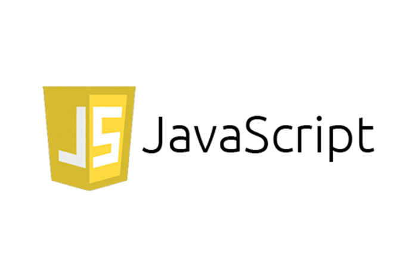

# Object Oriented Programming

 |

## Table of Contents

1. [Abbreviations](#abbreviations)
1. [Introduction](#introduction)
1. [ES2015 Classes](./javascript.vanilla.object-oriented-programming.es2015-classes.md)
1. [this](./javascript.vanilla.object-oriented-programming.this.md)

## Abbreviations

- \*[JS]: JavaScript
- \*[OOP]: Object-Oriented Programming
- \*[POJO]: Plain Old JavaScript Object

## Introduction

In this unit, we'll teach you a new programming paradigm called **Object-Oriented Programming** or **OOP**. Depending on how your career and interests progress, this might be the only paradigm you ever need to learn.

Before we get into precisely what OOP is, we need to explain what the heck a programming paradigm is. It is essentially a **style of programming**, a way to structure the language and dictate how you write code. Think about music for a second. There are all kinds of genres: jazz, rock, pop, hip hop. The note and instruments are the same, but the way the music is structured and presented is completely different. If you want to get good at a genre, you’ve got to pick one and stick to it. **Object-Oriented Programming is the pop music of the programming world**. Instead of playing on the most radio channels and in most public spaces, **it creates the front-ends and back- ends of most websites and apps**.

With Object-Oriented Programming, data is structured into classes, and coded procedures manipulate the data in objects. These words might be new, but you've already worked with both classes and procedures.**An object like an array is an instance of a class, and a method or function like filter is an instance of a procedure**. This entire unit is about OOP, so we won’t go into too much more detail here.

Once you know how to write Object-Oriented code, you can refactor some of your old projects to do incredible things with a fraction of the code. Let’s say you wanted to run multiple games of Connect Four simultaneously on the same screen. Without OOP, this would require hundreds of lines of code; with OOP, it would require less than ten.

This whole unit will be very conceptual, and some of the concepts may be difficult to grasp right away. **Don’t trip chocolate chip; everything will make sense with enough practice**. Keep in mind, JavaScript wasn’t originally designed as an Object-Oriented language. A major reason that JavaScript has remained relevant is the changes in ES2015 that made it more object- oriented. Many languages are only Object-Oriented, like Python (which you’ll learn in Section II).

### Goals

- Learn the ins and outs of Object-Oriented Programming
- Learn how to use the **this** keyword

