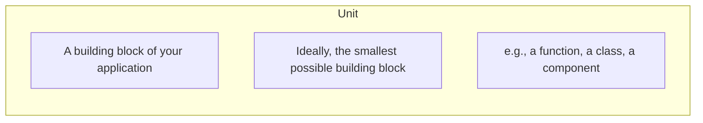
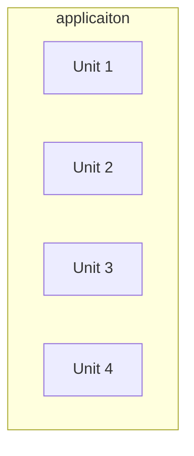
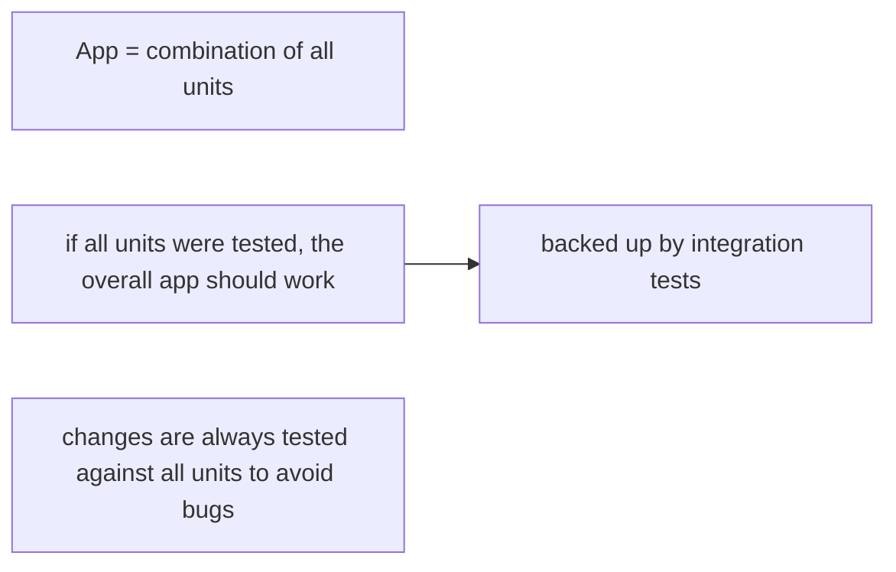
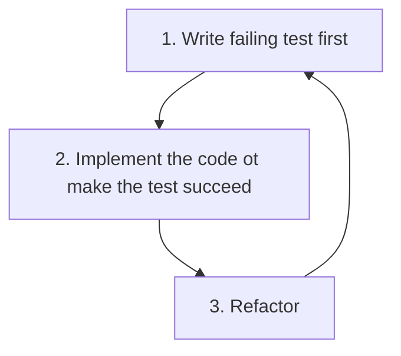

# JavaScript Unit Testing the Practical Guide

## TOC

- [JavaScript Unit Testing the Practical Guide](#javascript-unit-testing-the-practical-guide)
  - [TOC](#toc)
  - [Section 1 Getting Started](#section-1-getting-started)
    - [What is testing?](#what-is-testing)
    - [Unit Testing: What & Why?](#unit-testing-what--why)
    - [Unit, Integration & End-to-End (E2E) Testing](#unit-integration--end-to-end-e2e-testing)
    - [Test-Driven Development (TDD)](#test-driven-development-tdd)
  - [Section 2 Setup and Testing Software](#section-2-setup-and-testing-software)
    - [Which Tools Are Needed for Testing?](#which-tools-are-needed-for-testing)
  - [Section 3 Testing Basics](#section-3-testing-basics)
    - [AAA - Arrange, Act, Assert](#aaa---arrange-act-assert)
  - [Section 4 Writing Good Tests](#section-4-writing-good-tests)
    - [What To Test & What Not To Test](#what-to-test--what-not-to-test)
    - [Only Test Your Code](#only-test-your-code)
    - [Writing Good Tests](#writing-good-tests)
    - [Only Test One Thing](#only-test-one-thing)
  - [Section 5 Integration Tests](#section-5-integration-tests)
  - [Section 6 Advanced Testing Concepts](#section-6-advanced-testing-concepts)
  - [Section 7 Mocking and Spies Dealing with Side Effects](#section-7-mocking-and-spies-dealing-with-side-effects)
    - [Spies & Mocks](#spies--mocks)
  - [Section 8 More on Mocking and Diving Deeper](#section-8-more-on-mocking-and-diving-deeper)
  - [Section 9 Testing and The DOM](#section-9-testing-and-the-dom)
  - [Section 10 Course Roundup](#section-10-course-roundup)

## Section 1 Getting Started

[Slides](/slides/section-1-slides.pdf)

### What is testing?

- verify "if something works as intended"

Types of testing:

- Manual Testing
  - physically testing the code by hand (i.e. write some code, spin up the site and see if it works)
  - tedious & cumbersome
  - error prone
  - often incomplete (not all scenarios covered)
- Automated Testing
  - write some code to test the code you wrote for the feature/site you are working on
  - initial effort (write tests), no effort thereafter
  - predictable & consistent
  - high/complete code & scenario coverage can be achieved

### Unit Testing: What & Why?

What:

Why:

- avoids endless amounts of manual testing
- allows you to cover (close to) 100% of your code & scenarios
- code changes are tested against all scenarios (almost) instantly
- write cleaner & better code (because testing then becomes easier)

### Unit, Integration & End-to-End (E2E) Testing

| Unit Testing                                          | Integration Testing                                           | End-to-End (E2E) Testing                                       |
| ----------------------------------------------------- | ------------------------------------------------------------- | -------------------------------------------------------------- |
| Test the individual building blocks of an application | Test the combination of building blocks                       | Test entire flows and application features                     |
| Every building block (unit) is tested standalone      | Verify if building blocks (units) work together               | Test the actual "things" real users would do                   |
|                                                       |                                                               |                                                                |
| If all building blocks work, the overall app works    | Even if all units work standalone, the combination could fail | Real users use your app and its features, not individual units |

**You should combine all kinds of tests.**

| Unit Testing                                        | Integration Testing                               | End-to-End (E2E) Testing                           |
| --------------------------------------------------- | ------------------------------------------------- | -------------------------------------------------- |
| Quickly spot and pinpoint breaking changes & errors | Test (parts of) processes & combinations of units | Test realistic user flows & behaviors              |
| Ignore actual user flows and interferences          | Spotting the exact root of an error can be tricky | Covering all possible behaviors can be challenging |

[source](https://3fxtqy18kygf3on3bu39kh93-wpengine.netdna-ssl.com/wp-content/uploads/2020/01/test-automation-pyramid.jpg)

### Test-Driven Development (TDD)

A framework/philosophy for writing tests

[back to top](#toc)

## Section 2 Setup and Testing Software

[Slides](/slides/section-2-slides.pdf)

### Which Tools Are Needed for Testing?

- Application Setup & Code
  - Generally independent setup
  - All you need for manual testing
  - Testing setup can (and typically will) be integrated
    - e.g. based on Webpack, Vite, etc...
- Automated Tests
  - Test Runner
    - Runs your tests (i.e., the testing code)
    - Automatically detects testing code
    - Display results
    - e.g. Jest, Karma, Mocha, Jasmine, etc...
  - Assertion Library
    - Used to define expected outcomes
    - Checks whether expectations are met
    - Supports all kinds of expectations and modes (sync/async)
    - e.g. Jest, Chai, Expect, Sinon, etc...

[back to top](#toc)

## Section 3 Testing Basics

### AAA - Arrange, Act, Assert

|     |         |                                                                                 |
| --- | ------- | ------------------------------------------------------------------------------- |
| A   | Arrange | Define the testing environment & values                                         |
| A   | Act     | Run the actual code/function that should be tested                              |
| A   | Assert  | Evaluate the produced value/results and compare it to the expected value/result |
|     |         |                                                                                 |

Writing good tests is an interative process

[back to top](#toc)

## Section 4 Writing Good Tests

### What To Test & What Not To Test

- should only test your code
- don't test any third party code
- don't test what you can't change

### Only Test Your Code

**e.g. fetch() API**

- Don't test if it works as intended
- Don't test your server-side code implicitly via your client side code
  - Write separate tests for your backend code instead
- Do test your client-side reaction to different responses & errors

### Writing Good Tests

- AAA - Arrange - Act - Assert
- 1 - Only test one thing
- Focus on the **essence** of a test when arranging
- Keep your number of assertions ("expects") low

### Only Test One Thing

What is "one thing"?

- One feature
  - e.g. validate input or transform it

[back to top](#toc)

## Section 5 Integration Tests

[back to top](#toc)

## Section 6 Advanced Testing Concepts

[back to top](#toc)

## Section 7 Mocking and Spies Dealing with Side Effects

### Spies & Mocks

**Spies**:

- "Wrappers" around functions or empty replacements for functions that allow you to track if & how a funciton was called

**Mocks**:

- A replacement for an API that may provide some test specific behavior instead
- Objects re-programmed with expectations which form a specification of the calls they are expected to receive

**Dummy**:

- objects that are passed around, never actually used
- usually just used to fill parameter lists

**Fake**:

- objects that have working implementations but usually take some short cut which makes them not suitable for production
  - e.g. in memory database

**Stubs**:

- provide canned answers to calls made during tests
- usually not responding to anything outside what's programmed for the test
- may also record information about calls
  - e.g. email gateway stub that remembers the message it 'sent' or maybe only how many messages it 'sent'

[back to top](#toc)

## Section 8 More on Mocking and Diving Deeper

[back to top](#toc)

## Section 9 Testing and The DOM

[back to top](#toc)

## Section 10 Course Roundup

[back to top](#toc)
