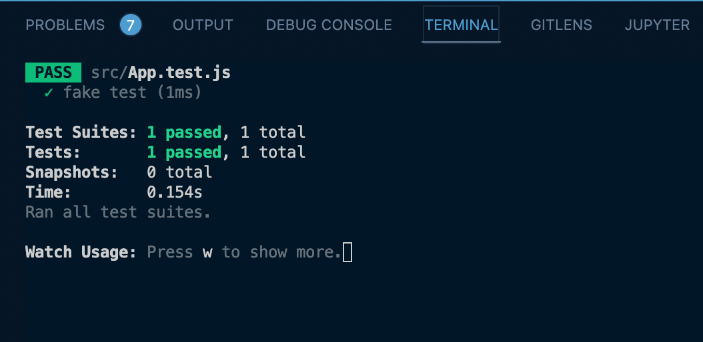

# React Testing for Beginners

[](https://testing-library.com/docs/react-testing-library/intro/)

## TOC

- [React Testing for Beginners](#react-testing-for-beginners)
  - [TOC](#toc)
  - [Jest Explained](#jest-explained)
  - [Writing Unit Tests with Jest](#writing-unit-tests-with-jest)
  - [Writing Integration Tests](#writing-integration-tests)
  - [Mock Functions & Why](#mock-functions--why)
  - [Mocking Modules](#mocking-modules)
  - [React Testing Library & Debug](#react-testing-library--debug)
  - [Testing with Test Ids](#testing-with-test-ids)
  - [Events in React Testing Library](#events-in-react-testing-library)
  - [Integration Testing in React & Cleanup](#integration-testing-in-react--cleanup)
  - [Snapshot Testing 101](#snapshot-testing-101)
  - [Spying & Mocking Functions in React](#spying--mocking-functions-in-react)
  - [Form Events With Controlled Inputs](#form-events-with-controlled-inputs)
  - [Testing for Errors & Global Mocks](#testing-for-errors--global-mocks)
  - [Negative Assertions & Testing With React Router](#negative-assertions--testing-with-react-router)
  - [What To Test](#what-to-test)
  - [Mocking Fetch](#mocking-fetch)
  - [Mocking Fetch Part 2 & Async Tests & Working With Data](#mocking-fetch-part-2--async-tests--working-with-data)
  - [Testing Loading States & More Pitfalls](#testing-loading-states--more-pitfalls)
  - [Refactoring with Tests](#refactoring-with-tests)
  - [Code Coverage](#code-coverage)

## Jest Explained

[Jest](https://jestjs.io/)

_src/App.test.js_

```javascript
// should pass
test('fake test', () => {
  expect(true).toBeTruthy();
});

// should fail
test('fake test', () => {
  expect(false).toBeTruthy();
});
```




[top](#toc)

## Writing Unit Tests with Jest

Unit Test - should test just one thing

_src/App.js_

```javascript
export const add = (x, y) => x + y;
```

_src/App.test.js_

```javascript
import { add } from './App';

// should pass
test.skip('fake test', () => {
  expect(true).toBeTruthy();
});

// should fail
test.skip('fake test', () => {
  expect(false).toBeTruthy();
});

test('add', () => {
  // option 1
  // const value = add(1, 2);
  // expect(value).toBe(3);

  // option 2
  expect(add(1, 2)).toBe(3);
  expect(add(2, 5)).toBe(7);
});
```


[top](#toc)

## Writing Integration Tests

Tests where one unit interacts with another unit

_src/App.js_

```javascript
export const add = (x, y) => x + y;

export const total = (shipping, subTotal) => `$${add(shipping, subTotal)}`;
```

_src/App.test.js_

```javascript
import { add, total } from './App';

test('add', () => {
  expect(add(1, 2)).toBe(3);
  expect(add(2, 5)).toBe(7);
});

// integration test b/c not only testing total function but also the add function and its output to total function
test('total', () => {
  expect(total(5, 20)).toBe('$25');
});
```

[top](#toc)

## Mock Functions & Why

- mock a function that may not be accessable to the current test but an assertion relies on what comes back from that function in order to test what it needs to test in the function it is designed to test
  - mock api calls
  - mock database calls

_src/App.test.js_

```javascript
import { total } from './App';

const add = jest.fn(() => 3); // mocking the add function

test('add', () => {
  expect(add(1, 2)).toBe(3);
  expect(add).toHaveBeenCalledTimes(1);
  expect(add).toHaveBeenCalledWith(1, 2);
});
```


[top](#toc)

## Mocking Modules

- mock the import and then mock the implementation of what we mock imported

_src/add.js_

```javascript
export const add = (x, y) => x + y;
```

_src/add.test.js_

```javascript
import { add } from './add';

// unit test

test('add', () => {
  expect(add(1, 2)).toBe(3);
  expect(add(2, 5)).toBe(7);
});
```

_src/App/js_

```javascript
import { add } from './add';

export const total = (shipping, subTotal) => `$${add(shipping, subTotal)}`;
```

_src/App.test.js_

```javascript
import { total } from './App';
import { add } from './add';

jest.mock('./add', () => ({
  add: jest.fn(() => 25),
}));

test('total', () => {
  expect(total(5, 20)).toBe('$25');
  expect(add).toHaveBeenCalledTimes(1); // spy on add function

  // Redundant
  add.mockImplementation(() => 30);

  expect(total(5, 25)).toBe('$30');
  expect(add).toHaveBeenCalledTimes(2); // spy on add function
});
```


[top](#toc)

## React Testing Library & Debug

> NOTE: `Counter.js` is not really used in the actual app,
> just demonstrate some basic React-Testing-Library
> principles.

_src/example_components/Counter.js_

```javascript
import React, { Component } from 'react';

export default class Counter extends Component {
  state = {
    count: 0,
  };

  render() {
    const { count } = this.state;
    return (
      <div>
        <button>{count}</button>
      </div>
    );
  }
}
```

_src/example_components/Counter.test.js_

```javascript
import React from 'react';
import { render, cleanup } from 'react-testing-library';
import Counter from './Counter';

test('<Counter />', () => {
  const wrapper = render(<Counter />);
  wrapper.debug();
});
```

Output from line 7 of `Counter.test.js`


- easy way to get some visibilty on our `<Counter />` component
- if you added `console.log(wrapper.getByText('0'));` inside the callback of the test function, the following output in the console would be the actual DOM node.


- from here you can then add on something like `console.log(wrapper.getByText('0').tagName);` and get:


_src/example_components/Counter.test.js_

```javascript
import React from 'react';
import { render, cleanup } from 'react-testing-library';
import Counter from './Counter';

test('<Counter />', () => {
  const wrapper = render(<Counter />);

  expect(wrapper.getByText('0').tagName).toBe('BUTTON');
});
```


[top](#toc)

## Testing with Test Ids

One of the big differences between using React-Testing-Library and a third-party library such as Enzyme (Enzyme is no longer going to be kept up after React 17) is in Enzyme you could lookup a component by the component name. Sounds great and easy, however, users don't know the component name or interact with the component directly. In React-Testing-Library you look up an element just as it is in the DOM. This is how a user interacts with your app, through the DOM. And you should test your app the way a user will interact with it.

_src/example_components/Counter.js_

```javascript
import React, { Component } from 'react';

export default class Counter extends Component {
  state = {
    count: 0,
  };

  render() {
    const { count } = this.state;
    return (
      <div>
        <button data-testid='counter-button'>{count}</button>
      </div>
    );
  }
}
```

> NOTE: if you happen to see in VSCode red underlines under the keywords **test** and **expect**, then you can add those as globals in the your `.eslintrc.js` file.

```javascript
...},
globals:{
  test: true,
  expect: true
}
```

- refactor `Counter.test.js` file to below.
  - destructure out `debug` and `getByTestId` from the `<Counter />` component
  - `const { debug, getByTestId } = render(<Counter />);`
  - now have access to `debug` and `getByTestId` directly

_src/example_components/Counter.test.js_

```javascript
import React from 'react';
import { render, cleanup } from 'react-testing-library';
import Counter from './Counter';

test('<Counter />', () => {
  // Renders component
  const { debug, getByTestId } = render(<Counter />);

  debug(); // not needed to test, just handy

  // Asserts counter-button is a button
  expect(getByTestId('counter-button').tagName).toBe('BUTTON');
  // Asserts counter-button starts at 0
  expect(getByTestId('counter-button').textContent).toBe('0');
});
```


[top](#toc)

## Events in React Testing Library

- can simulate events by using `fireEvent`
- do **NOT** have to have the app running to use these tests
- you do not need to check state with React-Testing-Library

_src/example_components/Counter.js_

```javascript
import React, { Component } from 'react';

export default class Counter extends Component {
  state = {
    count: 0,
  };

  count = () => {
    this.setState((prevState) => ({
      count: prevState.count + 1,
    }));
  };

  render() {
    const { count } = this.state;
    return (
      <div>
        <button onClick={this.count} data-testid='counter-button'>
          {count}
        </button>
      </div>
    );
  }
}
```

- refactor `Counter.test.js` again by using `const counterBtn = getByTestId('counter-button');`
- replace `getByTestId('counter-button')` with `counterBtn`

_src/example_components/Counter.test.js_

```javascript
import React from 'react';
import { render, cleanup, fireEvent } from 'react-testing-library';
import Counter from './Counter';

afterEach(cleanup);

test('<Counter />', () => {
  // Renders component
  const { debug, getByTestId } = render(<Counter />);

  // find the button
  const counterBtn = getByTestId('counter-button');

  debug(); // not needed to test, just handy

  // Asserts counter-button is a button
  expect(counterBtn.tagName).toBe('BUTTON');
  // Asserts counter-button starts at 0
  expect(counterBtn.textContent).toBe('0');

  // events
  fireEvent.click(counterBtn);
  // Asserts counter-button adds 1
  expect(counterBtn.textContent).toBe('1');

  // events
  fireEvent.click(counterBtn);
  // Asserts counter-button adds 1
  expect(counterBtn.textContent).toBe('2');

  debug();
});
```

- test output before adding counter functionality to `Counter.js`


- test output after adding counter functionality to `Counter.js`
  

[top](#toc)

## Integration Testing in React & Cleanup

_src/NewMovie.js_

```javascript
import React, { Component } from 'react';
import MovieForm from './MovieForm';

class NewMovie extends Component {
  render() {
    return (
      <div>
        <h1 data-testid='page-title'>New Movie</h1>
        <MovieForm />
      </div>
    );
  }
}

export default NewMovie;
```

_src/MovieForm.js_

```javascript
import React, { Component } from 'react';

export default class MovieForm extends Component {
  render() {
    return (
      <form data-testid='movie-form'>
        <input type='text' />
        <button>Submit</button>
      </form>
    );
  }
}
```

_src/NewMovie.test.js_

```javascript
import React from 'react';
import { render, cleanup, fireEvent } from 'react-testing-library';
import NewMovie from './NewMovie';

afterEach(cleanup);

test('<NewMovie/>', () => {
  const { debug, getByTestId, queryByTestId } = render(<NewMovie />);
  expect(getByTestId('page-title').textContent).toBe('New Movie');
  expect(queryByTestId('movie-form')).toBeTruthy();

  debug();
});
```

initial output with just skeleton files and test


- `getByTestId` will return an error if it can not find the element -- it MUST be there or throw an error
- `queryByTestId` is slightly different, it just sees if there or nothing

[top](#toc)

## Snapshot Testing 101

- generally better off with manual tests
- however, snapshot testing is really good for a component that does not change very often if hardly ever

  - then you can check the component to see if something changed
  - fragile tests

- they are easy and fast and very good in the right context

`expect(container.firstChild).toMatchSnapshot();`

_src/NewMovie.test.js_

```javascript
import React from 'react';
import { render, cleanup, fireEvent } from 'react-testing-library';
import NewMovie from './NewMovie';

afterEach(cleanup);

test('<NewMovie/>', () => {
  const { debug, getByTestId, queryByTestId, container } = render(<NewMovie />);

  expect(getByTestId('page-title').textContent).toBe('New Movie');
  expect(queryByTestId('movie-form')).toBeTruthy();
  expect(container.firstChild).toMatchSnapshot();

  debug();
});
```

- once this run when the test runs, creates a folder called `__snapshots__` under `src` and puts all snapshots there
- each and everytime thereafter, it runs a new snapshot (does not save it under the folder) and compares it to the one stored

failed snapshot test


- if this was a legimate change, then you can press 'u' while the terminal has focus and it will update the snapshot, else fix the issue and rerun

DO NOT rely on snapshot tests for your only testing

[top](#toc)

## Spying & Mocking Functions in React

_src/MovieForm.js_

```javascript
import React, { Component } from 'react';

export default class MovieForm extends Component {
  state = {
    text: '',
  };

  render() {
    const { submitForm } = this.props;
    const { text } = this.state;

    return (
      <form
        data-testid='movie-form'
        onSubmit={() =>
          submitForm({
            text,
          })
        }
      >
        <input type='text' />
        <button>Submit</button>
      </form>
    );
  }
}
```

_src/MovieForm.test.js_

```javascript
import React from 'react';
import { render, cleanup, fireEvent } from 'react-testing-library';
import MovieForm from './MovieForm';

afterEach(cleanup);

const onSubmit = jest.fn();

test('<MovieForm/>', () => {
  const { queryByTestId, container, getByText } = render(
    <MovieForm submitForm={onSubmit} />
  );

  expect(queryByTestId('movie-form')).toBeTruthy();

  const submitBtn = getByText('Submit');
  fireEvent.click(submitBtn);

  expect(onSubmit).toHaveBeenCalledTimes(1);
});
```

[top](#toc)

## Form Events With Controlled Inputs

_src/MovieForm.js_

```javascript
import React, { Component } from 'react';

export default class MovieForm extends Component {
  state = {
    text: '',
  };

  render() {
    const { submitForm } = this.props;
    const { text } = this.state;

    return (
      <form
        data-testid='movie-form'
        onSubmit={() =>
          submitForm({
            text,
          })
        }
      >
        <label htmlFor='text'>Text</label>
        <input
          type='text'
          id='text'
          onChange={(e) => this.setState({ text: e.target.value })}
        />
        <button>Submit</button>
      </form>
    );
  }
}
```

_src/MovieForm.test.js_

```javascript
import React from 'react';
import { render, cleanup, fireEvent } from 'react-testing-library';
import MovieForm from './MovieForm';

afterEach(cleanup);

const onSubmit = jest.fn();

test('<MovieForm/>', () => {
  const { queryByTestId, getByText, getByLabelText } = render(
    <MovieForm submitForm={onSubmit} />
  );

  expect(queryByTestId('movie-form')).toBeTruthy();

  // Note might not work
  // getByLabelText('Text').value = 'hello';
  // fireEvent.change(getByLabelText('Text'));

  fireEvent.change(getByLabelText('Text'), {
    target: { value: 'hello' },
  });

  fireEvent.click(getByText('Submit'));

  expect(onSubmit).toHaveBeenCalledTimes(1);
  expect(onSubmit).toHaveBeenCalledWith({
    text: 'hello',
  });
});
```

[top](#toc)

## Testing for Errors & Global Mocks

_src/Movie.js_

```javascript
import React from 'react';
import PropTypes from 'prop-types';
import { Link } from 'react-router-dom';
import styled from 'styled-components';
import Overdrive from 'react-overdrive';

const POSTER_PATH = 'http://image.tmdb.org/t/p/w154';

const Movie = ({ movie }) => {
  if (!movie) return null;

  return (
    <Link to={`/${movie.id}`}>
      <Overdrive id={`${movie.id}`}>
        <Poster src={`${POSTER_PATH}${movie.poster_path}`} alt={movie.title} />
      </Overdrive>
    </Link>
  );
};

export default Movie;

Movie.propTypes = {
  movie: PropTypes.shape({
    title: PropTypes.string.isRequired,
    poster_path: PropTypes.string.isRequired,
    id: PropTypes.string.isRequired,
  }).isRequired,
};

export const Poster = styled.img`
  box-shadow: 0 0 35px black;
`;
```

_src/Movie.test.js_

```javscript
import React from 'react';
import { render, cleanup } from 'react-testing-library';
import Movie from './Movie';

afterEach(cleanup);

console.error = jest.fn();

test('<Movie />', () => {
  render(<Movie />);
  expect(console.error).toBeCalled();
});
```

[top](#toc)

## Negative Assertions & Testing With React Router

_src/Movie.test.js_

```javascript
import React from 'react';
import { render, cleanup } from 'react-testing-library';
import Movie from './Movie';

afterEach(cleanup);

console.error = jest.fn();

test('<Movie />', () => {
  render(<Movie />);
  expect(console.error).toBeCalled();
});

test('<Movie />', () => {
  render(<Movie />);
  expect(console.error).not.toBeCalled();
});
```


_src/Movie.test.js_

```javascript
import React from 'react';
import { render, cleanup } from 'react-testing-library';
import { MemoryRouter } from 'react-router-dom';
import Movie from './Movie';

afterEach(cleanup);

console.error = jest.fn();

test('<Movie />', () => {
  render(<Movie />);
  expect(console.error).toBeCalled();
});

const movie = {
  id: 'hi',
  title: 'Some movie',
  poster_path: 'somepic.jpg',
};

test('<Movie /> with movie', () => {
  render(
    // fake router
    <MemoryRouter>
      <Movie movie={movie} />
    </MemoryRouter>
  );

  expect(console.error).not.toHaveBeenCalled();
});
```


- pitfall: console.error spy has been called in previous test when movie was undefined.
- mock functions remember when they have been called during the current testing session
- therefore, the spy function needs to be reset

_src/Movie.test.js_

```javascript
import React from 'react';
import { render, cleanup } from 'react-testing-library';
import { MemoryRouter } from 'react-router-dom';
import Movie from './Movie';

afterEach(() => {
  cleanup;
  console.error.mockClear(); // reset after each test
});

console.error = jest.fn();

test('<Movie />', () => {
  render(<Movie />);
  expect(console.error).toBeCalled();
});

const movie = {
  id: 'hi',
  title: 'Some movie',
  poster_path: 'somepic.jpg',
};

test('<Movie /> with movie', () => {
  render(
    <MemoryRouter>
      <Movie movie={movie} />
    </MemoryRouter>
  );

  expect(console.error).not.toHaveBeenCalled();
});
```


[top](#toc)

## What To Test

- don't want to test to make sure React is doing its job
- you want to test to make the sure the app is doing what the user is expecting it to do

`expect(getByTestId('movie-link').href);`

- can do it this way, however, remember locally running on localhost and this would return the absolute path to include https and make out test brittle

`expect(getByTestId('movie-link').getAttribute('href'));`

- better way because this would return relative path instead

_src/Movie.test.js_

```javascript
import React from 'react';
import { render, cleanup } from 'react-testing-library';
import { MemoryRouter } from 'react-router-dom';
import Movie from './Movie';

afterEach(() => {
  cleanup;
  console.error.mockClear(); // reset after each test
});

console.error = jest.fn();

test('<Movie />', () => {
  render(<Movie />);
  expect(console.error).toBeCalled();
});

const movie = {
  id: 'hi',
  title: 'Some movie',
  poster_path: 'somepic.jpg',
};

test('<Movie /> with movie', () => {
  const { debug, getByTestId } = render(
    // fake router
    <MemoryRouter>
      <Movie movie={movie} />
    </MemoryRouter>
  );

  expect(console.error).not.toHaveBeenCalled();
  expect(getByTestId('movie-link').getAttribute('href')).toBe(movie.id);
  debug();
});
```


_src/Movie.test.js_

```javascript
import React from 'react';
import { render, cleanup } from 'react-testing-library';
import { MemoryRouter } from 'react-router-dom';
import Movie from './Movie';

afterEach(() => {
  cleanup;
  console.error.mockClear(); // reset after each test
});

console.error = jest.fn();

test('<Movie />', () => {
  render(<Movie />);
  expect(console.error).toBeCalled();
});

const movie = {
  id: 'hi',
  title: 'Some movie',
  poster_path: 'somepic.jpg',
};

test('<Movie /> with movie', () => {
  const { debug, getByTestId } = render(
    // fake router
    <MemoryRouter>
      <Movie movie={movie} />
    </MemoryRouter>
  );

  expect(console.error).not.toHaveBeenCalled();
  expect(getByTestId('movie-link').getAttribute('href')).toBe(`/${movie.id}`);
  debug();
});
```


- tested to make sure the link href was correctly set

_src/Movie.test.js_

```javascript
import React from 'react';
import { render, cleanup } from 'react-testing-library';
import { MemoryRouter } from 'react-router-dom';
import Movie, { POSTER_PATH } from './Movie';

afterEach(() => {
  cleanup;
  console.error.mockClear(); // reset after each test
});

console.error = jest.fn();

test('<Movie />', () => {
  render(<Movie />);
  expect(console.error).toBeCalled();
});

const movie = {
  id: 'hi',
  title: 'Some movie',
  poster_path: 'somepic.jpg',
};

test('<Movie /> with movie', () => {
  const { debug, getByTestId } = render(
    // fake router
    <MemoryRouter>
      <Movie movie={movie} />
    </MemoryRouter>
  );

  expect(console.error).not.toHaveBeenCalled();
  expect(getByTestId('movie-link').getAttribute('href')).toBe(`/${movie.id}`);
  expect(getByTestId('movie-img').src).toBe(
    `${POSTER_PATH}${movie.poster_path}`
  );
  debug();
});
```


- tests to make sure the image src is set correctly

[top](#toc)

## Mocking Fetch

- need to add `jest-fetch-mock` - `npm install jest-fetch-mock`
  _src/MovieDetail.test.js_

```javascript

```


- notice though we have no h1, h3, p
- even though we mocked teh fetch and response, since this is an async call, it still takes time and then rerenders when the data comes back
- `debug()` on the other hand outputs before that data has come back

[top](#toc)

## Mocking Fetch Part 2 & Async Tests & Working With Data

_src/MovieDetail.test.js_

```javascript
import React from 'react';
import { render, cleanup, waitForElement } from 'react-testing-library';
import MovieDetail from './MovieDetail';

global.fetch = require('jest-fetch-mock');

afterEach(() => {
  cleanup;
  console.error.mockClear(); // reset after each test
});

const match = {
  params: {
    id: 'movieid',
  },
};

console.error = jest.fn();

// TODO: add rest of movie detail and add assertions for them
const movie = {
  id: 'hi',
  title: 'some movie title',
};

test('<MovieDetail />', async () => {
  fetch.mockResponseOnce(JSON.stringify(movie));

  const { debug, getByTestId } = render(<MovieDetail match={match} />);
  await waitForElement(() => getByTestId('movie-title'));

  expect(getByTestId('movie-title').textContent).toBe(movie.title);
});
```


[top](#toc)

## Testing Loading States & More Pitfalls

_src/MoviesList.js_

```javascript
/* eslint react/no-did-mount-set-state: 0 */
import React, { PureComponent } from 'react';
import styled from 'styled-components';
import Movie from './Movie';

class MoviesList extends PureComponent {
  state = {
    movies: [],
  };

  async componentDidMount() {
    try {
      const res = await fetch(
        `https://api.themoviedb.org/3/discover/movie?api_key=${process.env.REACT_APP_API_KEY}&language=en-US&sort_by=popularity.desc&include_adult=false&include_video=false&page=1`
      );
      const movies = await res.json();
      this.setState({
        movies: movies.results,
      });
    } catch (e) {
      console.log(e);
    }
  }

  render() {
    const { movies } = this.state;
    if (movies < 1) return <h1 data-testid='loading'>Loading...</h1>;
    return (
      <MovieGrid>
        {movies.map((movie) => (
          <Movie key={movie.id} movie={movie} />
        ))}
      </MovieGrid>
    );
  }
}

export default MoviesList;

const MovieGrid = styled.div`
  display: grid;
  padding: 1rem;
  grid-template-columns: repeat(6, 1fr);
  grid-row-gap: 1rem;
`;
```

_src/MoviesList.test.js_

```javascript
import React from 'react';
import { render, cleanup, waitForElement } from 'react-testing-library';
import { MemoryRouter } from 'react-router-dom';
import MoviesList from './MoviesList';

global.fetch = require('jest-fetch-mock');

afterEach(() => {
  cleanup;
  console.error.mockClear(); // reset after each test
});

console.error = jest.fn();

const movies = {
  results: [
    {
      id: 'hi',
      title: 'some movie title',
      poster_path: 'somepic.jpg',
    },
    {
      id: 'hiz',
      title: 'something movie title',
      poster_path: 'somepic.jpg',
    },
    {
      id: 'him',
      title: 'sometime movie title',
      poster_path: 'somepic.jpg',
    },
    {
      id: 'hizse',
      title: 'somewhere movie title',
      poster_path: 'somepic.jpg',
    },
    {
      id: 'hiewr',
      title: 'some other movie title',
      poster_path: 'somepic.jpg',
    },
  ],
};

const movie = movies.results[0];

test('<MoviesList />', async () => {
  fetch.mockResponseOnce(JSON.stringify(movies));

  const { debug, getByTestId, queryByTestId, getAllByTestId } = render(
    <MemoryRouter>
      <MoviesList />
    </MemoryRouter>
  );

  expect(getByTestId('loading')).toBeTruthy(); // test loading state

  await waitForElement(() => getByTestId('movie-link'));

  expect(queryByTestId('loading')).toBeFalsy(); // test loading state
  expect(getByTestId('movie-link').getAttribute('href')).toBe(`/${movie.id}`); // test for nested component
  expect(getAllByTestId('movie-link').length).toBe(movies.results.length); // tests to make sure it will render the same amount we expect is inputted
});
```


[top](#toc)

## Refactoring with Tests

_src/movies/MoviesList.js_

```javascript
/* eslint react/no-did-mount-set-state: 0 */
import React, { PureComponent } from 'react';
import styled from 'styled-components';
import Movie from './Movie';

class MoviesList extends PureComponent {
  state = {
    movies: [],
  };

  async componentDidMount() {
    try {
      const res = await fetch(
        `https://api.themoviedb.org/3/discover/movie?api_key=${process.env.REACT_APP_API_KEY}&language=en-US&sort_by=popularity.desc&include_adult=false&include_video=false&page=1`
      );
      const movies = await res.json();
      this.setState({
        movies: movies.results,
      });
    } catch (e) {
      console.log(e);
    }
  }

  render() {
    const { movies } = this.state;
    // TODO: maybe add loading component here
    if (movies < 1) return <h1 data-testid='loading'>Loading...</h1>;
    return (
      <MovieGrid>
        {movies.map((movie) => (
          <Movie key={movie.id} movie={movie} />
        ))}
      </MovieGrid>
    );
  }
}

export default MoviesList;

const MovieGrid = styled.div`
  display: grid;
  padding: 1rem;
  grid-template-columns: repeat(6, 1fr);
  grid-row-gap: 1rem;
`;
```

_src/movies/**tests**/MoviesList.test.js_

```javascript
import React from 'react';
import { render, cleanup, waitForElement } from 'react-testing-library';
import { MemoryRouter } from 'react-router-dom';
import MoviesList from '../MoviesList';

global.fetch = require('jest-fetch-mock');

afterEach(() => {
  cleanup;
  console.error.mockClear(); // reset after each test
});

console.error = jest.fn();

const movies = {
  success: true,
  results: [
    {
      id: 'hi',
      title: 'some movie title',
      poster_path: 'somepic.jpg',
    },
    {
      id: 'hiz',
      title: 'something movie title',
      poster_path: 'somepic.jpg',
    },
    {
      id: 'him',
      title: 'sometime movie title',
      poster_path: 'somepic.jpg',
    },
    {
      id: 'hizse',
      title: 'somewhere movie title',
      poster_path: 'somepic.jpg',
    },
    {
      id: 'hiewr',
      title: 'some other movie title',
      poster_path: 'somepic.jpg',
    },
  ],
};

const movie = movies.results[0];

test('<MoviesList />', async () => {
  fetch.mockResponseOnce(JSON.stringify(movies));

  const { debug, getByTestId, queryByTestId, getAllByTestId } = render(
    <MemoryRouter>
      <MoviesList />
    </MemoryRouter>
  );

  expect(getByTestId('loading')).toBeTruthy(); // test loading state

  await waitForElement(() => getByTestId('movie-link'));

  expect(queryByTestId('loading')).toBeFalsy(); // test loading state
  expect(getByTestId('movie-link').getAttribute('href')).toBe(`/${movie.id}`); // test for nested component
  expect(getAllByTestId('movie-link').length).toBe(movies.results.length); // tests to make sure it will render the same amount we expect is inputted
});

test('<MoviesList /> api fail', async () => {
  movies.success = false;
  fetch.mockResponseOnce(JSON.stringify(movies));

  const { getByTestId } = render(
    <MemoryRouter>
      <MoviesList />
    </MemoryRouter>
  );

  expect(getByTestId('loading')).toBeTruthy(); // test loading state
});
```


[top](#toc)

## Code Coverage

`yarn test --coverage`


[top](#toc)
